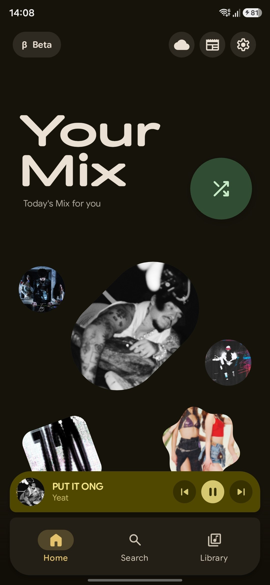
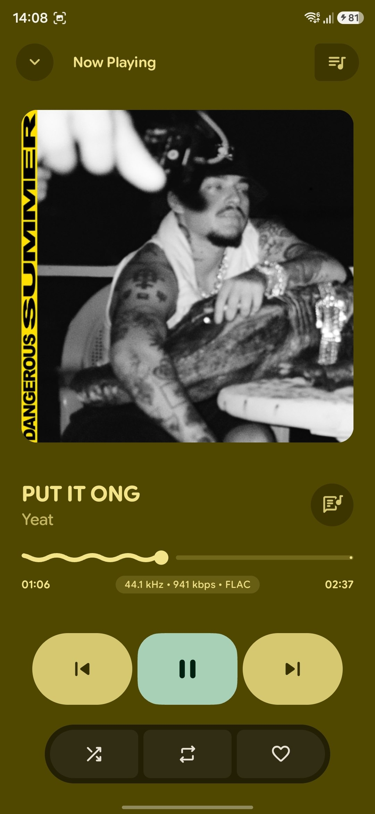
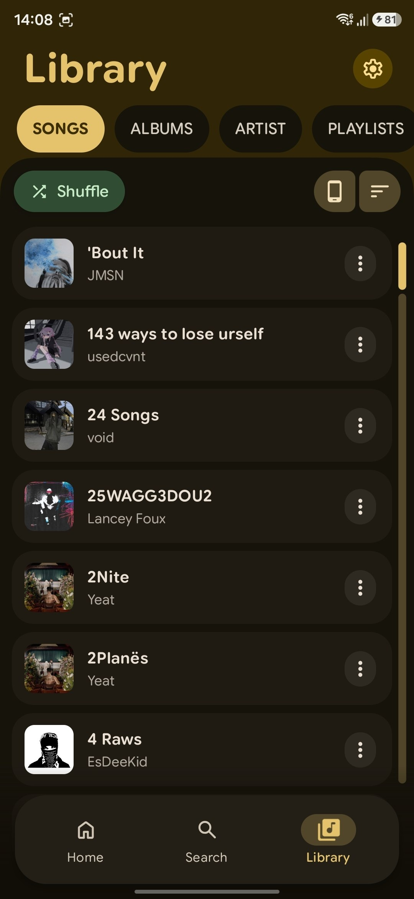
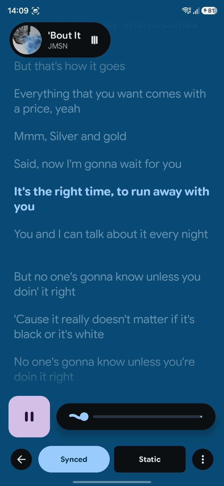

# Tonarc

<p align="center">
  
</p>

<p align="center">
  <a href="https://github.com/dharshan-X/Tonarc/releases/latest">
    
  </a>
  <a href="https://f-droid.org/packages/com.quietrays.tonarc/">
    
  </a>
  <a href="https://github.com/dharshan-X">
    
  </a>
  
  
  
</p>

<p align="center">
  
  
  
  
</p>

---

## Executive Overview

**Tonarc** is a privacy-first, high-performance Android audio player and streaming client engineered with Jetpack Compose and Material 3 Expressive design. It unifies local high-resolution audio files, self-hosted media server streaming (Navidrome, Jellyfin), client-side YouTube Music discovery, and an on-device personalized recommendation engine into a cohesive audio environment.

### Core Principles & Privacy
- **100% Privacy by Default**: Zero proprietary trackers, analytics, or telemetry SDKs (no Firebase, Crashlytics, or Google Analytics).
- **No Google Play Services Required**: Pure open-source architecture operable on de-Googled ROMs (GrapheneOS, CalyxOS, LineageOS).
- **Direct Client-Side Resolution**: Audio streams resolve on-device without third-party intermediary proxy servers.
- **On-Device Machine Intelligence**: Taste profiling, item co-occurrence graphs, and adaptive ranking execute locally without cloud inference.

- **Package Identifier**: `com.quietrays.tonarc`
- **Minimum SDK**: Android 11 (API Level 30)
- **Target SDK**: Android 15 (API Level 35) / Compile SDK 37
- **License**: GNU General Public License v3.0

---

## Key Features and Subsystems

### 1. On-Device Recommendation & Implicit Taste Engine
* **Personalized Ranker (`PersonalizedRanker`)**: Multi-signal scoring engine combining recency decay, play frequency, completion boosts ($\ge 90\%$), session repeat boosts, and early skip penalties ($< 30\text{s}$).
* **Item Co-Occurrence Graph (`ItemCooccurrenceStore`)**: On-device pairwise adjacency graph tracking songs played consecutively during listening sessions for associative candidate generation.
* **Adaptive Weight Tuner (`AdaptiveWeightTuner`)**: Continuous self-adjusting weight optimization responding dynamically to listening habits.
* **Daily Mix & Your Mix (`DailyMixManager`)**: Daily personalized playlists and continuous discovery mixes seamlessly aggregating local library tracks, cached items, YouTube Quick Picks, and favorite artist top tracks.
* **Keep Listening & Quick Picks**: Context-aware continue-listening carousel and instant radio generation across local and streaming sources.
* **Telemetry & Inspector UI**: Dedicated Recommendation Stats dashboard with real-time graph edge counters, completion/skip ratios, and testing diagnostic controls.

### 2. DualPlayerEngine & Playback Pipeline
* **Engine Architecture**: Dual-player architecture built on AndroidX Media3 and ExoPlayer, managed through a foreground `MusicService`.
* **Transitions & Crossfade**: Gapless playback, customizable crossfade durations, and non-linear audio transition curves.
* **Hardware Offload & Battery Optimization**: Dynamic audio offload stall detection, automatic decoder recovery, and CPU race-to-sleep wake mode optimizations.
* **DSP & Audio Processing**: Integrated ReplayGain track/album normalization, 10-band equalizer, bass boost, pitch/tempo adjustment, and sleep timer scheduling.

### 3. Client-Side YouTube Music Integration
* **Innertube Client**: Pure Kotlin client directly querying YouTube Music endpoints on-device with persistent `visitorData` session caching and direct token input.
* **Dynamic Stream Proxy (`YouTubeStreamProxy`)**: In-memory proxy managing token expiry (`&expire=`), upstream HTTP 401/403/404/410 recovery, and HTTP byte-range forwarding.
* **Discovery Surfaces**: Quick Picks, artist top tracks, continuous radio mixes, new releases, and mood/genre carousels.
* **Ultra-HD Artwork**: Automated thumbnail pipeline upscaling artwork to 1024px resolution.

### 4. Self-Hosted Cloud Streaming & Scrobbling
* **Navidrome / Subsonic**: Remote library synchronization, hierarchical artist/album navigation, server-side search, and on-demand streaming.
* **Jellyfin**: Native REST API client supporting token authentication, collection browsing, and direct streaming.
* **ListenBrainz**: Real-time playback scrobbling, now-playing notifications, and offline scrobble persistence with background WorkManager synchronization.

### 5. Unified Library & Hybrid Playlists
* **Full-Text Search (FTS4)**: Room SQLite database with virtual FTS4 tables indexing local files, cloud servers, and YouTube tracks concurrently.
* **Source Filtering Tabs**: Instant toggle between Unified (`ALL`), `LOCAL_ONLY`, and `YOUTUBE_MUSIC` modes.
* **Hybrid Playlists**: Create and manage playlists containing any combination of local files, Navidrome tracks, Jellyfin streams, and YouTube items.
* **Multi-Artist Indexing**: Relational database schema mapping collaborative tracks with individual artist navigation and metadata normalization.

### 6. Offline Download Manager & Native Tagging
* **Unified Downloader**: Background WorkManager download pipeline capturing remote streams, high-resolution companion artwork (`.jpg`), and synchronized lyrics (`.lrc`).
* **TagLib Native Tagging**: Directly embeds Title, Artist, Album, Cover Artwork picture bytes, and Synchronized LRC text into downloaded audio files using TagLib (C++ JNI).
* **Zero-Network Interception**: ExoPlayer automatically intercepts downloaded tracks across all screens, routing playback locally without network overhead.

### 7. Synchronized Lyrics Subsystem
* **Multi-Source Priority Fallback**: TagLib embedded tags $\rightarrow$ local companion `.lrc` $\rightarrow$ YouTube Music synchronized transcript feeds $\rightarrow$ LRCLIB cloud queries.
* **Interactive Lyrics UI**: Synchronized line-by-line scrolling, word-level highlight animations, romanization engines (Japanese, Korean, Devanagari, Gurmukhi, Cyrillic), and embedded lyrics editing.

### 8. Material 3 Expressive UI & Widgets
* **Dynamic Material You Theming**: Algorithmic color extraction from album artwork applying harmonious palettes throughout the UI.
* **Glance App Widgets**: Responsive Home Screen widgets with live playback controls, state synchronization, and artwork rendering.
* **Ergonomic Design**: Expandable bottom sheet player, fluid shared-element animations, and one-handed navigation layout.

---

## Modular Online Services Reference

| Service | Protocol / Source | Purpose | Authentication | Default State |
| :--- | :--- | :--- | :--- | :--- |
| **YouTube Music** | Innertube Client (Kotlin) | Online search, streaming, radio queues, artist discovery, and 1024px art | None required (Token opt-in) | Enabled |
| **Navidrome / Subsonic** | Subsonic REST API | Library synchronization, remote streaming, and offline downloads | Server credentials | Disabled (Opt-in) |
| **Jellyfin** | Jellyfin REST API | Server media streaming, library browsing, and offline downloads | Server credentials | Disabled (Opt-in) |
| **ListenBrainz** | ListenBrainz API | Real-time playback scrobbling and listening history tracking | User API token | Disabled (Opt-in) |
| **LRCLIB** | LRCLIB REST API | Synchronized and plain text lyrics retrieval fallback | None | Disabled (Opt-in) |
| **MusicBrainz** | MusicBrainz XML/JSON | On-demand metadata enrichment and artist identifier verification | None | On-demand |
| **Deezer** | Deezer Public API | Artist picture retrieval for local audio files | None | Disabled (Opt-in) |

---

## Supported Codecs and Containers

| Format / Codec | Extension | Local Playback | Cloud Streaming | Offline Download | Metadata Tagging |
| :--- | :--- | :--- | :--- | :--- | :--- |
| **FLAC** | `.flac` | Supported (Hi-Res) | Supported | Supported | Supported (TagLib) |
| **Opus** | `.opus`, `.ogg` | Supported | Supported (YouTube/WebM) | Supported | Supported (TagLib) |
| **AAC / M4A** | `.m4a`, `.aac` | Supported | Supported | Supported | Supported (TagLib) |
| **MP3** | `.mp3` | Supported | Supported | Supported | Supported (TagLib) |
| **Ogg Vorbis** | `.ogg` | Supported | Supported | Supported | Supported (TagLib) |
| **WAV** | `.wav` | Supported (PCM) | Supported | Supported | Supported (TagLib) |
| **WebM Audio** | `.webm` | Supported | Supported (YouTube) | Supported | Supported (TagLib) |

---

## Technical Stack

| Layer | Technologies and Libraries |
| :--- | :--- |
| **Language & Runtime** | Kotlin 2.4, Kotlin Coroutines, StateFlow, Java 21 |
| **UI Framework** | Jetpack Compose, Compose Foundation, Material 3 Expressive, Navigation Compose |
| **Audio & Media Engine** | AndroidX Media3 (ExoPlayer, Session, UI, Decoder), Custom `DualPlayerEngine` |
| **Database & Persistence** | Room SQLite 2.7+ with FTS4 Virtual Tables, Jetpack DataStore Preferences |
| **Recommendation Engine** | Custom on-device graph & ranking engine (`PersonalizedRanker`, `ItemCooccurrenceStore`) |
| **Dependency Injection** | Dagger Hilt 2.55+ |
| **Background Processing** | AndroidX WorkManager with Hilt Assisted Injection |
| **Networking & Serialization** | OkHttp 4, Retrofit 2, Kotlinx Serialization, Gson |
| **Native Tagging** | TagLib (C++ bindings via JNI) |
| **Image Pipeline** | Coil 3 |
| **Home Widgets** | AndroidX Glance |
| **Logging & Diagnostics** | Timber, Custom Audio Diagnostic Pipeline |

---

## Project Layout

```
Tonarc/
├── app/
│   ├── schemas/                          # Versioned Room DB JSON schemas
│   └── src/
│       ├── androidTest/                  # Instrumentation and database migration tests
│       ├── main/
│       │   ├── java/com/quietrays/tonarc/
│       │   │   ├── data/
│       │   │   │   ├── audio/            # Equalizer, DSP, ReplayGain, audio processors
│       │   │   │   ├── backup/           # JSON backup and restore modules
│       │   │   │   ├── database/         # Room Database, DAOs, Entities, Migrations
│       │   │   │   ├── jellyfin/         # Jellyfin API client and repository
│       │   │   │   ├── listenbrainz/     # ScrobbleManager and ListenBrainz API
│       │   │   │   ├── media/            # Audio metadata reader, editor, TagLib
│       │   │   │   ├── model/            # Core domain models (Song, Album, Artist, Lyrics)
│       │   │   │   ├── navidrome/        # Subsonic API client and repository
│       │   │   │   ├── network/          # HTTP clients, Innertube parser, LRCLIB
│       │   │   │   ├── offline/          # CloudOfflineRepository and download coordinator
│       │   │   │   ├── preferences/      # DataStore preference repositories
│       │   │   │   ├── recommendation/   # CandidateAggregator, PersonalizedRanker, ItemCooccurrenceStore
│       │   │   │   ├── repository/       # Music, Search, Lyrics, and Artist repositories
│       │   │   │   ├── service/          # Media3 MusicService, DualPlayerEngine, player wrappers
│       │   │   │   ├── stats/            # PlaybackStatsRepository and history
│       │   │   │   ├── stream/           # Local authenticated proxy and security validators
│       │   │   │   ├── worker/           # Background download, scrobble, and sync WorkManager workers
│       │   │   │   └── youtube/          # YouTube repository, stream proxy, and radio feeds
│       │   │   ├── di/                   # Dagger Hilt modules
│       │   │   ├── presentation/         # Compose UI screens, dialogs, navigation, ViewModels
│       │   │   ├── ui/                   # Theme, dynamic colors, typography, Glance widgets
│       │   │   └── utils/                # Audio format utilities, lyrics formatters, security checks
│       │   └── res/                      # Android resources, vector drawables, layouts, localized strings
│       └── test/                         # Unit tests (parsers, viewmodels, engines, rankers)
├── baselineprofile/                      # Macrobenchmark baseline profile generators
├── docs/                                 # Architectural Decision Records (ADRs) and release documentation
├── gradle/                               # Gradle wrapper and build configuration scripts
└── fastlane/                             # Fastlane metadata and automated distribution configuration
```

---

## Building and Development

### Environment Requirements
- **JDK**: Java Development Kit 21
- **Android SDK**: Build tools 35.0.0+, Platform SDK 37 (API 30+ minimum)
- **Gradle**: 9.x+ (managed via `./gradlew`)

### Build Commands

Clone the repository:
```sh
git clone https://github.com/dharshan-X/Tonarc.git
cd Tonarc
```

Assemble Debug APK:
```sh
./gradlew :app:assembleDebug --no-daemon
```

Install Debug APK to connected device:
```sh
./gradlew :app:installDebug --no-daemon
```

Assemble Universal Debug APK (single binary without ABI splits):
```sh
./gradlew :app:assembleDebug -Ptonarc.enableAbiSplits=false --no-daemon
```

Assemble Signed Release APKs:
```sh
./gradlew :app:assembleRelease --no-daemon
```

Execute Unit Test Suite:
```sh
./gradlew :app:testDebugUnitTest --no-daemon
```

Run Android Lint Analysis:
```sh
./gradlew :app:lintDebug --no-daemon
```

Generate Baseline Profiles (requires connected device or emulator):
```sh
./gradlew :app:generateBaselineProfile --no-daemon
```

---

## Distribution and Downloads

### Release Channels
- **F-Droid**: Available in the official F-Droid catalog:
  - Package: `com.quietrays.tonarc`
- **GitHub Releases**: Download pre-compiled signed APK binaries from the [Releases Page](https://github.com/dharshan-X/Tonarc/releases).
- **Obtainium**: Configure Obtainium with the repository URL: `https://github.com/dharshan-X/Tonarc`.

### Architecture Packages
- **`arm64-v8a`**: Optimized for modern 64-bit ARM Android devices.
- **`armeabi-v7a`**: Compatible with legacy 32-bit ARM devices.
- **Universal**: Contains all native binaries in a single package.

---

## Contributing and Guidelines

Contributions are welcome. Please ensure that:
1. Code follows the architectural conventions documented in `AGENTS.md` and `docs/`.
2. All playback modifications route through `MusicService` / `MediaController` rather than direct player manipulation.
3. Database schema modifications include an incremental migration in `data/database/Migrations.kt` and an exported schema JSON in `app/schemas/`.
4. All unit tests pass cleanly before submitting PRs: `./gradlew :app:testDebugUnitTest --no-daemon`.

Refer to [CONTRIBUTING.md](CONTRIBUTING.md) for pull request guidelines and [SECURITY.md](SECURITY.md) for security reporting protocols.

---

## License and Attribution

Tonarc is licensed under the terms of the **GNU General Public License v3.0** (`SPDX-License-Identifier: GPL-3.0-or-later`).

```text
Tonarc
Copyright (C) 2026 dharshan-X and Contributors

This program is free software: you can redistribute it and/or modify
it under the terms of the GNU General Public License as published by
the Free Software Foundation, either version 3 of the License, or
(at your option) any later version.

This program is distributed in the hope that it will be useful,
but WITHOUT ANY WARRANTY; without even the implied warranty of
MERCHANTABILITY or FITNESS FOR A PARTICULAR PURPOSE.  See the
GNU General Public License for more details.

You should have received a copy of the GNU General Public License
along with this program.  If not, see <https://www.gnu.org/licenses/>.
```

Third-party dependencies and licensing notices are detailed in [THIRD_PARTY_NOTICES.md](THIRD_PARTY_NOTICES.md).

<p align="center">
  Maintained by <a href="https://github.com/dharshan-X">dharshan-X</a>
</p>

