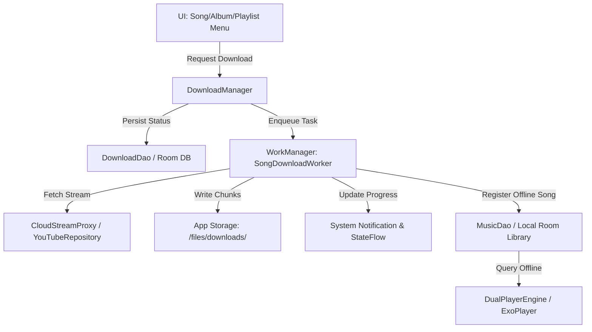

# Offline Download Manager Design Spec

**Date**: 2026-08-21  
**Status**: Approved  
**Topic**: Full-fledged Offline Download Manager for PixelPlayer  

---

## 1. Overview & Purpose
Provides PixelPlayer with complete offline downloading capabilities for online tracks (YouTube Music, Navidrome, Jellyfin), allowing users to download songs, albums, and playlists with one tap, manage storage, select bitrates, and play offline with zero internet dependency.

---

## 2. Architecture & Components

### Components:
1. **`DownloadTaskEntity` / `DownloadDao`**:
   - Room database entity storing metadata, progress, state (`QUEUED`, `DOWNLOADING`, `COMPLETED`, `PAUSED`, `FAILED`), downloaded bytes, total bytes, and local file path.
2. **`SongDownloadWorker`**:
   - `androidx.work.CoroutineWorker` managing chunked streaming download, SHA verification, notification updates, and error recovery.
3. **`DownloadRepository` / `DownloadManager`**:
   - Singleton managing queue prioritization, batch cancellation, deletion of downloaded files, and storage footprint calculations.
4. **`DownloadPreferences`**:
   - DataStore preference keys for `download_quality` (`SAVER`, `STANDARD`, `HIGH`), and `download_wifi_only` (`Boolean`).
5. **UI Layer**:
   - Download icons on song items, album details, and playlist menus.
   - Live download progress indicator in Compose.
   - Dedicated **Downloads Screen** in Library.
   - Integration with existing `StorageFilter.OFFLINE`.

---

## 3. Data Schema

### `download_tasks` Table:
* `id`: `String` (PrimaryKey, e.g. `youtube_videoId`, `navidrome_songId`)
* `title`: `String`
* `artist`: `String`
* `album`: `String`
* `artwork_url`: `String?`
* `duration_ms`: `Long`
* `file_path`: `String`
* `file_size_bytes`: `Long`
* `downloaded_bytes`: `Long`
* `status`: `String` (`QUEUED`, `DOWNLOADING`, `COMPLETED`, `FAILED`, `PAUSED`)
* `quality_bitrate`: `Int`
* `created_at`: `Long`
* `completed_at`: `Long?`

---

## 4. WorkManager & Worker Execution Flow

1. User clicks **"Download"** on a song / album / playlist.
2. `DownloadManager.enqueueSongDownload(song)` inserts record into `DownloadDao` with state `QUEUED`.
3. `WorkManager` schedules `SongDownloadWorker` with `NetworkType.CONNECTED` (or `UNMETERED` if Wi-Fi only) and `StorageNotLow`.
4. The worker streams the file using `OkHttpClient`, writes to `context.filesDir/downloads/{id}.m4a`, updates progress periodically (throttled to 250ms), and updates both the Android notification and `DownloadDao`.
5. Upon completion, `SongDownloadWorker` registers the song in `MusicDao` with `sourceType = LOCAL`, `contentUriString = file://{path}`, and `filePath = {path}` so it immediately appears in offline searches and the Offline library tab.

---

## 5. Verification Plan

* **Unit Tests**:
  * `DownloadDaoTest`: verify insertion, status updates, progress updates, and deletion.
  * `DownloadManagerTest`: verify single song, album, and playlist download enqueueing.
  * `SongDownloadWorkerTest`: verify mock stream reading, file write, and completion state.
* **Build Verification**:
  * Run `./gradlew --no-daemon testDebugUnitTest`
  * Run `./gradlew --no-daemon assembleDebug`
  * Install APK on connected device via `adb` and verify download + offline playback.
