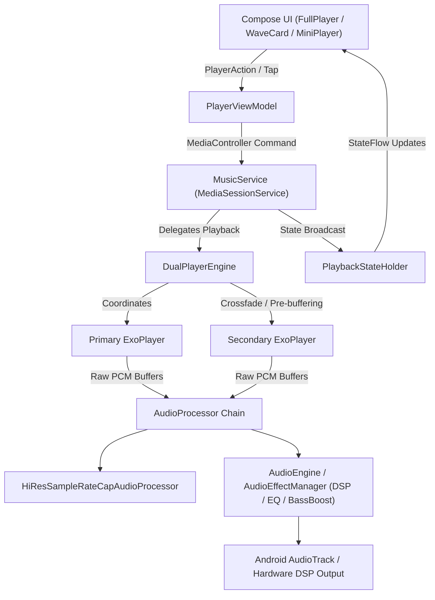
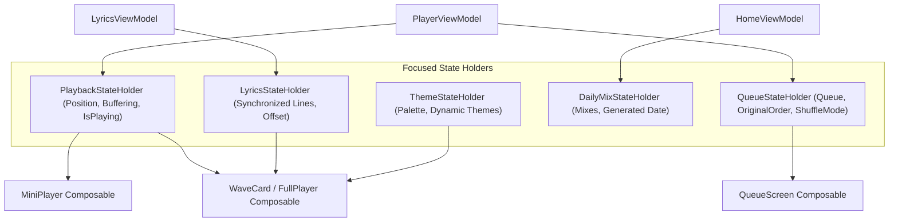
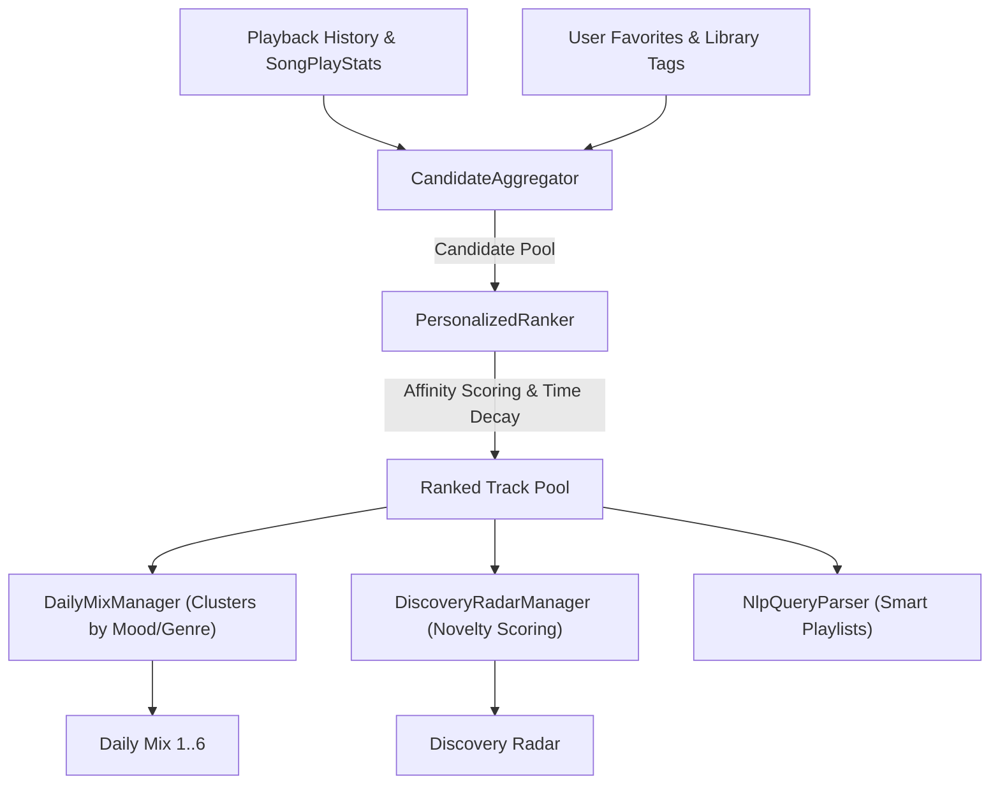

# Tonarc (PixelPlayer OSS) - Complete Human Codebase Index

> Authoritative engineering guide, architectural blueprint, and comprehensive file index for the Tonarc (PixelPlayer OSS) codebase.
>
> Every file in the repository is documented with its architectural layer, primary responsibilities, key symbols, and relationships.

---

## Table of Contents
- [1. Architectural Overview & Mental Model](#1-architectural-overview--mental-model)
- [2. System Architecture & Data Flow Diagrams](#2-system-architecture--data-flow-diagrams)
  - [2.1 Audio Playback Engine Pipeline](#21-audio-playback-engine-pipeline)
  - [2.2 Data Ingestion, Storage & Sync](#22-data-ingestion-storage--sync)
  - [2.3 UI State Management & Presentation Flow](#23-ui-state-management--presentation-flow)
  - [2.4 Cloud Streaming & Remote Integrations](#24-cloud-streaming--remote-integrations)
  - [2.5 Recommendation & Smart Playlist Pipeline](#25-recommendation--smart-playlist-pipeline)
- [3. Package-by-Package File Catalog](#3-package-by-package-file-catalog)
  - [3.1 Application Root & Entry Points (`com.quietrays.tonarc`)](#31-application-root--entry-points)
  - [3.2 Audio Engine & Playback Service (`data/service/`)](#32-audio-engine--playback-service)
  - [3.3 Equalizer & Audio DSP Pipeline (`data/equalizer/`)](#33-equalizer--audio-dsp-pipeline)
  - [3.4 Database & Persistence Subsystem (`data/database/`)](#34-database--persistence-subsystem)
  - [3.5 Cloud Providers & Network Streaming (`data/youtube/`, `data/navidrome/`, `data/jellyfin/`, `data/spotify/`, `data/network/`)](#35-cloud-providers--network-streaming)
  - [3.6 Stream Caching & Offline Storage (`data/stream/`, `data/cache/`, `data/offline/`)](#36-stream-caching--offline-storage)
  - [3.7 Media Ingestion & Metadata Scanning (`data/media/`, `data/library/`, `data/observer/`, `data/paging/`)](#37-media-ingestion--metadata-scanning)
  - [3.8 Recommendation Engine & Smart Mixes (`data/recommendation/`, `data/playlist/`, `data/playlist/nlp/`)](#38-recommendation-engine--smart-mixes)
  - [3.9 User Preferences & DataStore (`data/preferences/`)](#39-user-preferences--datastore)
  - [3.10 Repositories & Data Access Layer (`data/repository/`, `data/model/`, `data/provider/`)](#310-repositories--data-access-layer)
  - [3.11 Background Tasks & WorkManager (`data/worker/`)](#311-background-tasks--workmanager)
  - [3.12 Backup & Restore Subsystem (`data/backup/`)](#312-backup--restore-subsystem)
  - [3.13 Dependency Injection (`di/`)](#313-dependency-injection)
  - [3.14 Presentation: Navigation & Routing (`presentation/navigation/`)](#314-presentation-navigation--routing)
  - [3.15 Presentation: State Holders & ViewModels (`presentation/viewmodel/`)](#315-presentation-state-holders--viewmodels)
  - [3.16 Presentation: Screens (`presentation/screens/`)](#316-presentation-screens)
  - [3.17 Presentation: Cloud Auth & Dashboards (`presentation/youtube/`, `presentation/spotify/`, `presentation/navidrome/`, `presentation/jellyfin/`)](#317-presentation-cloud-auth--dashboards)
  - [3.18 Presentation: UI Component Library (`presentation/components/`)](#318-presentation-ui-component-library)
  - [3.19 Presentation: Audio Visualizers (`presentation/visualizer/`)](#319-presentation-audio-visualizers)
  - [3.20 UI Theming, Shapes & Design Tokens (`ui/theme/`, `utils/shapes/`)](#320-ui-theming-shapes--design-tokens)
  - [3.21 Glance App Widgets (`ui/glancewidget/`)](#321-glance-app-widgets)
  - [3.22 Utilities & Infrastructure Helpers (`utils/`)](#322-utilities--infrastructure-helpers)
- [4. Project Configuration & Build Scripts](#4-project-configuration--build-scripts)
- [5. Test Suite Architecture & Verification](#5-test-suite-architecture--verification)
- [6. Engineering Conventions & Development Workflows](#6-engineering-conventions--development-workflows)

---

## 1. Architectural Overview & Mental Model

Tonarc (PixelPlayer OSS) is an advanced, offline-first Material 3 Android music player engineered for audiophiles and power users. It combines rich local library playback with deep integration into cloud and self-hosted streaming ecosystems (YouTube Music, Navidrome/Subsonic, Jellyfin, and Spotify playlist imports).

### Core Principles
1. **Offline-First Reactive Core**: All library data is cached locally in SQLite via Room. UI components observe reactive Kotlin `StateFlow` streams. Any background sync (MediaStore scans, cloud fetching) updates the database, which automatically emits updates to active screens.
2. **Decoupled Audio Pipeline**: Playback is hosted inside AndroidX Media3 `MusicService`, completely decoupled from the UI process lifecycle. Even if the UI is completely destroyed by Android during memory pressure, audio playback and session controls continue unhindered.
3. **Dual-Player Engine**: Instead of relying on standard ExoPlayer track transition events, `DualPlayerEngine` maintains two independent player instances to achieve true seamless crossfading, sample-rate capping for Hi-Res audio, and gapless transitions.
4. **Unidirectional Data Flow (UDF) with Dedicated StateHolders**: To avoid monolithic, bloated ViewModels that trigger expensive recompositions, state is partitioned into specialized state holders (`PlaybackStateHolder`, `LyricsStateHolder`, `QueueStateHolder`, `DailyMixStateHolder`).
5. **Material 3 Expressive Design**: Fully fluid, gesture-driven Compose interface supporting dynamic color extraction from album art, stadium-shaped floating navigation bars, swipeable song actions, and glanceable home screen widgets.

---

## 2. System Architecture & Data Flow Diagrams

### 2.1 Audio Playback Engine Pipeline

The playback pipeline coordinates user gestures from Jetpack Compose UI down to low-level Android AudioTrack rendering:



### 2.2 Data Ingestion, Storage & Sync

The data layer manages ingestion from local MediaStore and remote cloud servers into Room SQLite:

```mermaid
flowchart LR
    subgraph Sources [Data Sources]
        MS_SRC["Android MediaStore"]
        YT_SRC["YouTube Music Innertube"]
        ND_SRC["Navidrome Subsonic API"]
        JF_SRC["Jellyfin Client API"]
    end
    subgraph Ingestion [Ingestion & Workers]
        SCAN["MediaStoreScanner"]
        WORK["WorkManager (CloudSyncCoordinator)"]
    end
    subgraph Persistence [Persistence Layer]
        DB[("TonarcDatabase (Room SQLite)")]
        FTS[("SongFts (FTS4 Search Index)")]
        DS[("UserPreferencesDataStore")]
    end
    subgraph Repos [Repositories]
        SR["SongRepository"]
        PR["PlaylistRepository"]
        CR["CloudRepository"]
    end
    Sources --> Ingestion
    Ingestion --> Persistence
    Persistence --> Repos
    Repos -->|Reactive Flow| VM["Presentation ViewModels"]
```



### 2.3 UI State Management & Presentation Flow

State is strictly decoupled into dedicated, focused holders to optimize Compose recomposition performance:



### 2.4 Cloud Streaming & Remote Integrations

Cloud streaming routes remote streams through a localhost proxy for seamless disk caching and format translation:

```mermaid
flowchart TD
    Remote["Remote Audio Stream (YouTube / Navidrome / Jellyfin)"] --> CSP["CloudStreamProxy (Localhost HTTP Server)"]
    CSP --> SDC["StreamDiskCache (Chunked Cache Storage)"]
    CSP --> SEC["CloudStreamSecurity (Loopback Auth Token)"]
    CSP -->|Stream URL (http://127.0.0.1:port/...)| ExoPlayer["ExoPlayer DataSource"]
    ExoPlayer --> Decoders["MediaCodec / FFmpeg Audio Decoders"]
```

### 2.5 Recommendation & Smart Playlist Pipeline

The on-device recommendation pipeline generates personalized mixes without sending private data to cloud servers:



---

## 3. Package-by-Package File Catalog

### 3.1 Application Root & Entry Points (`com.quietrays.tonarc`)

> Core Android components and top-level Activity entry points for the application. Coordinates app initialization, logging configuration, and root Compose UI scaffolding.

**Total files:** 5

- [ExternalPlayerActivity.kt](file:///home/dharshan/PixelPlayerOSS/app/src/main/java/com/quietrays/tonarc/ExternalPlayerActivity.kt) ([`ExternalPlayerActivity`](file:///home/dharshan/PixelPlayerOSS/app/src/main/java/com/quietrays/tonarc/ExternalPlayerActivity.kt)) - **Helper / Utility**
  Dedicated lightweight Activity invoked when Tonarc handles external VIEW/AUDIO intents from third-party file managers or web browsers. Manages standalone playback without loading the full library UI.

- [MainActivity.kt](file:///home/dharshan/PixelPlayerOSS/app/src/main/java/com/quietrays/tonarc/MainActivity.kt) ([`BottomNavItem`](file:///home/dharshan/PixelPlayerOSS/app/src/main/java/com/quietrays/tonarc/MainActivity.kt)) - **Helper / Utility**
  Primary application Activity. Hosts the root Jetpack Compose hierarchy, top-level Scaffold, bottom navigation bar (supporting Default, Full Width, and Floating Pill styles), expandable bottom sheet player (MiniPlayer and FullPlayer/WaveCardPlayer), back handling, and system insets coordination.

- [MainActivityIntentContract.kt](file:///home/dharshan/PixelPlayerOSS/app/src/main/java/com/quietrays/tonarc/MainActivityIntentContract.kt) ([`MainActivityIntentContract`](file:///home/dharshan/PixelPlayerOSS/app/src/main/java/com/quietrays/tonarc/MainActivityIntentContract.kt)) - **Helper / Utility**
  Intent contract defining action constants and extras passed between background services/widgets and MainActivity (e.g. expanding player, opening specific playlists).

- [ReleaseTree.kt](file:///home/dharshan/PixelPlayerOSS/app/src/main/java/com/quietrays/tonarc/ReleaseTree.kt) ([`ReleaseTree`](file:///home/dharshan/PixelPlayerOSS/app/src/main/java/com/quietrays/tonarc/ReleaseTree.kt)) - **Helper / Utility**
  Timber logging tree used in release builds. Filters out debug/verbose logs, strips sensitive information, and only logs warnings, errors, and fatal exceptions.

- [TonarcApplication.kt](file:///home/dharshan/PixelPlayerOSS/app/src/main/java/com/quietrays/tonarc/TonarcApplication.kt) ([`TonarcApplication`](file:///home/dharshan/PixelPlayerOSS/app/src/main/java/com/quietrays/tonarc/TonarcApplication.kt)) - **Helper / Utility**
  Application entry point. Initializes Dagger Hilt dependency injection, Timber logging (with ReleaseTree for release builds), notification channels for audio playback and offline downloads, WorkManager configuration, and dynamic color/theme bootstrapping.

---

### 3.2 Audio Engine & Playback Service (`data/service/`)

> The audio playback engine implemented on top of AndroidX Media3. Houses `MusicService` (MediaSessionService), `DualPlayerEngine` (dual ExoPlayer coordination for gapless and crossfade playback), audio processors, decoders, and Quick Settings tile services.

**Total files:** 21

#### Package: `com.quietrays.tonarc.data.service` (10 files)

- [CoilBitmapLoader.kt](file:///home/dharshan/PixelPlayerOSS/app/src/main/java/com/quietrays/tonarc/data/service/CoilBitmapLoader.kt) ([`CoilBitmapLoader`](file:///home/dharshan/PixelPlayerOSS/app/src/main/java/com/quietrays/tonarc/data/service/CoilBitmapLoader.kt)) - **Helper / Utility**
  Defines domain class CoilBitmapLoader for managing CoilBitmapLoader operations in the data/service layer.

- [LocalOnlyMediaNotificationProvider.kt](file:///home/dharshan/PixelPlayerOSS/app/src/main/java/com/quietrays/tonarc/data/service/LocalOnlyMediaNotificationProvider.kt) ([`LocalOnlyMediaNotificationProvider`](file:///home/dharshan/PixelPlayerOSS/app/src/main/java/com/quietrays/tonarc/data/service/LocalOnlyMediaNotificationProvider.kt)) - **Helper / Utility**
  Wraps Media3's default provider and marks playback notifications as local-only.

- [MusicNotificationProvider.kt](file:///home/dharshan/PixelPlayerOSS/app/src/main/java/com/quietrays/tonarc/data/service/MusicNotificationProvider.kt) ([`MusicNotificationProvider`](file:///home/dharshan/PixelPlayerOSS/app/src/main/java/com/quietrays/tonarc/data/service/MusicNotificationProvider.kt)) - **Helper / Utility**
  Builds and maintains MediaStyle playback notifications with custom action buttons, seek bar progress, and dynamic palette-colored backgrounds.

- [MusicService.kt](file:///home/dharshan/PixelPlayerOSS/app/src/main/java/com/quietrays/tonarc/data/service/MusicService.kt) ([`MusicService`](file:///home/dharshan/PixelPlayerOSS/app/src/main/java/com/quietrays/tonarc/data/service/MusicService.kt)) - **Android Background Service**
  Core AndroidX Media3 MediaSessionService. Manages the lifecycle of the MediaSession, coordinates playback commands from MediaControllers (system notifications, Android Auto, Wear OS, widgets, UI), integrates with DualPlayerEngine, and handles audio focus changes.

- [PlaybackActivityTracker.kt](file:///home/dharshan/PixelPlayerOSS/app/src/main/java/com/quietrays/tonarc/data/service/PlaybackActivityTracker.kt) ([`PlaybackActivityTracker`](file:///home/dharshan/PixelPlayerOSS/app/src/main/java/com/quietrays/tonarc/data/service/PlaybackActivityTracker.kt)) - **Helper / Utility**
  Tracks audio playback sessions, listening durations, and scrobble eligibility (e.g. track played for >50% or 4 minutes).

- [PlaybackTimerController.kt](file:///home/dharshan/PixelPlayerOSS/app/src/main/java/com/quietrays/tonarc/data/service/PlaybackTimerController.kt) ([`SleepTimerAlarmScheduler`](file:///home/dharshan/PixelPlayerOSS/app/src/main/java/com/quietrays/tonarc/data/service/PlaybackTimerController.kt)) - **Helper / Utility**
  Schedules and cancels the OS alarm backing the duration sleep timer.

- [ReplayGainProcessor.kt](file:///home/dharshan/PixelPlayerOSS/app/src/main/java/com/quietrays/tonarc/data/service/ReplayGainProcessor.kt) ([`ReplayGainProcessor`](file:///home/dharshan/PixelPlayerOSS/app/src/main/java/com/quietrays/tonarc/data/service/ReplayGainProcessor.kt)) - **Audio DSP / Playback Processor**
  Owns all ReplayGain volume-normalization state and logic, extracted from [MusicService].

- [SleepTimerReceiver.kt](file:///home/dharshan/PixelPlayerOSS/app/src/main/java/com/quietrays/tonarc/data/service/SleepTimerReceiver.kt) ([`SleepTimerReceiver`](file:///home/dharshan/PixelPlayerOSS/app/src/main/java/com/quietrays/tonarc/data/service/SleepTimerReceiver.kt)) - **Helper / Utility**
  Defines domain class SleepTimerReceiver for managing SleepTimerReceiver operations in the data/service layer.

- [TonarcMediaButtonReceiver.kt](file:///home/dharshan/PixelPlayerOSS/app/src/main/java/com/quietrays/tonarc/data/service/TonarcMediaButtonReceiver.kt) ([`TonarcMediaButtonReceiver`](file:///home/dharshan/PixelPlayerOSS/app/src/main/java/com/quietrays/tonarc/data/service/TonarcMediaButtonReceiver.kt)) - **Helper / Utility**
  Defines domain class TonarcMediaButtonReceiver for managing TonarcMediaButtonReceiver operations in the data/service layer.

- [TrustedMediaItemsResolution.kt](file:///home/dharshan/PixelPlayerOSS/app/src/main/java/com/quietrays/tonarc/data/service/TrustedMediaItemsResolution.kt) - **Helper / Utility**
  Core implementation file for TrustedMediaItemsResolution in package data/service.

#### Package: `com.quietrays.tonarc.data.service.player` (8 files)

- [AudioDecoderPolicy.kt](file:///home/dharshan/PixelPlayerOSS/app/src/main/java/com/quietrays/tonarc/data/service/player/AudioDecoderPolicy.kt) - **Helper / Utility**
  Configures decoder priority, hardware acceleration flags, and fallback mechanisms for various audio formats (FLAC, ALAC, Opus, AAC, MP3).

- [DualPlayerEngine.kt](file:///home/dharshan/PixelPlayerOSS/app/src/main/java/com/quietrays/tonarc/data/service/player/DualPlayerEngine.kt) ([`ActiveDecoderInfo`](file:///home/dharshan/PixelPlayerOSS/app/src/main/java/com/quietrays/tonarc/data/service/player/DualPlayerEngine.kt)) - **Audio DSP / Playback Processor**
  Advanced dual ExoPlayer playback coordinator. Maintains two active ExoPlayer instances to achieve seamless gapless playback, crossfading between tracks, dynamic pre-buffering, and transparent switching between local and remote stream sources.

- [HiFiCapabilityChecker.kt](file:///home/dharshan/PixelPlayerOSS/app/src/main/java/com/quietrays/tonarc/data/service/player/HiFiCapabilityChecker.kt) ([`HiFiCapabilityChecker`](file:///home/dharshan/PixelPlayerOSS/app/src/main/java/com/quietrays/tonarc/data/service/player/HiFiCapabilityChecker.kt)) - **Helper / Utility**
  Queries Android AudioManager and AudioDeviceInfo to determine hardware capabilities for high-resolution audio output (24-bit/96kHz+, direct PCM, bit-perfect playback).

- [HiResSampleRateCapAudioProcessor.kt](file:///home/dharshan/PixelPlayerOSS/app/src/main/java/com/quietrays/tonarc/data/service/player/HiResSampleRateCapAudioProcessor.kt) ([`HiResSampleRateCapAudioProcessor`](file:///home/dharshan/PixelPlayerOSS/app/src/main/java/com/quietrays/tonarc/data/service/player/HiResSampleRateCapAudioProcessor.kt)) - **Audio DSP / Playback Processor**
  Custom ExoPlayer AudioProcessor that caps or resamples ultra-high sample rates when hardware direct output is unavailable or unsupported.

- [MappingPlayer.kt](file:///home/dharshan/PixelPlayerOSS/app/src/main/java/com/quietrays/tonarc/data/service/player/MappingPlayer.kt) ([`MappingPlayer`](file:///home/dharshan/PixelPlayerOSS/app/src/main/java/com/quietrays/tonarc/data/service/player/MappingPlayer.kt)) - **Helper / Utility**
  Custom ForwardingPlayer wrapper mapping MediaItem IDs and metadata between internal database song representations and Media3 media items.

- [SmartCrossfadePlanner.kt](file:///home/dharshan/PixelPlayerOSS/app/src/main/java/com/quietrays/tonarc/data/service/player/SmartCrossfadePlanner.kt) ([`BpmCompatibility`](file:///home/dharshan/PixelPlayerOSS/app/src/main/java/com/quietrays/tonarc/data/service/player/SmartCrossfadePlanner.kt)) - **Helper / Utility**
  How the outgoing and incoming tracks' tempos relate, after octave folding.

- [SurroundDownmixProcessor.kt](file:///home/dharshan/PixelPlayerOSS/app/src/main/java/com/quietrays/tonarc/data/service/player/SurroundDownmixProcessor.kt) ([`SurroundDownmixProcessor`](file:///home/dharshan/PixelPlayerOSS/app/src/main/java/com/quietrays/tonarc/data/service/player/SurroundDownmixProcessor.kt)) - **Audio DSP / Playback Processor**
  An [AudioProcessor] that downmixes 5.1 (6-channel) and 7.1 (8-channel) surround audio to stereo (2-channel) PCM using the standard Dolby downmix matrix coefficients.

- [TransitionController.kt](file:///home/dharshan/PixelPlayerOSS/app/src/main/java/com/quietrays/tonarc/data/service/player/TransitionController.kt) ([`TransitionController`](file:///home/dharshan/PixelPlayerOSS/app/src/main/java/com/quietrays/tonarc/data/service/player/TransitionController.kt)) - **Helper / Utility**
  Orchestrates song transitions by observing the player state and commanding the DualPlayerEngine.

#### Package: `com.quietrays.tonarc.data.service.tile` (3 files)

- [LastPlaylistTileService.kt](file:///home/dharshan/PixelPlayerOSS/app/src/main/java/com/quietrays/tonarc/data/service/tile/LastPlaylistTileService.kt) ([`LastPlaylistTileService`](file:///home/dharshan/PixelPlayerOSS/app/src/main/java/com/quietrays/tonarc/data/service/tile/LastPlaylistTileService.kt)) - **Network / API Service**
  Android Quick Settings tile service that resumes the user's most recently played playlist with a single tap.

- [ShuffleAllTileService.kt](file:///home/dharshan/PixelPlayerOSS/app/src/main/java/com/quietrays/tonarc/data/service/tile/ShuffleAllTileService.kt) ([`ShuffleAllTileService`](file:///home/dharshan/PixelPlayerOSS/app/src/main/java/com/quietrays/tonarc/data/service/tile/ShuffleAllTileService.kt)) - **Network / API Service**
  Android Quick Settings tile service allowing users to immediately shuffle play all library songs from the notification shade.

- [TileServiceCompat.kt](file:///home/dharshan/PixelPlayerOSS/app/src/main/java/com/quietrays/tonarc/data/service/tile/TileServiceCompat.kt) - **Network / API Service**
  Base compatibility helper for Android Quick Settings tile services.

---

### 3.3 Equalizer & Audio DSP Pipeline (`data/equalizer/`)

> Digital Signal Processing (DSP) subsystem managing hardware and software audio effects, graphic equalizer bands, bass boost, virtualizer, and loudness enhancement.

**Total files:** 3

- [EqualizerManager.kt](file:///home/dharshan/PixelPlayerOSS/app/src/main/java/com/quietrays/tonarc/data/equalizer/EqualizerManager.kt) ([`EqualizerManager`](file:///home/dharshan/PixelPlayerOSS/app/src/main/java/com/quietrays/tonarc/data/equalizer/EqualizerManager.kt)) - **Business Logic Manager / Engine**
  Manages Android's built-in audio effects (Equalizer, BassBoost, Virtualizer).

- [EqualizerPreset.kt](file:///home/dharshan/PixelPlayerOSS/app/src/main/java/com/quietrays/tonarc/data/equalizer/EqualizerPreset.kt) ([`EqualizerPreset`](file:///home/dharshan/PixelPlayerOSS/app/src/main/java/com/quietrays/tonarc/data/equalizer/EqualizerPreset.kt)) - **Helper / Utility**
  Represents an equalizer preset with predefined band values.

- [ExternalAudioEffectSession.kt](file:///home/dharshan/PixelPlayerOSS/app/src/main/java/com/quietrays/tonarc/data/equalizer/ExternalAudioEffectSession.kt) ([`ExternalAudioEffectSession`](file:///home/dharshan/PixelPlayerOSS/app/src/main/java/com/quietrays/tonarc/data/equalizer/ExternalAudioEffectSession.kt)) - **Helper / Utility**
  Announces the player's audio session to external audio effect apps (ViPER4Android, JamesDSP, Wavelet, the OEM "audio effects" panel, ...).

---

### 3.4 Database & Persistence Subsystem (`data/database/`)

> Room SQLite persistence engine. Defines the `TonarcDatabase`, incremental migrations (`Migrations.kt`), FTS4 virtual tables for fast search, and over 40 DAOs and entities covering songs, playlists, artists, albums, lyrics, and scrobble queues.

**Total files:** 43

- [AlbumArtThemeDao.kt](file:///home/dharshan/PixelPlayerOSS/app/src/main/java/com/quietrays/tonarc/data/database/AlbumArtThemeDao.kt) ([`AlbumArtThemeDao`](file:///home/dharshan/PixelPlayerOSS/app/src/main/java/com/quietrays/tonarc/data/database/AlbumArtThemeDao.kt)) - **Helper / Utility**
  DAO caching extracted color schemes and dominant palettes for album artworks.

- [AlbumArtThemeEntity.kt](file:///home/dharshan/PixelPlayerOSS/app/src/main/java/com/quietrays/tonarc/data/database/AlbumArtThemeEntity.kt) ([`StoredColorSchemeValues`](file:///home/dharshan/PixelPlayerOSS/app/src/main/java/com/quietrays/tonarc/data/database/AlbumArtThemeEntity.kt)) - **Helper / Utility**
  Room SQLite database entity defining schema, columns, and foreign key relationships for AlbumArtTheme records.

- [AlbumEntity.kt](file:///home/dharshan/PixelPlayerOSS/app/src/main/java/com/quietrays/tonarc/data/database/AlbumEntity.kt) ([`AlbumEntity`](file:///home/dharshan/PixelPlayerOSS/app/src/main/java/com/quietrays/tonarc/data/database/AlbumEntity.kt)) - **Helper / Utility**
  Room SQLite database entity defining schema, columns, and foreign key relationships for Album records.

- [ArtistEntity.kt](file:///home/dharshan/PixelPlayerOSS/app/src/main/java/com/quietrays/tonarc/data/database/ArtistEntity.kt) ([`ArtistEntity`](file:///home/dharshan/PixelPlayerOSS/app/src/main/java/com/quietrays/tonarc/data/database/ArtistEntity.kt)) - **Helper / Utility**
  Room SQLite database entity defining schema, columns, and foreign key relationships for Artist records.

- [AudioBookmarkDao.kt](file:///home/dharshan/PixelPlayerOSS/app/src/main/java/com/quietrays/tonarc/data/database/AudioBookmarkDao.kt) ([`AudioBookmarkDao`](file:///home/dharshan/PixelPlayerOSS/app/src/main/java/com/quietrays/tonarc/data/database/AudioBookmarkDao.kt)) - **Helper / Utility**
  DAO storing timestamps, titles, and notes for user-created audio bookmarks within tracks.

- [AudioBookmarkEntity.kt](file:///home/dharshan/PixelPlayerOSS/app/src/main/java/com/quietrays/tonarc/data/database/AudioBookmarkEntity.kt) ([`AudioBookmarkEntity`](file:///home/dharshan/PixelPlayerOSS/app/src/main/java/com/quietrays/tonarc/data/database/AudioBookmarkEntity.kt)) - **Helper / Utility**
  Room SQLite database entity defining schema, columns, and foreign key relationships for AudioBookmark records.

- [ColorConverters.kt](file:///home/dharshan/PixelPlayerOSS/app/src/main/java/com/quietrays/tonarc/data/database/ColorConverters.kt) - **Helper / Utility**
  Core implementation file for ColorConverters in package data/database.

- [EngagementDao.kt](file:///home/dharshan/PixelPlayerOSS/app/src/main/java/com/quietrays/tonarc/data/database/EngagementDao.kt) ([`EngagementDao`](file:///home/dharshan/PixelPlayerOSS/app/src/main/java/com/quietrays/tonarc/data/database/EngagementDao.kt)) - **Helper / Utility**
  DAO for song engagement statistics.

- [FavoritesDao.kt](file:///home/dharshan/PixelPlayerOSS/app/src/main/java/com/quietrays/tonarc/data/database/FavoritesDao.kt) ([`FavoritesDao`](file:///home/dharshan/PixelPlayerOSS/app/src/main/java/com/quietrays/tonarc/data/database/FavoritesDao.kt)) - **Helper / Utility**
  Data Access Object providing Room database query and transaction methods for Favorites records.

- [FavoritesEntity.kt](file:///home/dharshan/PixelPlayerOSS/app/src/main/java/com/quietrays/tonarc/data/database/FavoritesEntity.kt) ([`FavoritesEntity`](file:///home/dharshan/PixelPlayerOSS/app/src/main/java/com/quietrays/tonarc/data/database/FavoritesEntity.kt)) - **Helper / Utility**
  Room SQLite database entity defining schema, columns, and foreign key relationships for Favorites records.

- [FolderSongRow.kt](file:///home/dharshan/PixelPlayerOSS/app/src/main/java/com/quietrays/tonarc/data/database/FolderSongRow.kt) ([`FolderSongRow`](file:///home/dharshan/PixelPlayerOSS/app/src/main/java/com/quietrays/tonarc/data/database/FolderSongRow.kt)) - **Helper / Utility**
  Minimal projection used to build the folder tree without loading full song rows.

- [ItemCooccurrenceDao.kt](file:///home/dharshan/PixelPlayerOSS/app/src/main/java/com/quietrays/tonarc/data/database/ItemCooccurrenceDao.kt) ([`ItemCooccurrenceDao`](file:///home/dharshan/PixelPlayerOSS/app/src/main/java/com/quietrays/tonarc/data/database/ItemCooccurrenceDao.kt)) - **Helper / Utility**
  DAO for recording and querying on-device pairwise item co-occurrence graphs.

- [ItemCooccurrenceEntity.kt](file:///home/dharshan/PixelPlayerOSS/app/src/main/java/com/quietrays/tonarc/data/database/ItemCooccurrenceEntity.kt) ([`ItemCooccurrenceEntity`](file:///home/dharshan/PixelPlayerOSS/app/src/main/java/com/quietrays/tonarc/data/database/ItemCooccurrenceEntity.kt)) - **Helper / Utility**
  Room entity tracking pairwise co-occurrence frequencies of songs played in proximity during user listening sessions (on-device prod2vec sparse graph).

- [JellyfinDao.kt](file:///home/dharshan/PixelPlayerOSS/app/src/main/java/com/quietrays/tonarc/data/database/JellyfinDao.kt) ([`JellyfinDao`](file:///home/dharshan/PixelPlayerOSS/app/src/main/java/com/quietrays/tonarc/data/database/JellyfinDao.kt)) - **Helper / Utility**
  DAO for Jellyfin-specific cached libraries, servers, and mapped item IDs.

- [JellyfinPlaylistEntity.kt](file:///home/dharshan/PixelPlayerOSS/app/src/main/java/com/quietrays/tonarc/data/database/JellyfinPlaylistEntity.kt) ([`JellyfinPlaylistEntity`](file:///home/dharshan/PixelPlayerOSS/app/src/main/java/com/quietrays/tonarc/data/database/JellyfinPlaylistEntity.kt)) - **Helper / Utility**
  Room SQLite database entity defining schema, columns, and foreign key relationships for JellyfinPlaylist records.

- [JellyfinSongEntity.kt](file:///home/dharshan/PixelPlayerOSS/app/src/main/java/com/quietrays/tonarc/data/database/JellyfinSongEntity.kt) ([`JellyfinSongEntity`](file:///home/dharshan/PixelPlayerOSS/app/src/main/java/com/quietrays/tonarc/data/database/JellyfinSongEntity.kt)) - **Helper / Utility**
  Room SQLite database entity defining schema, columns, and foreign key relationships for JellyfinSong records.

- [ListenBrainzDao.kt](file:///home/dharshan/PixelPlayerOSS/app/src/main/java/com/quietrays/tonarc/data/database/ListenBrainzDao.kt) ([`ListenBrainzDao`](file:///home/dharshan/PixelPlayerOSS/app/src/main/java/com/quietrays/tonarc/data/database/ListenBrainzDao.kt)) - **Helper / Utility**
  DAO managing queued, failed, and submitted ListenBrainz scrobble records.

- [ListenBrainzPendingListenEntity.kt](file:///home/dharshan/PixelPlayerOSS/app/src/main/java/com/quietrays/tonarc/data/database/ListenBrainzPendingListenEntity.kt) ([`ListenBrainzPendingListenEntity`](file:///home/dharshan/PixelPlayerOSS/app/src/main/java/com/quietrays/tonarc/data/database/ListenBrainzPendingListenEntity.kt)) - **Helper / Utility**
  A listen awaiting submission to ListenBrainz.

- [LocalPlaylistDao.kt](file:///home/dharshan/PixelPlayerOSS/app/src/main/java/com/quietrays/tonarc/data/database/LocalPlaylistDao.kt) ([`LocalPlaylistDao`](file:///home/dharshan/PixelPlayerOSS/app/src/main/java/com/quietrays/tonarc/data/database/LocalPlaylistDao.kt)) - **Helper / Utility**
  Data Access Object providing Room database query and transaction methods for LocalPlaylist records.

- [LyricsDao.kt](file:///home/dharshan/PixelPlayerOSS/app/src/main/java/com/quietrays/tonarc/data/database/LyricsDao.kt) ([`LyricsDao`](file:///home/dharshan/PixelPlayerOSS/app/src/main/java/com/quietrays/tonarc/data/database/LyricsDao.kt)) - **Helper / Utility**
  DAO for cached and synchronized lyrics lines associated with tracks.

- [LyricsEntity.kt](file:///home/dharshan/PixelPlayerOSS/app/src/main/java/com/quietrays/tonarc/data/database/LyricsEntity.kt) ([`LyricsEntity`](file:///home/dharshan/PixelPlayerOSS/app/src/main/java/com/quietrays/tonarc/data/database/LyricsEntity.kt)) - **Helper / Utility**
  Room SQLite database entity defining schema, columns, and foreign key relationships for Lyrics records.

- [Migrations.kt](file:///home/dharshan/PixelPlayerOSS/app/src/main/java/com/quietrays/tonarc/data/database/Migrations.kt) - **Helper / Utility**
  Sequential database schema migrations. Ensures zero data loss across schema updates with incremental SQL migrations and schema verification.

- [MusicDao.kt](file:///home/dharshan/PixelPlayerOSS/app/src/main/java/com/quietrays/tonarc/data/database/MusicDao.kt) ([`DeviceCapabilitySongRow`](file:///home/dharshan/PixelPlayerOSS/app/src/main/java/com/quietrays/tonarc/data/database/MusicDao.kt)) - **Helper / Utility**
  Primary Data Access Object for local songs, albums, artists, genres, and playlists. Provides reactive Kotlin Flow queries for library screens.

- [NavidromeDao.kt](file:///home/dharshan/PixelPlayerOSS/app/src/main/java/com/quietrays/tonarc/data/database/NavidromeDao.kt) ([`NavidromeDao`](file:///home/dharshan/PixelPlayerOSS/app/src/main/java/com/quietrays/tonarc/data/database/NavidromeDao.kt)) - **Helper / Utility**
  DAO for Navidrome/Subsonic server configurations, scanned folders, and remote track caches.

- [NavidromePlaylistEntity.kt](file:///home/dharshan/PixelPlayerOSS/app/src/main/java/com/quietrays/tonarc/data/database/NavidromePlaylistEntity.kt) ([`NavidromePlaylistEntity`](file:///home/dharshan/PixelPlayerOSS/app/src/main/java/com/quietrays/tonarc/data/database/NavidromePlaylistEntity.kt)) - **Helper / Utility**
  Represents a playlist cached from a Navidrome/Subsonic server.

- [NavidromeSongEntity.kt](file:///home/dharshan/PixelPlayerOSS/app/src/main/java/com/quietrays/tonarc/data/database/NavidromeSongEntity.kt) ([`NavidromeSongEntity`](file:///home/dharshan/PixelPlayerOSS/app/src/main/java/com/quietrays/tonarc/data/database/NavidromeSongEntity.kt)) - **Helper / Utility**
  Represents a song cached from a Navidrome/Subsonic server.

- [OfflineTrackDao.kt](file:///home/dharshan/PixelPlayerOSS/app/src/main/java/com/quietrays/tonarc/data/database/OfflineTrackDao.kt) ([`OfflineTrackDao`](file:///home/dharshan/PixelPlayerOSS/app/src/main/java/com/quietrays/tonarc/data/database/OfflineTrackDao.kt)) - **Helper / Utility**
  DAO managing cached and downloaded cloud tracks (YouTube, Subsonic, Jellyfin). Tracks local storage file URIs, download states, expiration timestamps, and stream bitrates.

- [OfflineTrackEntity.kt](file:///home/dharshan/PixelPlayerOSS/app/src/main/java/com/quietrays/tonarc/data/database/OfflineTrackEntity.kt) ([`OfflineTrackEntity`](file:///home/dharshan/PixelPlayerOSS/app/src/main/java/com/quietrays/tonarc/data/database/OfflineTrackEntity.kt)) - **Helper / Utility**
  Persistent state for an app-private copy of a cloud track.

- [PlaylistEntity.kt](file:///home/dharshan/PixelPlayerOSS/app/src/main/java/com/quietrays/tonarc/data/database/PlaylistEntity.kt) ([`PlaylistEntity`](file:///home/dharshan/PixelPlayerOSS/app/src/main/java/com/quietrays/tonarc/data/database/PlaylistEntity.kt)) - **Helper / Utility**
  Room SQLite database entity defining schema, columns, and foreign key relationships for Playlist records.

- [PlaylistSongEntity.kt](file:///home/dharshan/PixelPlayerOSS/app/src/main/java/com/quietrays/tonarc/data/database/PlaylistSongEntity.kt) ([`PlaylistSongEntity`](file:///home/dharshan/PixelPlayerOSS/app/src/main/java/com/quietrays/tonarc/data/database/PlaylistSongEntity.kt)) - **Helper / Utility**
  Room SQLite database entity defining schema, columns, and foreign key relationships for PlaylistSong records.

- [PlaylistWithSongsEntity.kt](file:///home/dharshan/PixelPlayerOSS/app/src/main/java/com/quietrays/tonarc/data/database/PlaylistWithSongsEntity.kt) ([`PlaylistWithSongsEntity`](file:///home/dharshan/PixelPlayerOSS/app/src/main/java/com/quietrays/tonarc/data/database/PlaylistWithSongsEntity.kt)) - **Helper / Utility**
  Room SQLite database entity defining schema, columns, and foreign key relationships for PlaylistWithSongs records.

- [SearchHistoryDao.kt](file:///home/dharshan/PixelPlayerOSS/app/src/main/java/com/quietrays/tonarc/data/database/SearchHistoryDao.kt) ([`SearchHistoryDao`](file:///home/dharshan/PixelPlayerOSS/app/src/main/java/com/quietrays/tonarc/data/database/SearchHistoryDao.kt)) - **Helper / Utility**
  Data Access Object providing Room database query and transaction methods for SearchHistory records.

- [SearchHistoryEntity.kt](file:///home/dharshan/PixelPlayerOSS/app/src/main/java/com/quietrays/tonarc/data/database/SearchHistoryEntity.kt) ([`SearchHistoryEntity`](file:///home/dharshan/PixelPlayerOSS/app/src/main/java/com/quietrays/tonarc/data/database/SearchHistoryEntity.kt)) - **Helper / Utility**
  Room SQLite database entity defining schema, columns, and foreign key relationships for SearchHistory records.

- [SongArtistCrossRef.kt](file:///home/dharshan/PixelPlayerOSS/app/src/main/java/com/quietrays/tonarc/data/database/SongArtistCrossRef.kt) ([`SongArtistCrossRef`](file:///home/dharshan/PixelPlayerOSS/app/src/main/java/com/quietrays/tonarc/data/database/SongArtistCrossRef.kt)) - **Helper / Utility**
  Junction table for many-to-many relationship between songs and artists.

- [SongEngagementEntity.kt](file:///home/dharshan/PixelPlayerOSS/app/src/main/java/com/quietrays/tonarc/data/database/SongEngagementEntity.kt) ([`SongEngagementEntity`](file:///home/dharshan/PixelPlayerOSS/app/src/main/java/com/quietrays/tonarc/data/database/SongEngagementEntity.kt)) - **Helper / Utility**
  Room entity for storing song engagement statistics.

- [SongEntity.kt](file:///home/dharshan/PixelPlayerOSS/app/src/main/java/com/quietrays/tonarc/data/database/SongEntity.kt) ([`SourceType`](file:///home/dharshan/PixelPlayerOSS/app/src/main/java/com/quietrays/tonarc/data/database/SongEntity.kt)) - **Helper / Utility**
  Integer constants for the `source_type` column — faster than LIKE checks on URI scheme.

- [SongSearchFtsEntity.kt](file:///home/dharshan/PixelPlayerOSS/app/src/main/java/com/quietrays/tonarc/data/database/SongSearchFtsEntity.kt) ([`SongSearchFtsEntity`](file:///home/dharshan/PixelPlayerOSS/app/src/main/java/com/quietrays/tonarc/data/database/SongSearchFtsEntity.kt)) - **Helper / Utility**
  Room SQLite database entity defining schema, columns, and foreign key relationships for SongSearchFts records.

- [TonarcDatabase.kt](file:///home/dharshan/PixelPlayerOSS/app/src/main/java/com/quietrays/tonarc/data/database/TonarcDatabase.kt) ([`TonarcDatabase`](file:///home/dharshan/PixelPlayerOSS/app/src/main/java/com/quietrays/tonarc/data/database/TonarcDatabase.kt)) - **Helper / Utility**
  Central Room SQLite database definition. Manages entities for songs, albums, artists, playlists, genres, offline cache, lyrics, listening history, scrobbles, sync states, and SQLite FTS4 virtual tables for fast search.

- [TransitionDao.kt](file:///home/dharshan/PixelPlayerOSS/app/src/main/java/com/quietrays/tonarc/data/database/TransitionDao.kt) ([`TransitionDao`](file:///home/dharshan/PixelPlayerOSS/app/src/main/java/com/quietrays/tonarc/data/database/TransitionDao.kt)) - **Helper / Utility**
  Data Access Object for transition rules.

- [TransitionRuleEntity.kt](file:///home/dharshan/PixelPlayerOSS/app/src/main/java/com/quietrays/tonarc/data/database/TransitionRuleEntity.kt) ([`TransitionRuleEntity`](file:///home/dharshan/PixelPlayerOSS/app/src/main/java/com/quietrays/tonarc/data/database/TransitionRuleEntity.kt)) - **Helper / Utility**
  Room SQLite database entity defining schema, columns, and foreign key relationships for TransitionRule records.

- [YouTubeDao.kt](file:///home/dharshan/PixelPlayerOSS/app/src/main/java/com/quietrays/tonarc/data/database/YouTubeDao.kt) ([`YouTubeDao`](file:///home/dharshan/PixelPlayerOSS/app/src/main/java/com/quietrays/tonarc/data/database/YouTubeDao.kt)) - **Helper / Utility**
  Data Access Object for YouTube Music cached songs and playlists.

- [YouTubePlaylistEntity.kt](file:///home/dharshan/PixelPlayerOSS/app/src/main/java/com/quietrays/tonarc/data/database/YouTubePlaylistEntity.kt) ([`YouTubePlaylistEntity`](file:///home/dharshan/PixelPlayerOSS/app/src/main/java/com/quietrays/tonarc/data/database/YouTubePlaylistEntity.kt)) - **Helper / Utility**
  Represents a cached or synced YouTube Music playlist.

- [YouTubeSongEntity.kt](file:///home/dharshan/PixelPlayerOSS/app/src/main/java/com/quietrays/tonarc/data/database/YouTubeSongEntity.kt) ([`YouTubeSongEntity`](file:///home/dharshan/PixelPlayerOSS/app/src/main/java/com/quietrays/tonarc/data/database/YouTubeSongEntity.kt)) - **Helper / Utility**
  Represents a cached or synced YouTube Music track.

---

### 3.5 Cloud Providers & Network Streaming (`data/youtube/`, `data/navidrome/`, `data/jellyfin/`, `data/spotify/`, `data/network/`)

> Integration layer for external and self-hosted music platforms. Supports YouTube Music via Innertube, Navidrome via Subsonic REST API, Jellyfin Media Server, Spotify playlist matching, ListenBrainz scrobbling, and Deezer/LRCLIB lyrics lookup.

**Total files:** 47

#### Package: `com.quietrays.tonarc.data.youtube` (2 files)

- [YouTubeRepository.kt](file:///home/dharshan/PixelPlayerOSS/app/src/main/java/com/quietrays/tonarc/data/youtube/YouTubeRepository.kt) ([`YouTubeRepository`](file:///home/dharshan/PixelPlayerOSS/app/src/main/java/com/quietrays/tonarc/data/youtube/YouTubeRepository.kt)) - **Data Repository**
  Repository managing YouTube Music search, playlist retrieval, artist discographies, and stream resolution via Innertube.

- [YouTubeStreamProxy.kt](file:///home/dharshan/PixelPlayerOSS/app/src/main/java/com/quietrays/tonarc/data/youtube/YouTubeStreamProxy.kt) ([`YouTubeStreamProxy`](file:///home/dharshan/PixelPlayerOSS/app/src/main/java/com/quietrays/tonarc/data/youtube/YouTubeStreamProxy.kt)) - **Helper / Utility**
  Stream proxy resolving YouTube Music audio streams through the local caching proxy.

#### Package: `com.quietrays.tonarc.data.navidrome` (2 files)

- [NavidromeRepository.kt](file:///home/dharshan/PixelPlayerOSS/app/src/main/java/com/quietrays/tonarc/data/navidrome/NavidromeRepository.kt) ([`NavidromeRepository`](file:///home/dharshan/PixelPlayerOSS/app/src/main/java/com/quietrays/tonarc/data/navidrome/NavidromeRepository.kt)) - **Data Repository**
  Repository interfacing with Navidrome and generic Subsonic servers to browse libraries, fetch albums, and stream audio.

- [NavidromeStreamProxy.kt](file:///home/dharshan/PixelPlayerOSS/app/src/main/java/com/quietrays/tonarc/data/navidrome/NavidromeStreamProxy.kt) ([`NavidromeStreamProxy`](file:///home/dharshan/PixelPlayerOSS/app/src/main/java/com/quietrays/tonarc/data/navidrome/NavidromeStreamProxy.kt)) - **Helper / Utility**
  Local HTTP proxy server for streaming Navidrome/Subsonic audio.

#### Package: `com.quietrays.tonarc.data.navidrome.model` (7 files)

- [NavidromeAlbum.kt](file:///home/dharshan/PixelPlayerOSS/app/src/main/java/com/quietrays/tonarc/data/navidrome/model/NavidromeAlbum.kt) ([`NavidromeAlbum`](file:///home/dharshan/PixelPlayerOSS/app/src/main/java/com/quietrays/tonarc/data/navidrome/model/NavidromeAlbum.kt)) - **Helper / Utility**
  Represents an album from a Navidrome/Subsonic server.

- [NavidromeArtist.kt](file:///home/dharshan/PixelPlayerOSS/app/src/main/java/com/quietrays/tonarc/data/navidrome/model/NavidromeArtist.kt) ([`NavidromeArtist`](file:///home/dharshan/PixelPlayerOSS/app/src/main/java/com/quietrays/tonarc/data/navidrome/model/NavidromeArtist.kt)) - **Helper / Utility**
  Represents an artist from a Navidrome/Subsonic server.

- [NavidromeAuthMethod.kt](file:///home/dharshan/PixelPlayerOSS/app/src/main/java/com/quietrays/tonarc/data/navidrome/model/NavidromeAuthMethod.kt) ([`NavidromeAuthMethod`](file:///home/dharshan/PixelPlayerOSS/app/src/main/java/com/quietrays/tonarc/data/navidrome/model/NavidromeAuthMethod.kt)) - **Helper / Utility**
  How credentials are sent to a Subsonic-compatible server.

- [NavidromeCredentials.kt](file:///home/dharshan/PixelPlayerOSS/app/src/main/java/com/quietrays/tonarc/data/navidrome/model/NavidromeCredentials.kt) ([`NavidromeCredentials`](file:///home/dharshan/PixelPlayerOSS/app/src/main/java/com/quietrays/tonarc/data/navidrome/model/NavidromeCredentials.kt)) - **Helper / Utility**
  Represents authentication credentials for a Navidrome/Subsonic server.

- [NavidromeMusicFolder.kt](file:///home/dharshan/PixelPlayerOSS/app/src/main/java/com/quietrays/tonarc/data/navidrome/model/NavidromeMusicFolder.kt) ([`NavidromeMusicFolder`](file:///home/dharshan/PixelPlayerOSS/app/src/main/java/com/quietrays/tonarc/data/navidrome/model/NavidromeMusicFolder.kt)) - **Helper / Utility**
  Represents a music folder (library) from a Navidrome/Subsonic server.

- [NavidromePlaylist.kt](file:///home/dharshan/PixelPlayerOSS/app/src/main/java/com/quietrays/tonarc/data/navidrome/model/NavidromePlaylist.kt) ([`NavidromePlaylist`](file:///home/dharshan/PixelPlayerOSS/app/src/main/java/com/quietrays/tonarc/data/navidrome/model/NavidromePlaylist.kt)) - **Helper / Utility**
  Represents a playlist from a Navidrome/Subsonic server.

- [NavidromeSong.kt](file:///home/dharshan/PixelPlayerOSS/app/src/main/java/com/quietrays/tonarc/data/navidrome/model/NavidromeSong.kt) ([`NavidromeSong`](file:///home/dharshan/PixelPlayerOSS/app/src/main/java/com/quietrays/tonarc/data/navidrome/model/NavidromeSong.kt)) - **Helper / Utility**
  Represents a song from a Navidrome/Subsonic server.

#### Package: `com.quietrays.tonarc.data.jellyfin` (2 files)

- [JellyfinRepository.kt](file:///home/dharshan/PixelPlayerOSS/app/src/main/java/com/quietrays/tonarc/data/jellyfin/JellyfinRepository.kt) ([`JellyfinRepository`](file:///home/dharshan/PixelPlayerOSS/app/src/main/java/com/quietrays/tonarc/data/jellyfin/JellyfinRepository.kt)) - **Data Repository**
  Repository interfacing with Jellyfin media servers for music library exploration, collection browsing, and streaming.

- [JellyfinStreamProxy.kt](file:///home/dharshan/PixelPlayerOSS/app/src/main/java/com/quietrays/tonarc/data/jellyfin/JellyfinStreamProxy.kt) ([`JellyfinStreamProxy`](file:///home/dharshan/PixelPlayerOSS/app/src/main/java/com/quietrays/tonarc/data/jellyfin/JellyfinStreamProxy.kt)) - **Helper / Utility**
  Defines domain class JellyfinStreamProxy for managing JellyfinStreamProxy operations in the data/jellyfin layer.

#### Package: `com.quietrays.tonarc.data.jellyfin.model` (6 files)

- [JellyfinAlbum.kt](file:///home/dharshan/PixelPlayerOSS/app/src/main/java/com/quietrays/tonarc/data/jellyfin/model/JellyfinAlbum.kt) ([`JellyfinAlbum`](file:///home/dharshan/PixelPlayerOSS/app/src/main/java/com/quietrays/tonarc/data/jellyfin/model/JellyfinAlbum.kt)) - **Helper / Utility**
  Defines domain class JellyfinAlbum for managing JellyfinAlbum operations in the data/jellyfin/model layer.

- [JellyfinArtist.kt](file:///home/dharshan/PixelPlayerOSS/app/src/main/java/com/quietrays/tonarc/data/jellyfin/model/JellyfinArtist.kt) ([`JellyfinArtist`](file:///home/dharshan/PixelPlayerOSS/app/src/main/java/com/quietrays/tonarc/data/jellyfin/model/JellyfinArtist.kt)) - **Helper / Utility**
  Defines domain class JellyfinArtist for managing JellyfinArtist operations in the data/jellyfin/model layer.

- [JellyfinCredentials.kt](file:///home/dharshan/PixelPlayerOSS/app/src/main/java/com/quietrays/tonarc/data/jellyfin/model/JellyfinCredentials.kt) ([`JellyfinCredentials`](file:///home/dharshan/PixelPlayerOSS/app/src/main/java/com/quietrays/tonarc/data/jellyfin/model/JellyfinCredentials.kt)) - **Helper / Utility**
  Whether Android 17's local-network runtime permission is needed for this server.

- [JellyfinLibrary.kt](file:///home/dharshan/PixelPlayerOSS/app/src/main/java/com/quietrays/tonarc/data/jellyfin/model/JellyfinLibrary.kt) ([`JellyfinLibrary`](file:///home/dharshan/PixelPlayerOSS/app/src/main/java/com/quietrays/tonarc/data/jellyfin/model/JellyfinLibrary.kt)) - **Helper / Utility**
  Represents a media library (user view) on a Jellyfin server.

- [JellyfinPlaylist.kt](file:///home/dharshan/PixelPlayerOSS/app/src/main/java/com/quietrays/tonarc/data/jellyfin/model/JellyfinPlaylist.kt) ([`JellyfinPlaylist`](file:///home/dharshan/PixelPlayerOSS/app/src/main/java/com/quietrays/tonarc/data/jellyfin/model/JellyfinPlaylist.kt)) - **Helper / Utility**
  Defines domain class JellyfinPlaylist for managing JellyfinPlaylist operations in the data/jellyfin/model layer.

- [JellyfinSong.kt](file:///home/dharshan/PixelPlayerOSS/app/src/main/java/com/quietrays/tonarc/data/jellyfin/model/JellyfinSong.kt) ([`JellyfinSong`](file:///home/dharshan/PixelPlayerOSS/app/src/main/java/com/quietrays/tonarc/data/jellyfin/model/JellyfinSong.kt)) - **Helper / Utility**
  Defines domain class JellyfinSong for managing JellyfinSong operations in the data/jellyfin/model layer.

#### Package: `com.quietrays.tonarc.data.spotify` (1 files)

- [SpotifyMatchingEngine.kt](file:///home/dharshan/PixelPlayerOSS/app/src/main/java/com/quietrays/tonarc/data/spotify/SpotifyMatchingEngine.kt) ([`MatchProgress`](file:///home/dharshan/PixelPlayerOSS/app/src/main/java/com/quietrays/tonarc/data/spotify/SpotifyMatchingEngine.kt)) - **Audio DSP / Playback Processor**
  Fuzzy matching algorithm that takes Spotify playlist tracks and resolves them to YouTube Music or local tracks.

#### Package: `com.quietrays.tonarc.data.musicbrainz` (2 files)

- [MusicBrainzApiService.kt](file:///home/dharshan/PixelPlayerOSS/app/src/main/java/com/quietrays/tonarc/data/musicbrainz/MusicBrainzApiService.kt) ([`MusicBrainzMatch`](file:///home/dharshan/PixelPlayerOSS/app/src/main/java/com/quietrays/tonarc/data/musicbrainz/MusicBrainzApiService.kt)) - **Network / API Service**
  Network API interface defining REST / RPC endpoints for MusicBrainzApiService.kt.

- [MusicBrainzRepository.kt](file:///home/dharshan/PixelPlayerOSS/app/src/main/java/com/quietrays/tonarc/data/musicbrainz/MusicBrainzRepository.kt) ([`MusicBrainzRepository`](file:///home/dharshan/PixelPlayerOSS/app/src/main/java/com/quietrays/tonarc/data/musicbrainz/MusicBrainzRepository.kt)) - **Data Repository**
  Repository querying MusicBrainz for authoritative artist IDs, release MBIDs, and genre tags.

#### Package: `com.quietrays.tonarc.data.listenbrainz` (7 files)

- [ListenBrainzApiService.kt](file:///home/dharshan/PixelPlayerOSS/app/src/main/java/com/quietrays/tonarc/data/listenbrainz/ListenBrainzApiService.kt) ([`ListenBrainzApiService`](file:///home/dharshan/PixelPlayerOSS/app/src/main/java/com/quietrays/tonarc/data/listenbrainz/ListenBrainzApiService.kt)) - **Network / API Service**
  Retrofit interface for the ListenBrainz API.

- [ListenBrainzEndpoint.kt](file:///home/dharshan/PixelPlayerOSS/app/src/main/java/com/quietrays/tonarc/data/listenbrainz/ListenBrainzEndpoint.kt) ([`ListenBrainzEndpoint`](file:///home/dharshan/PixelPlayerOSS/app/src/main/java/com/quietrays/tonarc/data/listenbrainz/ListenBrainzEndpoint.kt)) - **Helper / Utility**
  Holds the ListenBrainz-compatible API root all requests are routed to.

- [ListenBrainzLabsApiService.kt](file:///home/dharshan/PixelPlayerOSS/app/src/main/java/com/quietrays/tonarc/data/listenbrainz/ListenBrainzLabsApiService.kt) ([`ListenBrainzLabsApiService`](file:///home/dharshan/PixelPlayerOSS/app/src/main/java/com/quietrays/tonarc/data/listenbrainz/ListenBrainzLabsApiService.kt)) - **Network / API Service**
  Retrofit interface for ListenBrainz Labs open APIs.

- [ListenBrainzLabsModels.kt](file:///home/dharshan/PixelPlayerOSS/app/src/main/java/com/quietrays/tonarc/data/listenbrainz/ListenBrainzLabsModels.kt) ([`LbSimilarArtistsResponse`](file:///home/dharshan/PixelPlayerOSS/app/src/main/java/com/quietrays/tonarc/data/listenbrainz/ListenBrainzLabsModels.kt)) - **Helper / Utility**
  Models for ListenBrainz Labs API responses (https://labs.api.listenbrainz.org/).

- [ListenBrainzModels.kt](file:///home/dharshan/PixelPlayerOSS/app/src/main/java/com/quietrays/tonarc/data/listenbrainz/ListenBrainzModels.kt) ([`ListenBrainzSubmission`](file:///home/dharshan/PixelPlayerOSS/app/src/main/java/com/quietrays/tonarc/data/listenbrainz/ListenBrainzModels.kt)) - **Helper / Utility**
  Request body for `POST /1/submit-listens`.

- [ListenBrainzRepository.kt](file:///home/dharshan/PixelPlayerOSS/app/src/main/java/com/quietrays/tonarc/data/listenbrainz/ListenBrainzRepository.kt) ([`InvalidServerUrlException`](file:///home/dharshan/PixelPlayerOSS/app/src/main/java/com/quietrays/tonarc/data/listenbrainz/ListenBrainzRepository.kt)) - **Data Repository**
  Connecting failed because the entered server URL is not a usable http(s) URL.

- [ScrobbleManager.kt](file:///home/dharshan/PixelPlayerOSS/app/src/main/java/com/quietrays/tonarc/data/listenbrainz/ScrobbleManager.kt) ([`ScrobbleManager`](file:///home/dharshan/PixelPlayerOSS/app/src/main/java/com/quietrays/tonarc/data/listenbrainz/ScrobbleManager.kt)) - **Business Logic Manager / Engine**
  Bridges finalized listening sessions to the ListenBrainz submission queue.

#### Package: `com.quietrays.tonarc.data.network.youtube` (8 files)

- [InnertubeApiService.kt](file:///home/dharshan/PixelPlayerOSS/app/src/main/java/com/quietrays/tonarc/data/network/youtube/InnertubeApiService.kt) ([`InnertubeApiService`](file:///home/dharshan/PixelPlayerOSS/app/src/main/java/com/quietrays/tonarc/data/network/youtube/InnertubeApiService.kt)) - **Network / API Service**
  Direct client for YouTube Music Innertube internal API endpoints.

- [InnertubeAuthParser.kt](file:///home/dharshan/PixelPlayerOSS/app/src/main/java/com/quietrays/tonarc/data/network/youtube/InnertubeAuthParser.kt) ([`ParsedInnertubeAuth`](file:///home/dharshan/PixelPlayerOSS/app/src/main/java/com/quietrays/tonarc/data/network/youtube/InnertubeAuthParser.kt)) - **Helper / Utility**
  Parses raw user input containing Innertube authentication data.

- [InnertubeModels.kt](file:///home/dharshan/PixelPlayerOSS/app/src/main/java/com/quietrays/tonarc/data/network/youtube/InnertubeModels.kt) ([`InnertubeTrack`](file:///home/dharshan/PixelPlayerOSS/app/src/main/java/com/quietrays/tonarc/data/network/youtube/InnertubeModels.kt)) - **Helper / Utility**
  Data models for YouTube Music Innertube API communication.

- [InnertubeParser.kt](file:///home/dharshan/PixelPlayerOSS/app/src/main/java/com/quietrays/tonarc/data/network/youtube/InnertubeParser.kt) ([`InnertubeParser`](file:///home/dharshan/PixelPlayerOSS/app/src/main/java/com/quietrays/tonarc/data/network/youtube/InnertubeParser.kt)) - **Helper / Utility**
  Parser for YouTube Music Innertube JSON responses.

- [NewPipeDownloader.kt](file:///home/dharshan/PixelPlayerOSS/app/src/main/java/com/quietrays/tonarc/data/network/youtube/NewPipeDownloader.kt) ([`NewPipeDownloader`](file:///home/dharshan/PixelPlayerOSS/app/src/main/java/com/quietrays/tonarc/data/network/youtube/NewPipeDownloader.kt)) - **Helper / Utility**
  Custom OkHttp-backed Downloader implementation for NewPipeExtractor.

- [YouTubeExtractorManager.kt](file:///home/dharshan/PixelPlayerOSS/app/src/main/java/com/quietrays/tonarc/data/network/youtube/YouTubeExtractorManager.kt) ([`YouTubeExtractorManager`](file:///home/dharshan/PixelPlayerOSS/app/src/main/java/com/quietrays/tonarc/data/network/youtube/YouTubeExtractorManager.kt)) - **Business Logic Manager / Engine**
  Manages audio stream extraction using NewPipeExtractor with automated n-sig & cipher deobfuscation.

- [YouTubeGenreCatalog.kt](file:///home/dharshan/PixelPlayerOSS/app/src/main/java/com/quietrays/tonarc/data/network/youtube/YouTubeGenreCatalog.kt) ([`YouTubeGenre`](file:///home/dharshan/PixelPlayerOSS/app/src/main/java/com/quietrays/tonarc/data/network/youtube/YouTubeGenreCatalog.kt)) - **Helper / Utility**
  Defines domain class YouTubeGenre for managing YouTubeGenreCatalog operations in the data/network/youtube layer.

- [YouTubeLibrarySyncEngine.kt](file:///home/dharshan/PixelPlayerOSS/app/src/main/java/com/quietrays/tonarc/data/network/youtube/YouTubeLibrarySyncEngine.kt) ([`SyncState`](file:///home/dharshan/PixelPlayerOSS/app/src/main/java/com/quietrays/tonarc/data/network/youtube/YouTubeLibrarySyncEngine.kt)) - **Audio DSP / Playback Processor**
  Sealed interface representing the state of YouTube Music library synchronization.

#### Package: `com.quietrays.tonarc.data.network.navidrome` (2 files)

- [NavidromeApiService.kt](file:///home/dharshan/PixelPlayerOSS/app/src/main/java/com/quietrays/tonarc/data/network/navidrome/NavidromeApiService.kt) ([`NavidromeApiService`](file:///home/dharshan/PixelPlayerOSS/app/src/main/java/com/quietrays/tonarc/data/network/navidrome/NavidromeApiService.kt)) - **Network / API Service**
  Navidrome/Subsonic API client.

- [NavidromeResponseParser.kt](file:///home/dharshan/PixelPlayerOSS/app/src/main/java/com/quietrays/tonarc/data/network/navidrome/NavidromeResponseParser.kt) ([`NavidromeResponseParser`](file:///home/dharshan/PixelPlayerOSS/app/src/main/java/com/quietrays/tonarc/data/network/navidrome/NavidromeResponseParser.kt)) - **Helper / Utility**
  Parser for Subsonic API JSON responses.

#### Package: `com.quietrays.tonarc.data.network.jellyfin` (2 files)

- [JellyfinApiService.kt](file:///home/dharshan/PixelPlayerOSS/app/src/main/java/com/quietrays/tonarc/data/network/jellyfin/JellyfinApiService.kt) ([`JellyfinApiService`](file:///home/dharshan/PixelPlayerOSS/app/src/main/java/com/quietrays/tonarc/data/network/jellyfin/JellyfinApiService.kt)) - **Network / API Service**
  Jellyfin API client.

- [JellyfinResponseParser.kt](file:///home/dharshan/PixelPlayerOSS/app/src/main/java/com/quietrays/tonarc/data/network/jellyfin/JellyfinResponseParser.kt) ([`JellyfinResponseParser`](file:///home/dharshan/PixelPlayerOSS/app/src/main/java/com/quietrays/tonarc/data/network/jellyfin/JellyfinResponseParser.kt)) - **Helper / Utility**
  Parser for Jellyfin API JSON responses.

#### Package: `com.quietrays.tonarc.data.network.spotify` (2 files)

- [SpotifyModels.kt](file:///home/dharshan/PixelPlayerOSS/app/src/main/java/com/quietrays/tonarc/data/network/spotify/SpotifyModels.kt) ([`SpotifyTrack`](file:///home/dharshan/PixelPlayerOSS/app/src/main/java/com/quietrays/tonarc/data/network/spotify/SpotifyModels.kt)) - **Helper / Utility**
  Defines domain class SpotifyTrack for managing SpotifyModels operations in the data/network/spotify layer.

- [SpotifyPlaylistFetcher.kt](file:///home/dharshan/PixelPlayerOSS/app/src/main/java/com/quietrays/tonarc/data/network/spotify/SpotifyPlaylistFetcher.kt) ([`SpotifyPlaylistFetcher`](file:///home/dharshan/PixelPlayerOSS/app/src/main/java/com/quietrays/tonarc/data/network/spotify/SpotifyPlaylistFetcher.kt)) - **Helper / Utility**
  Network fetcher for Spotify playlists.

#### Package: `com.quietrays.tonarc.data.network.deezer` (2 files)

- [DeezerApiService.kt](file:///home/dharshan/PixelPlayerOSS/app/src/main/java/com/quietrays/tonarc/data/network/deezer/DeezerApiService.kt) ([`DeezerApiService`](file:///home/dharshan/PixelPlayerOSS/app/src/main/java/com/quietrays/tonarc/data/network/deezer/DeezerApiService.kt)) - **Network / API Service**
  Retrofit interface for Deezer API.

- [DeezerModels.kt](file:///home/dharshan/PixelPlayerOSS/app/src/main/java/com/quietrays/tonarc/data/network/deezer/DeezerModels.kt) ([`DeezerSearchResponse`](file:///home/dharshan/PixelPlayerOSS/app/src/main/java/com/quietrays/tonarc/data/network/deezer/DeezerModels.kt)) - **Helper / Utility**
  Response from Deezer artist search API.

#### Package: `com.quietrays.tonarc.data.network.lyrics` (2 files)

- [LrcLibApiService.kt](file:///home/dharshan/PixelPlayerOSS/app/src/main/java/com/quietrays/tonarc/data/network/lyrics/LrcLibApiService.kt) ([`LrcLibApiService`](file:///home/dharshan/PixelPlayerOSS/app/src/main/java/com/quietrays/tonarc/data/network/lyrics/LrcLibApiService.kt)) - **Network / API Service**
  Retrofit interface for interacting with the LRCLIB API.

- [LrcLibResponse.kt](file:///home/dharshan/PixelPlayerOSS/app/src/main/java/com/quietrays/tonarc/data/network/lyrics/LrcLibResponse.kt) ([`LrcLibResponse`](file:///home/dharshan/PixelPlayerOSS/app/src/main/java/com/quietrays/tonarc/data/network/lyrics/LrcLibResponse.kt)) - **Helper / Utility**
  Represents the response from the LRCLIB API.

---

### 3.6 Stream Caching & Offline Storage (`data/stream/`, `data/cache/`, `data/offline/`)

> Local HTTP streaming proxy and chunked disk caching engine. Intercepts remote audio streams on localhost (`127.0.0.1`), validates loopback security tokens, and transparently caches audio chunks to disk for offline and repeat playback.

**Total files:** 6

#### Package: `com.quietrays.tonarc.data.stream` (4 files)

- [CloudMusicUtils.kt](file:///home/dharshan/PixelPlayerOSS/app/src/main/java/com/quietrays/tonarc/data/stream/CloudMusicUtils.kt) ([`BulkSyncResult`](file:///home/dharshan/PixelPlayerOSS/app/src/main/java/com/quietrays/tonarc/data/stream/CloudMusicUtils.kt)) - **Helper / Utility**
  Shared data class for bulk sync operations across cloud music repositories.

- [CloudStreamProxy.kt](file:///home/dharshan/PixelPlayerOSS/app/src/main/java/com/quietrays/tonarc/data/stream/CloudStreamProxy.kt) ([`CloudStreamProxy`](file:///home/dharshan/PixelPlayerOSS/app/src/main/java/com/quietrays/tonarc/data/stream/CloudStreamProxy.kt)) - **Helper / Utility**
  Local HTTP proxy server running on loopback (127.0.0.1). Streams remote audio chunks to ExoPlayer while simultaneously writing them to StreamDiskCache.

- [CloudStreamSecurity.kt](file:///home/dharshan/PixelPlayerOSS/app/src/main/java/com/quietrays/tonarc/data/stream/CloudStreamSecurity.kt) ([`CloudStreamSecurity`](file:///home/dharshan/PixelPlayerOSS/app/src/main/java/com/quietrays/tonarc/data/stream/CloudStreamSecurity.kt)) - **Helper / Utility**
  Generates and verifies one-time HMAC loopback security tokens to ensure only Tonarc can access the local stream proxy.

- [StreamDiskCache.kt](file:///home/dharshan/PixelPlayerOSS/app/src/main/java/com/quietrays/tonarc/data/stream/StreamDiskCache.kt) ([`StreamDiskCache`](file:///home/dharshan/PixelPlayerOSS/app/src/main/java/com/quietrays/tonarc/data/stream/StreamDiskCache.kt)) - **Helper / Utility**
  High-performance disk cache managing chunked streaming audio files, LRU eviction, and integrity verification.

#### Package: `com.quietrays.tonarc.data.cache` (1 files)

- [UiContentCache.kt](file:///home/dharshan/PixelPlayerOSS/app/src/main/java/com/quietrays/tonarc/data/cache/UiContentCache.kt) ([`ExploreDashboardCachedData`](file:///home/dharshan/PixelPlayerOSS/app/src/main/java/com/quietrays/tonarc/data/cache/UiContentCache.kt)) - **Helper / Utility**
  Defines domain class ExploreDashboardCachedData for managing UiContentCache operations in the data/cache layer.

#### Package: `com.quietrays.tonarc.data.offline` (1 files)

- [CloudOfflineRepository.kt](file:///home/dharshan/PixelPlayerOSS/app/src/main/java/com/quietrays/tonarc/data/offline/CloudOfflineRepository.kt) ([`OfflineDownloadStatus`](file:///home/dharshan/PixelPlayerOSS/app/src/main/java/com/quietrays/tonarc/data/offline/CloudOfflineRepository.kt)) - **Data Repository**
  Called on ExoPlayer's loading thread; Room I/O is dispatched by the caller.

---

### 3.7 Media Ingestion & Metadata Scanning (`data/media/`, `data/library/`, `data/observer/`, `data/paging/`)

> Local filesystem and Android MediaStore indexing engine. Queries MediaStore, parses embedded ID3/Vorbis/FLAC tags, monitors directory changes, and batches insertions into the Room database.

**Total files:** 12

#### Package: `com.quietrays.tonarc.data.media` (9 files)

- [AudioMetadataReader.kt](file:///home/dharshan/PixelPlayerOSS/app/src/main/java/com/quietrays/tonarc/data/media/AudioMetadataReader.kt) ([`AudioMetadata`](file:///home/dharshan/PixelPlayerOSS/app/src/main/java/com/quietrays/tonarc/data/media/AudioMetadataReader.kt)) - **Helper / Utility**
  Fallback reader using JAudioTagger for files where TagLib can't map ID3 frames.

- [AudioMetadataUtils.kt](file:///home/dharshan/PixelPlayerOSS/app/src/main/java/com/quietrays/tonarc/data/media/AudioMetadataUtils.kt) - **Helper / Utility**
  Utility and helper class providing reusable methods for AudioMetadataUtils.

- [ImageCacheManager.kt](file:///home/dharshan/PixelPlayerOSS/app/src/main/java/com/quietrays/tonarc/data/media/ImageCacheManager.kt) ([`ImageCacheManager`](file:///home/dharshan/PixelPlayerOSS/app/src/main/java/com/quietrays/tonarc/data/media/ImageCacheManager.kt)) - **Business Logic Manager / Engine**
  Utility and helper class providing reusable methods for ImageCacheManager.

- [MediaControllerFactory.kt](file:///home/dharshan/PixelPlayerOSS/app/src/main/java/com/quietrays/tonarc/data/media/MediaControllerFactory.kt) ([`MediaControllerFactory`](file:///home/dharshan/PixelPlayerOSS/app/src/main/java/com/quietrays/tonarc/data/media/MediaControllerFactory.kt)) - **Helper / Utility**
  Defines domain class MediaControllerFactory for managing MediaControllerFactory operations in the data/media layer.

- [MediaMapper.kt](file:///home/dharshan/PixelPlayerOSS/app/src/main/java/com/quietrays/tonarc/data/media/MediaMapper.kt) ([`MediaMapper`](file:///home/dharshan/PixelPlayerOSS/app/src/main/java/com/quietrays/tonarc/data/media/MediaMapper.kt)) - **Helper / Utility**
  Helper to map MediaItem to Song.

- [ReplayGainManager.kt](file:///home/dharshan/PixelPlayerOSS/app/src/main/java/com/quietrays/tonarc/data/media/ReplayGainManager.kt) ([`ReplayGainManager`](file:///home/dharshan/PixelPlayerOSS/app/src/main/java/com/quietrays/tonarc/data/media/ReplayGainManager.kt)) - **Business Logic Manager / Engine**
  Reads ReplayGain metadata from audio files and computes volume multipliers.

- [SongMetadataEditor.kt](file:///home/dharshan/PixelPlayerOSS/app/src/main/java/com/quietrays/tonarc/data/media/SongMetadataEditor.kt) ([`MetadataEditError`](file:///home/dharshan/PixelPlayerOSS/app/src/main/java/com/quietrays/tonarc/data/media/SongMetadataEditor.kt)) - **Helper / Utility**
  Error types for metadata editing operations.

- [TagBpmReader.kt](file:///home/dharshan/PixelPlayerOSS/app/src/main/java/com/quietrays/tonarc/data/media/TagBpmReader.kt) ([`TagBpmReader`](file:///home/dharshan/PixelPlayerOSS/app/src/main/java/com/quietrays/tonarc/data/media/TagBpmReader.kt)) - **Helper / Utility**
  Reads an embedded BPM tag directly from a local audio file, without decoding any audio.

- [TrackBpmRepository.kt](file:///home/dharshan/PixelPlayerOSS/app/src/main/java/com/quietrays/tonarc/data/media/TrackBpmRepository.kt) ([`TrackBpmRepository`](file:///home/dharshan/PixelPlayerOSS/app/src/main/java/com/quietrays/tonarc/data/media/TrackBpmRepository.kt)) - **Data Repository**
  Tempo source for the smart crossfade: resolves a track's BPM from its embedded tag (via [TagBpmReader]) and memoizes the result — including misses — s.

#### Package: `com.quietrays.tonarc.data.library` (1 files)

- [DuplicateFinder.kt](file:///home/dharshan/PixelPlayerOSS/app/src/main/java/com/quietrays/tonarc/data/library/DuplicateFinder.kt) ([`DuplicateFinder`](file:///home/dharshan/PixelPlayerOSS/app/src/main/java/com/quietrays/tonarc/data/library/DuplicateFinder.kt)) - **Helper / Utility**
  Pure, side-effect-free duplicate-track detection.

#### Package: `com.quietrays.tonarc.data.observer` (1 files)

- [MediaStoreObserver.kt](file:///home/dharshan/PixelPlayerOSS/app/src/main/java/com/quietrays/tonarc/data/observer/MediaStoreObserver.kt) ([`MediaStoreObserver`](file:///home/dharshan/PixelPlayerOSS/app/src/main/java/com/quietrays/tonarc/data/observer/MediaStoreObserver.kt)) - **Helper / Utility**
  Defines domain class MediaStoreObserver for managing MediaStoreObserver operations in the data/observer layer.

#### Package: `com.quietrays.tonarc.data.paging` (1 files)

- [MediaStorePagingSource.kt](file:///home/dharshan/PixelPlayerOSS/app/src/main/java/com/quietrays/tonarc/data/paging/MediaStorePagingSource.kt) ([`MediaStorePagingSource`](file:///home/dharshan/PixelPlayerOSS/app/src/main/java/com/quietrays/tonarc/data/paging/MediaStorePagingSource.kt)) - **Helper / Utility**
  PagingSource that loads songs from MediaStore based on a pre-filtered list of IDs.

---

### 3.8 Recommendation Engine & Smart Mixes (`data/recommendation/`, `data/playlist/`, `data/playlist/nlp/`)

> On-device recommendation algorithms and smart playlist generators. Aggregates listening candidates, computes affinity scores with recency decay, clusters tracks into Daily Mixes and Discovery Radars, and parses natural language playlist queries.

**Total files:** 16

#### Package: `com.quietrays.tonarc.data.recommendation` (6 files)

- [AdaptiveWeightTuner.kt](file:///home/dharshan/PixelPlayerOSS/app/src/main/java/com/quietrays/tonarc/data/recommendation/AdaptiveWeightTuner.kt) ([`AdaptiveWeightTuner`](file:///home/dharshan/PixelPlayerOSS/app/src/main/java/com/quietrays/tonarc/data/recommendation/AdaptiveWeightTuner.kt)) - **Helper / Utility**
  Stage 3 of recommendation engine: on-device self-tuning module.

- [CandidateAggregator.kt](file:///home/dharshan/PixelPlayerOSS/app/src/main/java/com/quietrays/tonarc/data/recommendation/CandidateAggregator.kt) ([`CandidateAggregator`](file:///home/dharshan/PixelPlayerOSS/app/src/main/java/com/quietrays/tonarc/data/recommendation/CandidateAggregator.kt)) - **Helper / Utility**
  Gathers candidate tracks from listening history, frequent plays, artist affinity, and genre clusters to feed the personalized ranker.

- [ItemEmbeddingStore.kt](file:///home/dharshan/PixelPlayerOSS/app/src/main/java/com/quietrays/tonarc/data/recommendation/ItemEmbeddingStore.kt) ([`ItemEmbeddingStore`](file:///home/dharshan/PixelPlayerOSS/app/src/main/java/com/quietrays/tonarc/data/recommendation/ItemEmbeddingStore.kt)) - **Helper / Utility**
  Manages lightweight sparse item embeddings computed directly from session playback co-occurrences.

- [PersonalizedRanker.kt](file:///home/dharshan/PixelPlayerOSS/app/src/main/java/com/quietrays/tonarc/data/recommendation/PersonalizedRanker.kt) ([`PersonalizedRanker`](file:///home/dharshan/PixelPlayerOSS/app/src/main/java/com/quietrays/tonarc/data/recommendation/PersonalizedRanker.kt)) - **Helper / Utility**
  Scoring algorithm ranking candidate songs based on recency decay, play frequency, skip penalties, and user favoriting.

- [RecommendationCandidate.kt](file:///home/dharshan/PixelPlayerOSS/app/src/main/java/com/quietrays/tonarc/data/recommendation/RecommendationCandidate.kt) ([`CandidateSourceType`](file:///home/dharshan/PixelPlayerOSS/app/src/main/java/com/quietrays/tonarc/data/recommendation/RecommendationCandidate.kt)) - **Helper / Utility**
  The source pool from which a recommendation candidate was generated.

- [SmartRadioEngine.kt](file:///home/dharshan/PixelPlayerOSS/app/src/main/java/com/quietrays/tonarc/data/recommendation/SmartRadioEngine.kt) ([`RadioResult`](file:///home/dharshan/PixelPlayerOSS/app/src/main/java/com/quietrays/tonarc/data/recommendation/SmartRadioEngine.kt)) - **Audio DSP / Playback Processor**
  Result of radio station generation.

#### Package: `com.quietrays.tonarc.data.playlist` (3 files)

- [M3uManager.kt](file:///home/dharshan/PixelPlayerOSS/app/src/main/java/com/quietrays/tonarc/data/playlist/M3uManager.kt) ([`M3uManager`](file:///home/dharshan/PixelPlayerOSS/app/src/main/java/com/quietrays/tonarc/data/playlist/M3uManager.kt)) - **Business Logic Manager / Engine**
  Utility and helper class providing reusable methods for M3uManager.

- [NlpPlaylistGenerator.kt](file:///home/dharshan/PixelPlayerOSS/app/src/main/java/com/quietrays/tonarc/data/playlist/NlpPlaylistGenerator.kt) ([`NlpPlaylistGenerator`](file:///home/dharshan/PixelPlayerOSS/app/src/main/java/com/quietrays/tonarc/data/playlist/NlpPlaylistGenerator.kt)) - **Helper / Utility**
  Turns a natural-language description ("songs to lift weights to") into a ranked song list, fully offline: it feeds the local library through [PlaylistIntentEngine]'s TF-IDF + stemmed-synonym scorer.

- [SmartPlaylistBuilder.kt](file:///home/dharshan/PixelPlayerOSS/app/src/main/java/com/quietrays/tonarc/data/playlist/SmartPlaylistBuilder.kt) ([`SmartPlaylistBuilder`](file:///home/dharshan/PixelPlayerOSS/app/src/main/java/com/quietrays/tonarc/data/playlist/SmartPlaylistBuilder.kt)) - **Helper / Utility**
  Pure, side-effect-free selection logic for rule-based ("smart") playlists.

#### Package: `com.quietrays.tonarc.data.playlist.nlp` (7 files)

- [GenreTaxonomy.kt](file:///home/dharshan/PixelPlayerOSS/app/src/main/java/com/quietrays/tonarc/data/playlist/nlp/GenreTaxonomy.kt) ([`GenreFamily`](file:///home/dharshan/PixelPlayerOSS/app/src/main/java/com/quietrays/tonarc/data/playlist/nlp/GenreTaxonomy.kt)) - **Helper / Utility**
  Coarse genre "super-families".

- [LibraryIndex.kt](file:///home/dharshan/PixelPlayerOSS/app/src/main/java/com/quietrays/tonarc/data/playlist/nlp/LibraryIndex.kt) ([`IndexedSong`](file:///home/dharshan/PixelPlayerOSS/app/src/main/java/com/quietrays/tonarc/data/playlist/nlp/LibraryIndex.kt)) - **Helper / Utility**
  A song with its textual fields pre-normalized and pre-stemmed, so the scorer never has to re-tokenize the library on the hot path.

- [LocalMetadataHeuristics.kt](file:///home/dharshan/PixelPlayerOSS/app/src/main/java/com/quietrays/tonarc/data/playlist/nlp/LocalMetadataHeuristics.kt) ([`LocalMetadataHeuristics`](file:///home/dharshan/PixelPlayerOSS/app/src/main/java/com/quietrays/tonarc/data/playlist/nlp/LocalMetadataHeuristics.kt)) - **Helper / Utility**
  Offline, rule-based metadata / tagging / mood-analysis helpers backing the NLP engine.

- [MoodProfile.kt](file:///home/dharshan/PixelPlayerOSS/app/src/main/java/com/quietrays/tonarc/data/playlist/nlp/MoodProfile.kt) ([`MoodKind`](file:///home/dharshan/PixelPlayerOSS/app/src/main/java/com/quietrays/tonarc/data/playlist/nlp/MoodProfile.kt)) - **Helper / Utility**
  How a matched [MoodProfile] influences song scoring.

- [NlpLexicon.kt](file:///home/dharshan/PixelPlayerOSS/app/src/main/java/com/quietrays/tonarc/data/playlist/nlp/NlpLexicon.kt) ([`NlpLexicon`](file:///home/dharshan/PixelPlayerOSS/app/src/main/java/com/quietrays/tonarc/data/playlist/nlp/NlpLexicon.kt)) - **Helper / Utility**
  Static, centralized vocabulary for the offline NLP engine.

- [NlpText.kt](file:///home/dharshan/PixelPlayerOSS/app/src/main/java/com/quietrays/tonarc/data/playlist/nlp/NlpText.kt) ([`NlpText`](file:///home/dharshan/PixelPlayerOSS/app/src/main/java/com/quietrays/tonarc/data/playlist/nlp/NlpText.kt)) - **Helper / Utility**
  Pure, allocation-light text utilities shared by the offline NLP engine.

- [PlaylistIntentEngine.kt](file:///home/dharshan/PixelPlayerOSS/app/src/main/java/com/quietrays/tonarc/data/playlist/nlp/PlaylistIntentEngine.kt) ([`SongVibe`](file:///home/dharshan/PixelPlayerOSS/app/src/main/java/com/quietrays/tonarc/data/playlist/nlp/PlaylistIntentEngine.kt)) - **Audio DSP / Playback Processor**
  A song's measured acoustic "vibe vector", decoupled from any DB/Android type so the pure `nlp` package stays dependency-free.

---

### 3.9 User Preferences & DataStore (`data/preferences/`)

> Reactive settings persistence built on Jetpack DataStore. Manages user options across theme, navigation bar styles, audio DSP configurations, playback behavior, library folders, and cloud service credentials.

**Total files:** 16

- [AlbumArtColorAccuracy.kt](file:///home/dharshan/PixelPlayerOSS/app/src/main/java/com/quietrays/tonarc/data/preferences/AlbumArtColorAccuracy.kt) ([`AlbumArtColorAccuracy`](file:///home/dharshan/PixelPlayerOSS/app/src/main/java/com/quietrays/tonarc/data/preferences/AlbumArtColorAccuracy.kt)) - **Helper / Utility**
  Defines domain class AlbumArtColorAccuracy for managing AlbumArtColorAccuracy operations in the data/preferences layer.

- [AlbumArtPaletteStyle.kt](file:///home/dharshan/PixelPlayerOSS/app/src/main/java/com/quietrays/tonarc/data/preferences/AlbumArtPaletteStyle.kt) ([`AlbumArtPaletteStyle`](file:///home/dharshan/PixelPlayerOSS/app/src/main/java/com/quietrays/tonarc/data/preferences/AlbumArtPaletteStyle.kt)) - **Helper / Utility**
  Defines domain class AlbumArtPaletteStyle for managing AlbumArtPaletteStyle operations in the data/preferences layer.

- [AppLanguage.kt](file:///home/dharshan/PixelPlayerOSS/app/src/main/java/com/quietrays/tonarc/data/preferences/AppLanguage.kt) ([`AppLanguage`](file:///home/dharshan/PixelPlayerOSS/app/src/main/java/com/quietrays/tonarc/data/preferences/AppLanguage.kt)) - **Helper / Utility**
  Defines domain class AppLanguage for managing AppLanguage operations in the data/preferences layer.

- [CarouselStyle.kt](file:///home/dharshan/PixelPlayerOSS/app/src/main/java/com/quietrays/tonarc/data/preferences/CarouselStyle.kt) ([`CarouselStyle`](file:///home/dharshan/PixelPlayerOSS/app/src/main/java/com/quietrays/tonarc/data/preferences/CarouselStyle.kt)) - **Helper / Utility**
  Defines domain class CarouselStyle for managing CarouselStyle operations in the data/preferences layer.

- [CollagePattern.kt](file:///home/dharshan/PixelPlayerOSS/app/src/main/java/com/quietrays/tonarc/data/preferences/CollagePattern.kt) ([`CollagePattern`](file:///home/dharshan/PixelPlayerOSS/app/src/main/java/com/quietrays/tonarc/data/preferences/CollagePattern.kt)) - **Helper / Utility**
  Defines domain class CollagePattern for managing CollagePattern operations in the data/preferences layer.

- [EqualizerPreferencesRepository.kt](file:///home/dharshan/PixelPlayerOSS/app/src/main/java/com/quietrays/tonarc/data/preferences/EqualizerPreferencesRepository.kt) ([`EqualizerPreferencesRepository`](file:///home/dharshan/PixelPlayerOSS/app/src/main/java/com/quietrays/tonarc/data/preferences/EqualizerPreferencesRepository.kt)) - **Data Repository**
  Repository mediating data access between local database DAOs, network services, and presentation ViewModels for EqualizerPreferences.

- [FullPlayerLoadingTweaks.kt](file:///home/dharshan/PixelPlayerOSS/app/src/main/java/com/quietrays/tonarc/data/preferences/FullPlayerLoadingTweaks.kt) ([`FullPlayerLoadingTweaks`](file:///home/dharshan/PixelPlayerOSS/app/src/main/java/com/quietrays/tonarc/data/preferences/FullPlayerLoadingTweaks.kt)) - **Helper / Utility**
  Defines domain class FullPlayerLoadingTweaks for managing FullPlayerLoadingTweaks operations in the data/preferences layer.

- [LaunchTab.kt](file:///home/dharshan/PixelPlayerOSS/app/src/main/java/com/quietrays/tonarc/data/preferences/LaunchTab.kt) ([`LaunchTab`](file:///home/dharshan/PixelPlayerOSS/app/src/main/java/com/quietrays/tonarc/data/preferences/LaunchTab.kt)) - **Helper / Utility**
  Defines domain class LaunchTab for managing LaunchTab operations in the data/preferences layer.

- [LibraryNavigationMode.kt](file:///home/dharshan/PixelPlayerOSS/app/src/main/java/com/quietrays/tonarc/data/preferences/LibraryNavigationMode.kt) ([`LibraryNavigationMode`](file:///home/dharshan/PixelPlayerOSS/app/src/main/java/com/quietrays/tonarc/data/preferences/LibraryNavigationMode.kt)) - **Helper / Utility**
  Defines domain class LibraryNavigationMode for managing LibraryNavigationMode operations in the data/preferences layer.

- [ListenBrainzPreferencesRepository.kt](file:///home/dharshan/PixelPlayerOSS/app/src/main/java/com/quietrays/tonarc/data/preferences/ListenBrainzPreferencesRepository.kt) ([`ListenBrainzPreferencesRepository`](file:///home/dharshan/PixelPlayerOSS/app/src/main/java/com/quietrays/tonarc/data/preferences/ListenBrainzPreferencesRepository.kt)) - **Data Repository**
  Per-source scrobble toggles.

- [NavBarStyle.kt](file:///home/dharshan/PixelPlayerOSS/app/src/main/java/com/quietrays/tonarc/data/preferences/NavBarStyle.kt) ([`NavBarStyle`](file:///home/dharshan/PixelPlayerOSS/app/src/main/java/com/quietrays/tonarc/data/preferences/NavBarStyle.kt)) - **Helper / Utility**
  Defines domain class NavBarStyle for managing NavBarStyle operations in the data/preferences layer.

- [PlayerDesignStyle.kt](file:///home/dharshan/PixelPlayerOSS/app/src/main/java/com/quietrays/tonarc/data/preferences/PlayerDesignStyle.kt) ([`PlayerDesignStyle`](file:///home/dharshan/PixelPlayerOSS/app/src/main/java/com/quietrays/tonarc/data/preferences/PlayerDesignStyle.kt)) - **Helper / Utility**
  Defines domain class PlayerDesignStyle for managing PlayerDesignStyle operations in the data/preferences layer.

- [PlaylistPreferencesRepository.kt](file:///home/dharshan/PixelPlayerOSS/app/src/main/java/com/quietrays/tonarc/data/preferences/PlaylistPreferencesRepository.kt) ([`PlaylistPreferencesRepository`](file:///home/dharshan/PixelPlayerOSS/app/src/main/java/com/quietrays/tonarc/data/preferences/PlaylistPreferencesRepository.kt)) - **Data Repository**
  Repository mediating data access between local database DAOs, network services, and presentation ViewModels for PlaylistPreferences.

- [PreferenceBackupEntry.kt](file:///home/dharshan/PixelPlayerOSS/app/src/main/java/com/quietrays/tonarc/data/preferences/PreferenceBackupEntry.kt) ([`PreferenceBackupEntry`](file:///home/dharshan/PixelPlayerOSS/app/src/main/java/com/quietrays/tonarc/data/preferences/PreferenceBackupEntry.kt)) - **Helper / Utility**
  Defines domain class PreferenceBackupEntry for managing PreferenceBackupEntry operations in the data/preferences layer.

- [ThemePreferencesRepository.kt](file:///home/dharshan/PixelPlayerOSS/app/src/main/java/com/quietrays/tonarc/data/preferences/ThemePreferencesRepository.kt) ([`ThemePreferencesRepository`](file:///home/dharshan/PixelPlayerOSS/app/src/main/java/com/quietrays/tonarc/data/preferences/ThemePreferencesRepository.kt)) - **Data Repository**
  Repository mediating data access between local database DAOs, network services, and presentation ViewModels for ThemePreferences.

- [UserPreferencesRepository.kt](file:///home/dharshan/PixelPlayerOSS/app/src/main/java/com/quietrays/tonarc/data/preferences/UserPreferencesRepository.kt) ([`ThemePreference`](file:///home/dharshan/PixelPlayerOSS/app/src/main/java/com/quietrays/tonarc/data/preferences/UserPreferencesRepository.kt)) - **Data Repository**
  Central DataStore preferences repository managing user choices for theme, navigation style, audio DSP settings, playback behaviors, and cloud accounts.

---

### 3.10 Repositories & Data Access Layer (`data/repository/`, `data/model/`, `data/provider/`)

> Clean architecture repository layer and domain models. Mediates between local database DAOs, remote cloud APIs, and presentation ViewModels while providing offline-first caching guarantees.

**Total files:** 47

#### Package: `com.quietrays.tonarc.data.repository` (13 files)

- [ArtistImageRepository.kt](file:///home/dharshan/PixelPlayerOSS/app/src/main/java/com/quietrays/tonarc/data/repository/ArtistImageRepository.kt) ([`ArtistImageRepository`](file:///home/dharshan/PixelPlayerOSS/app/src/main/java/com/quietrays/tonarc/data/repository/ArtistImageRepository.kt)) - **Data Repository**
  Repository for fetching and caching artist images from Deezer API.

- [AudioBookmarkRepository.kt](file:///home/dharshan/PixelPlayerOSS/app/src/main/java/com/quietrays/tonarc/data/repository/AudioBookmarkRepository.kt) ([`AudioBookmarkRepository`](file:///home/dharshan/PixelPlayerOSS/app/src/main/java/com/quietrays/tonarc/data/repository/AudioBookmarkRepository.kt)) - **Data Repository**
  Repository mediating data access between local database DAOs, network services, and presentation ViewModels for AudioBookmark.

- [AudioBookmarkRepositoryImpl.kt](file:///home/dharshan/PixelPlayerOSS/app/src/main/java/com/quietrays/tonarc/data/repository/AudioBookmarkRepositoryImpl.kt) ([`AudioBookmarkRepositoryImpl`](file:///home/dharshan/PixelPlayerOSS/app/src/main/java/com/quietrays/tonarc/data/repository/AudioBookmarkRepositoryImpl.kt)) - **Data Repository**
  Repository mediating data access between local database DAOs, network services, and presentation ViewModels for AudioBookmarkRepositoryImpl.kt.

- [FolderTreeBuilder.kt](file:///home/dharshan/PixelPlayerOSS/app/src/main/java/com/quietrays/tonarc/data/repository/FolderTreeBuilder.kt) ([`FolderTreeBuilder`](file:///home/dharshan/PixelPlayerOSS/app/src/main/java/com/quietrays/tonarc/data/repository/FolderTreeBuilder.kt)) - **Helper / Utility**
  Defines domain class FolderTreeBuilder for managing FolderTreeBuilder operations in the data/repository layer.

- [LyricsRepository.kt](file:///home/dharshan/PixelPlayerOSS/app/src/main/java/com/quietrays/tonarc/data/repository/LyricsRepository.kt) ([`LyricsRepository`](file:///home/dharshan/PixelPlayerOSS/app/src/main/java/com/quietrays/tonarc/data/repository/LyricsRepository.kt)) - **Data Repository**
  Returns already-persisted lyrics without performing any network request.

- [LyricsRepositoryImpl.kt](file:///home/dharshan/PixelPlayerOSS/app/src/main/java/com/quietrays/tonarc/data/repository/LyricsRepositoryImpl.kt) ([`LyricsRepositoryImpl`](file:///home/dharshan/PixelPlayerOSS/app/src/main/java/com/quietrays/tonarc/data/repository/LyricsRepositoryImpl.kt)) - **Data Repository**
  LyricsData for JSON disk cache (matches Rhythm's format).

- [MediaStoreSongRepository.kt](file:///home/dharshan/PixelPlayerOSS/app/src/main/java/com/quietrays/tonarc/data/repository/MediaStoreSongRepository.kt) ([`MediaStoreSongRepository`](file:///home/dharshan/PixelPlayerOSS/app/src/main/java/com/quietrays/tonarc/data/repository/MediaStoreSongRepository.kt)) - **Data Repository**
  Computes allowed parent directories by filtering out blocked directories.

- [MusicRepository.kt](file:///home/dharshan/PixelPlayerOSS/app/src/main/java/com/quietrays/tonarc/data/repository/MusicRepository.kt) ([`MusicRepository`](file:///home/dharshan/PixelPlayerOSS/app/src/main/java/com/quietrays/tonarc/data/repository/MusicRepository.kt)) - **Data Repository**
  Returns the list of audio files (songs) filtered by allowed directories.

- [MusicRepositoryImpl.kt](file:///home/dharshan/PixelPlayerOSS/app/src/main/java/com/quietrays/tonarc/data/repository/MusicRepositoryImpl.kt) ([`MusicRepositoryImpl`](file:///home/dharshan/PixelPlayerOSS/app/src/main/java/com/quietrays/tonarc/data/repository/MusicRepositoryImpl.kt)) - **Data Repository**
  Maximum number of search results to load at once to avoid memory issues with large libraries.

- [SmartPlaylistGenerator.kt](file:///home/dharshan/PixelPlayerOSS/app/src/main/java/com/quietrays/tonarc/data/repository/SmartPlaylistGenerator.kt) ([`SmartPlaylistGenerator`](file:///home/dharshan/PixelPlayerOSS/app/src/main/java/com/quietrays/tonarc/data/repository/SmartPlaylistGenerator.kt)) - **Helper / Utility**
  Generates dynamic smart playlists based on listening history, engagement statistics, library recency, and algorithmic recommendations.

- [SongRepository.kt](file:///home/dharshan/PixelPlayerOSS/app/src/main/java/com/quietrays/tonarc/data/repository/SongRepository.kt) ([`SongRepository`](file:///home/dharshan/PixelPlayerOSS/app/src/main/java/com/quietrays/tonarc/data/repository/SongRepository.kt)) - **Data Repository**
  Repository mediating data access between local database DAOs, network services, and presentation ViewModels for Song.

- [TransitionRepository.kt](file:///home/dharshan/PixelPlayerOSS/app/src/main/java/com/quietrays/tonarc/data/repository/TransitionRepository.kt) ([`TransitionRepository`](file:///home/dharshan/PixelPlayerOSS/app/src/main/java/com/quietrays/tonarc/data/repository/TransitionRepository.kt)) - **Data Repository**
  Repository for managing transition rules and settings.

- [TransitionRepositoryImpl.kt](file:///home/dharshan/PixelPlayerOSS/app/src/main/java/com/quietrays/tonarc/data/repository/TransitionRepositoryImpl.kt) ([`TransitionRepositoryImpl`](file:///home/dharshan/PixelPlayerOSS/app/src/main/java/com/quietrays/tonarc/data/repository/TransitionRepositoryImpl.kt)) - **Data Repository**
  Repository mediating data access between local database DAOs, network services, and presentation ViewModels for TransitionRepositoryImpl.kt.

#### Package: `com.quietrays.tonarc.data.model` (20 files)

- [DirectoryItem.kt](file:///home/dharshan/PixelPlayerOSS/app/src/main/java/com/quietrays/tonarc/data/model/DirectoryItem.kt) ([`DirectoryItem`](file:///home/dharshan/PixelPlayerOSS/app/src/main/java/com/quietrays/tonarc/data/model/DirectoryItem.kt)) - **Helper / Utility**
  Defines domain class DirectoryItem for managing DirectoryItem operations in the data/model layer.

- [FolderSource.kt](file:///home/dharshan/PixelPlayerOSS/app/src/main/java/com/quietrays/tonarc/data/model/FolderSource.kt) ([`FolderSource`](file:///home/dharshan/PixelPlayerOSS/app/src/main/java/com/quietrays/tonarc/data/model/FolderSource.kt)) - **Helper / Utility**
  Defines domain class FolderSource for managing FolderSource operations in the data/model layer.

- [Genre.kt](file:///home/dharshan/PixelPlayerOSS/app/src/main/java/com/quietrays/tonarc/data/model/Genre.kt) ([`Genre`](file:///home/dharshan/PixelPlayerOSS/app/src/main/java/com/quietrays/tonarc/data/model/Genre.kt)) - **Helper / Utility**
  Defines domain class Genre for managing Genre operations in the data/model layer.

- [LibraryModels.kt](file:///home/dharshan/PixelPlayerOSS/app/src/main/java/com/quietrays/tonarc/data/model/LibraryModels.kt) ([`Album`](file:///home/dharshan/PixelPlayerOSS/app/src/main/java/com/quietrays/tonarc/data/model/LibraryModels.kt)) - **Helper / Utility**
  Returns the image URL/path to use, preferring the user's custom image.

- [LibraryTabId.kt](file:///home/dharshan/PixelPlayerOSS/app/src/main/java/com/quietrays/tonarc/data/model/LibraryTabId.kt) ([`LibraryTabId`](file:///home/dharshan/PixelPlayerOSS/app/src/main/java/com/quietrays/tonarc/data/model/LibraryTabId.kt)) - **Helper / Utility**
  Defines domain class LibraryTabId for managing LibraryTabId operations in the data/model layer.

- [Lyrics.kt](file:///home/dharshan/PixelPlayerOSS/app/src/main/java/com/quietrays/tonarc/data/model/Lyrics.kt) ([`Lyrics`](file:///home/dharshan/PixelPlayerOSS/app/src/main/java/com/quietrays/tonarc/data/model/Lyrics.kt)) - **Helper / Utility**
  Data model for song lyrics.

- [LyricsSourcePreference.kt](file:///home/dharshan/PixelPlayerOSS/app/src/main/java/com/quietrays/tonarc/data/model/LyricsSourcePreference.kt) ([`LyricsSourcePreference`](file:///home/dharshan/PixelPlayerOSS/app/src/main/java/com/quietrays/tonarc/data/model/LyricsSourcePreference.kt)) - **Helper / Utility**
  Preference for lyrics source priority order.

- [MusicFolder.kt](file:///home/dharshan/PixelPlayerOSS/app/src/main/java/com/quietrays/tonarc/data/model/MusicFolder.kt) ([`MusicFolder`](file:///home/dharshan/PixelPlayerOSS/app/src/main/java/com/quietrays/tonarc/data/model/MusicFolder.kt)) - **Helper / Utility**
  Defines domain class MusicFolder for managing MusicFolder operations in the data/model layer.

- [PlayList.kt](file:///home/dharshan/PixelPlayerOSS/app/src/main/java/com/quietrays/tonarc/data/model/PlayList.kt) ([`Playlist`](file:///home/dharshan/PixelPlayerOSS/app/src/main/java/com/quietrays/tonarc/data/model/PlayList.kt)) - **Helper / Utility**
  Defines domain class Playlist for managing PlayList operations in the data/model layer.

- [PlaybackQueueSnapshot.kt](file:///home/dharshan/PixelPlayerOSS/app/src/main/java/com/quietrays/tonarc/data/model/PlaybackQueueSnapshot.kt) ([`PlaybackQueueItemSnapshot`](file:///home/dharshan/PixelPlayerOSS/app/src/main/java/com/quietrays/tonarc/data/model/PlaybackQueueSnapshot.kt)) - **Helper / Utility**
  Defines domain class PlaybackQueueItemSnapshot for managing PlaybackQueueSnapshot operations in the data/model layer.

- [PlayerInfo.kt](file:///home/dharshan/PixelPlayerOSS/app/src/main/java/com/quietrays/tonarc/data/model/PlayerInfo.kt) ([`QueueItem`](file:///home/dharshan/PixelPlayerOSS/app/src/main/java/com/quietrays/tonarc/data/model/PlayerInfo.kt)) - **Helper / Utility**
  Defines domain class QueueItem for managing PlayerInfo operations in the data/model layer.

- [SearchFilterType.kt](file:///home/dharshan/PixelPlayerOSS/app/src/main/java/com/quietrays/tonarc/data/model/SearchFilterType.kt) ([`SearchFilterType`](file:///home/dharshan/PixelPlayerOSS/app/src/main/java/com/quietrays/tonarc/data/model/SearchFilterType.kt)) - **Helper / Utility**
  Defines domain class SearchFilterType for managing SearchFilterType operations in the data/model layer.

- [SearchHistoryItem.kt](file:///home/dharshan/PixelPlayerOSS/app/src/main/java/com/quietrays/tonarc/data/model/SearchHistoryItem.kt) ([`SearchHistoryItem`](file:///home/dharshan/PixelPlayerOSS/app/src/main/java/com/quietrays/tonarc/data/model/SearchHistoryItem.kt)) - **Helper / Utility**
  Defines domain class SearchHistoryItem for managing SearchHistoryItem operations in the data/model layer.

- [SearchResultItem.kt](file:///home/dharshan/PixelPlayerOSS/app/src/main/java/com/quietrays/tonarc/data/model/SearchResultItem.kt) ([`SearchResultItem`](file:///home/dharshan/PixelPlayerOSS/app/src/main/java/com/quietrays/tonarc/data/model/SearchResultItem.kt)) - **Helper / Utility**
  Defines domain class SearchResultItem for managing SearchResultItem operations in the data/model layer.

- [SmartPlaylistRule.kt](file:///home/dharshan/PixelPlayerOSS/app/src/main/java/com/quietrays/tonarc/data/model/SmartPlaylistRule.kt) ([`SmartPlaylistRule`](file:///home/dharshan/PixelPlayerOSS/app/src/main/java/com/quietrays/tonarc/data/model/SmartPlaylistRule.kt)) - **Helper / Utility**
  Defines domain class SmartPlaylistRule for managing SmartPlaylistRule operations in the data/model layer.

- [SmartPlaylistType.kt](file:///home/dharshan/PixelPlayerOSS/app/src/main/java/com/quietrays/tonarc/data/model/SmartPlaylistType.kt) ([`SmartPlaylistType`](file:///home/dharshan/PixelPlayerOSS/app/src/main/java/com/quietrays/tonarc/data/model/SmartPlaylistType.kt)) - **Helper / Utility**
  Defines smart auto-generated playlist categories.

- [Song.kt](file:///home/dharshan/PixelPlayerOSS/app/src/main/java/com/quietrays/tonarc/data/model/Song.kt) ([`Song`](file:///home/dharshan/PixelPlayerOSS/app/src/main/java/com/quietrays/tonarc/data/model/Song.kt)) - **Helper / Utility**
  Legacy artist display string.

- [SortOption.kt](file:///home/dharshan/PixelPlayerOSS/app/src/main/java/com/quietrays/tonarc/data/model/SortOption.kt) ([`SortDirection`](file:///home/dharshan/PixelPlayerOSS/app/src/main/java/com/quietrays/tonarc/data/model/SortOption.kt)) - **Helper / Utility**
  Defines domain class SortDirection for managing SortOption operations in the data/model layer.

- [StorageFilter.kt](file:///home/dharshan/PixelPlayerOSS/app/src/main/java/com/quietrays/tonarc/data/model/StorageFilter.kt) ([`StorageFilter`](file:///home/dharshan/PixelPlayerOSS/app/src/main/java/com/quietrays/tonarc/data/model/StorageFilter.kt)) - **Helper / Utility**
  Defines domain class StorageFilter for managing StorageFilter operations in the data/model layer.

- [Transition.kt](file:///home/dharshan/PixelPlayerOSS/app/src/main/java/com/quietrays/tonarc/data/model/Transition.kt) ([`TransitionMode`](file:///home/dharshan/PixelPlayerOSS/app/src/main/java/com/quietrays/tonarc/data/model/Transition.kt)) - **Helper / Utility**
  Defines the available transition modes between songs.

#### Package: `com.quietrays.tonarc.data.provider` (1 files)

- [SharedArtworkContentProvider.kt](file:///home/dharshan/PixelPlayerOSS/app/src/main/java/com/quietrays/tonarc/data/provider/SharedArtworkContentProvider.kt) ([`SharedArtworkContentProvider`](file:///home/dharshan/PixelPlayerOSS/app/src/main/java/com/quietrays/tonarc/data/provider/SharedArtworkContentProvider.kt)) - **Helper / Utility**
  Defines domain class SharedArtworkContentProvider for managing SharedArtworkContentProvider operations in the data/provider layer.

#### Package: `com.quietrays.tonarc.data.analytics` (1 files)

- [TasteProfileManager.kt](file:///home/dharshan/PixelPlayerOSS/app/src/main/java/com/quietrays/tonarc/data/analytics/TasteProfileManager.kt) ([`GenreRatio`](file:///home/dharshan/PixelPlayerOSS/app/src/main/java/com/quietrays/tonarc/data/analytics/TasteProfileManager.kt)) - **Business Logic Manager / Engine**
  Utility and helper class providing reusable methods for TasteProfileManager.

#### Package: `com.quietrays.tonarc.data.stats` (1 files)

- [PlaybackStatsRepository.kt](file:///home/dharshan/PixelPlayerOSS/app/src/main/java/com/quietrays/tonarc/data/stats/PlaybackStatsRepository.kt) ([`PlaybackStatsRepository`](file:///home/dharshan/PixelPlayerOSS/app/src/main/java/com/quietrays/tonarc/data/stats/PlaybackStatsRepository.kt)) - **Data Repository**
  Repository mediating data access between local database DAOs, network services, and presentation ViewModels for PlaybackStats.

#### Package: `com.quietrays.tonarc.data` (2 files)

- [DailyMixManager.kt](file:///home/dharshan/PixelPlayerOSS/app/src/main/java/com/quietrays/tonarc/data/DailyMixManager.kt) ([`MixMood`](file:///home/dharshan/PixelPlayerOSS/app/src/main/java/com/quietrays/tonarc/data/DailyMixManager.kt)) - **Business Logic Manager / Engine**
  Generates dynamic themed daily mixes (e.g. Chill, Energy, Focus, Discovery) by clustering ranked candidates into coherent playlists.

- [EotStateHolder.kt](file:///home/dharshan/PixelPlayerOSS/app/src/main/java/com/quietrays/tonarc/data/EotStateHolder.kt) ([`EotStateHolder`](file:///home/dharshan/PixelPlayerOSS/app/src/main/java/com/quietrays/tonarc/data/EotStateHolder.kt)) - **UI / Audio State Holder**
  Singleton object to hold and share the state of the "End of Track" (EOT) timer, specifically which song ID is targeted by an active EOT.

#### Package: `com.quietrays.tonarc.data.image` (3 files)

- [JellyfinCoilFetcher.kt](file:///home/dharshan/PixelPlayerOSS/app/src/main/java/com/quietrays/tonarc/data/image/JellyfinCoilFetcher.kt) ([`JellyfinCoilFetcher`](file:///home/dharshan/PixelPlayerOSS/app/src/main/java/com/quietrays/tonarc/data/image/JellyfinCoilFetcher.kt)) - **Helper / Utility**
  Defines domain class JellyfinCoilFetcher for managing JellyfinCoilFetcher operations in the data/image layer.

- [LocalArtworkCoilFetcher.kt](file:///home/dharshan/PixelPlayerOSS/app/src/main/java/com/quietrays/tonarc/data/image/LocalArtworkCoilFetcher.kt) ([`LocalArtworkCoilFetcher`](file:///home/dharshan/PixelPlayerOSS/app/src/main/java/com/quietrays/tonarc/data/image/LocalArtworkCoilFetcher.kt)) - **Helper / Utility**
  Defines domain class LocalArtworkCoilFetcher for managing LocalArtworkCoilFetcher operations in the data/image layer.

- [NavidromeCoilFetcher.kt](file:///home/dharshan/PixelPlayerOSS/app/src/main/java/com/quietrays/tonarc/data/image/NavidromeCoilFetcher.kt) ([`NavidromeCoilFetcher`](file:///home/dharshan/PixelPlayerOSS/app/src/main/java/com/quietrays/tonarc/data/image/NavidromeCoilFetcher.kt)) - **Helper / Utility**
  Custom Coil Fetcher for Navidrome album art.

#### Package: `com.quietrays.tonarc.data.diagnostics` (6 files)

- [AdvancedPerformanceDiagnostics.kt](file:///home/dharshan/PixelPlayerOSS/app/src/main/java/com/quietrays/tonarc/data/diagnostics/AdvancedPerformanceDiagnostics.kt) ([`AdvancedPerformanceDiagnostics`](file:///home/dharshan/PixelPlayerOSS/app/src/main/java/com/quietrays/tonarc/data/diagnostics/AdvancedPerformanceDiagnostics.kt)) - **Helper / Utility**
  Opt-in recorder for beta lag investigations.

- [AdvancedPerformanceDiagnosticsController.kt](file:///home/dharshan/PixelPlayerOSS/app/src/main/java/com/quietrays/tonarc/data/diagnostics/AdvancedPerformanceDiagnosticsController.kt) ([`AdvancedPerformanceDiagnosticsController`](file:///home/dharshan/PixelPlayerOSS/app/src/main/java/com/quietrays/tonarc/data/diagnostics/AdvancedPerformanceDiagnosticsController.kt)) - **Helper / Utility**
  Defines domain class AdvancedPerformanceDiagnosticsController for managing AdvancedPerformanceDiagnosticsController operations in the data/diagnostics layer.

- [DebugPerformanceReport.kt](file:///home/dharshan/PixelPlayerOSS/app/src/main/java/com/quietrays/tonarc/data/diagnostics/DebugPerformanceReport.kt) ([`DebugPerformanceReport`](file:///home/dharshan/PixelPlayerOSS/app/src/main/java/com/quietrays/tonarc/data/diagnostics/DebugPerformanceReport.kt)) - **Helper / Utility**
  Structured, shareable diagnostic snapshot for performance investigations.

- [DebugPerformanceReportCollector.kt](file:///home/dharshan/PixelPlayerOSS/app/src/main/java/com/quietrays/tonarc/data/diagnostics/DebugPerformanceReportCollector.kt) ([`DebugPerformanceReportCollector`](file:///home/dharshan/PixelPlayerOSS/app/src/main/java/com/quietrays/tonarc/data/diagnostics/DebugPerformanceReportCollector.kt)) - **Helper / Utility**
  Assembles a [DebugPerformanceReport] from already-known data: device/build info, single-pass DB aggregates, the live player/engine state, user setting.

- [MainThreadStallMonitor.kt](file:///home/dharshan/PixelPlayerOSS/app/src/main/java/com/quietrays/tonarc/data/diagnostics/MainThreadStallMonitor.kt) ([`MainThreadStallMonitor`](file:///home/dharshan/PixelPlayerOSS/app/src/main/java/com/quietrays/tonarc/data/diagnostics/MainThreadStallMonitor.kt)) - **Helper / Utility**
  Records large frame gaps while advanced diagnostics are enabled.

- [PerformanceMetrics.kt](file:///home/dharshan/PixelPlayerOSS/app/src/main/java/com/quietrays/tonarc/data/diagnostics/PerformanceMetrics.kt) ([`PerformanceMetrics`](file:///home/dharshan/PixelPlayerOSS/app/src/main/java/com/quietrays/tonarc/data/diagnostics/PerformanceMetrics.kt)) - **Helper / Utility**
  Lightweight, process-wide, in-memory recorder for performance diagnostics.

---

### 3.11 Background Tasks & WorkManager (`data/worker/`)

> Asynchronous background task coordination using Android WorkManager. Handles periodic library scans, cloud synchronization, metadata enrichment, lyrics prefetching, and automated database backups.

**Total files:** 11

- [AlbumGroupingUtils.kt](file:///home/dharshan/PixelPlayerOSS/app/src/main/java/com/quietrays/tonarc/data/worker/AlbumGroupingUtils.kt) - **Helper / Utility**
  Utility and helper class providing reusable methods for AlbumGroupingUtils.

- [ArtistParsingUtils.kt](file:///home/dharshan/PixelPlayerOSS/app/src/main/java/com/quietrays/tonarc/data/worker/ArtistParsingUtils.kt) - **Helper / Utility**
  Utility and helper class providing reusable methods for ArtistParsingUtils.

- [CloudSyncCoordinator.kt](file:///home/dharshan/PixelPlayerOSS/app/src/main/java/com/quietrays/tonarc/data/worker/CloudSyncCoordinator.kt) ([`CloudSyncCoordinator`](file:///home/dharshan/PixelPlayerOSS/app/src/main/java/com/quietrays/tonarc/data/worker/CloudSyncCoordinator.kt)) - **Helper / Utility**
  Defines domain class CloudSyncCoordinator for managing CloudSyncCoordinator operations in the data/worker layer.

- [CloudTrackDownloadWorker.kt](file:///home/dharshan/PixelPlayerOSS/app/src/main/java/com/quietrays/tonarc/data/worker/CloudTrackDownloadWorker.kt) ([`CloudTrackDownloadWorker`](file:///home/dharshan/PixelPlayerOSS/app/src/main/java/com/quietrays/tonarc/data/worker/CloudTrackDownloadWorker.kt)) - **WorkManager Background Worker**
  WorkManager background worker executing asynchronous background operations for CloudTrackDownload.

- [JellyfinSyncWorker.kt](file:///home/dharshan/PixelPlayerOSS/app/src/main/java/com/quietrays/tonarc/data/worker/JellyfinSyncWorker.kt) ([`JellyfinSyncWorker`](file:///home/dharshan/PixelPlayerOSS/app/src/main/java/com/quietrays/tonarc/data/worker/JellyfinSyncWorker.kt)) - **WorkManager Background Worker**
  WorkManager background worker executing asynchronous background operations for JellyfinSync.

- [NavidromeSyncWorker.kt](file:///home/dharshan/PixelPlayerOSS/app/src/main/java/com/quietrays/tonarc/data/worker/NavidromeSyncWorker.kt) ([`NavidromeSyncWorker`](file:///home/dharshan/PixelPlayerOSS/app/src/main/java/com/quietrays/tonarc/data/worker/NavidromeSyncWorker.kt)) - **WorkManager Background Worker**
  WorkManager background worker executing asynchronous background operations for NavidromeSync.

- [RecommendationWorker.kt](file:///home/dharshan/PixelPlayerOSS/app/src/main/java/com/quietrays/tonarc/data/worker/RecommendationWorker.kt) ([`RecommendationWorker`](file:///home/dharshan/PixelPlayerOSS/app/src/main/java/com/quietrays/tonarc/data/worker/RecommendationWorker.kt)) - **WorkManager Background Worker**
  Background worker to periodically maintain recommendation graphs: - Prunes stale item co-occurrence counts (>30 days).

- [ScrobbleFlushWorker.kt](file:///home/dharshan/PixelPlayerOSS/app/src/main/java/com/quietrays/tonarc/data/worker/ScrobbleFlushWorker.kt) ([`ScrobbleFlushWorker`](file:///home/dharshan/PixelPlayerOSS/app/src/main/java/com/quietrays/tonarc/data/worker/ScrobbleFlushWorker.kt)) - **WorkManager Background Worker**
  Drains the ListenBrainz pending-listen queue in batches, oldest first.

- [SyncExecutionPlan.kt](file:///home/dharshan/PixelPlayerOSS/app/src/main/java/com/quietrays/tonarc/data/worker/SyncExecutionPlan.kt) - **Helper / Utility**
  Core implementation file for SyncExecutionPlan in package data/worker.

- [SyncManager.kt](file:///home/dharshan/PixelPlayerOSS/app/src/main/java/com/quietrays/tonarc/data/worker/SyncManager.kt) ([`SyncProgress`](file:///home/dharshan/PixelPlayerOSS/app/src/main/java/com/quietrays/tonarc/data/worker/SyncManager.kt)) - **Business Logic Manager / Engine**
  Data class representing the progress of the sync operation.

- [SyncWorker.kt](file:///home/dharshan/PixelPlayerOSS/app/src/main/java/com/quietrays/tonarc/data/worker/SyncWorker.kt) ([`SyncMode`](file:///home/dharshan/PixelPlayerOSS/app/src/main/java/com/quietrays/tonarc/data/worker/SyncWorker.kt)) - **WorkManager Background Worker**
  Data class to hold the result of multi-artist preprocessing.

---

### 3.12 Backup & Restore Subsystem (`data/backup/`)

> Modular backup and restore framework. Exports and imports user playlists, listening history, custom equalizer curves, and app preferences to JSON and ZIP formats with SHA-256 integrity verification.

**Total files:** 30

#### Package: `com.quietrays.tonarc.data.backup` (2 files)

- [AppDataBackupManager.kt](file:///home/dharshan/PixelPlayerOSS/app/src/main/java/com/quietrays/tonarc/data/backup/AppDataBackupManager.kt) ([`BackupSection`](file:///home/dharshan/PixelPlayerOSS/app/src/main/java/com/quietrays/tonarc/data/backup/AppDataBackupManager.kt)) - **Business Logic Manager / Engine**
  Utility and helper class providing reusable methods for AppDataBackupManager.

- [BackupManager.kt](file:///home/dharshan/PixelPlayerOSS/app/src/main/java/com/quietrays/tonarc/data/backup/BackupManager.kt) ([`BackupManager`](file:///home/dharshan/PixelPlayerOSS/app/src/main/java/com/quietrays/tonarc/data/backup/BackupManager.kt)) - **Business Logic Manager / Engine**
  Decrypted copies of encrypted backups, keyed by the original URI string.

#### Package: `com.quietrays.tonarc.data.backup.format` (5 files)

- [BackupCrypto.kt](file:///home/dharshan/PixelPlayerOSS/app/src/main/java/com/quietrays/tonarc/data/backup/format/BackupCrypto.kt) ([`BackupEncryptedException`](file:///home/dharshan/PixelPlayerOSS/app/src/main/java/com/quietrays/tonarc/data/backup/format/BackupCrypto.kt)) - **Helper / Utility**
  Thrown when an encrypted backup is opened without providing a passphrase.

- [BackupFormatDetector.kt](file:///home/dharshan/PixelPlayerOSS/app/src/main/java/com/quietrays/tonarc/data/backup/format/BackupFormatDetector.kt) ([`BackupFormatDetector`](file:///home/dharshan/PixelPlayerOSS/app/src/main/java/com/quietrays/tonarc/data/backup/format/BackupFormatDetector.kt)) - **Helper / Utility**
  Defines domain class BackupFormatDetector for managing BackupFormatDetector operations in the data/backup/format layer.

- [BackupReader.kt](file:///home/dharshan/PixelPlayerOSS/app/src/main/java/com/quietrays/tonarc/data/backup/format/BackupReader.kt) ([`BackupReader`](file:///home/dharshan/PixelPlayerOSS/app/src/main/java/com/quietrays/tonarc/data/backup/format/BackupReader.kt)) - **Helper / Utility**
  Reads only the manifest from a backup file (efficient for inspection/preview).

- [BackupWriter.kt](file:///home/dharshan/PixelPlayerOSS/app/src/main/java/com/quietrays/tonarc/data/backup/format/BackupWriter.kt) ([`BackupWriter`](file:///home/dharshan/PixelPlayerOSS/app/src/main/java/com/quietrays/tonarc/data/backup/format/BackupWriter.kt)) - **Helper / Utility**
  Defines domain class BackupWriter for managing BackupWriter operations in the data/backup/format layer.

- [LegacyPayloadAdapter.kt](file:///home/dharshan/PixelPlayerOSS/app/src/main/java/com/quietrays/tonarc/data/backup/format/LegacyPayloadAdapter.kt) ([`LegacyPayloadAdapter`](file:///home/dharshan/PixelPlayerOSS/app/src/main/java/com/quietrays/tonarc/data/backup/format/LegacyPayloadAdapter.kt)) - **Helper / Utility**
  Converts v1/v2 AppDataBackupPayload JSON into v3-compatible manifest + module map.

#### Package: `com.quietrays.tonarc.data.backup.history` (1 files)

- [BackupHistoryRepository.kt](file:///home/dharshan/PixelPlayerOSS/app/src/main/java/com/quietrays/tonarc/data/backup/history/BackupHistoryRepository.kt) ([`BackupHistoryRepository`](file:///home/dharshan/PixelPlayerOSS/app/src/main/java/com/quietrays/tonarc/data/backup/history/BackupHistoryRepository.kt)) - **Data Repository**
  Repository mediating data access between local database DAOs, network services, and presentation ViewModels for BackupHistory.

#### Package: `com.quietrays.tonarc.data.backup.model` (3 files)

- [BackupManifest.kt](file:///home/dharshan/PixelPlayerOSS/app/src/main/java/com/quietrays/tonarc/data/backup/model/BackupManifest.kt) ([`BackupManifest`](file:///home/dharshan/PixelPlayerOSS/app/src/main/java/com/quietrays/tonarc/data/backup/model/BackupManifest.kt)) - **Helper / Utility**
  Defines domain class BackupManifest for managing BackupManifest operations in the data/backup/model layer.

- [BackupModels.kt](file:///home/dharshan/PixelPlayerOSS/app/src/main/java/com/quietrays/tonarc/data/backup/model/BackupModels.kt) ([`BackupOperationType`](file:///home/dharshan/PixelPlayerOSS/app/src/main/java/com/quietrays/tonarc/data/backup/model/BackupModels.kt)) - **Helper / Utility**
  Defines domain class BackupOperationType for managing BackupModels operations in the data/backup/model layer.

- [BackupSection.kt](file:///home/dharshan/PixelPlayerOSS/app/src/main/java/com/quietrays/tonarc/data/backup/model/BackupSection.kt) ([`BackupSection`](file:///home/dharshan/PixelPlayerOSS/app/src/main/java/com/quietrays/tonarc/data/backup/model/BackupSection.kt)) - **Helper / Utility**
  Defines domain class BackupSection for managing BackupSection operations in the data/backup/model layer.

#### Package: `com.quietrays.tonarc.data.backup.module` (12 files)

- [ArtistImagesModuleHandler.kt](file:///home/dharshan/PixelPlayerOSS/app/src/main/java/com/quietrays/tonarc/data/backup/module/ArtistImagesModuleHandler.kt) ([`ArtistImagesModuleHandler`](file:///home/dharshan/PixelPlayerOSS/app/src/main/java/com/quietrays/tonarc/data/backup/module/ArtistImagesModuleHandler.kt)) - **Helper / Utility**
  restore() is additive — it never writes blank values — so replaying the snapshot through it cannot undo image data a failed restore wrote onto artists that had none before.

- [BackupModuleHandler.kt](file:///home/dharshan/PixelPlayerOSS/app/src/main/java/com/quietrays/tonarc/data/backup/module/BackupModuleHandler.kt) ([`BackupModuleHandler`](file:///home/dharshan/PixelPlayerOSS/app/src/main/java/com/quietrays/tonarc/data/backup/module/BackupModuleHandler.kt)) - **Helper / Utility**
  Serialize current app data for this module into a JSON string.

- [EngagementStatsModuleHandler.kt](file:///home/dharshan/PixelPlayerOSS/app/src/main/java/com/quietrays/tonarc/data/backup/module/EngagementStatsModuleHandler.kt) ([`EngagementStatsModuleHandler`](file:///home/dharshan/PixelPlayerOSS/app/src/main/java/com/quietrays/tonarc/data/backup/module/EngagementStatsModuleHandler.kt)) - **Helper / Utility**
  Backup module handling serialization and deserialization of EngagementStatsModuleHandler.kt data during backup/restore operations.

- [EqualizerModuleHandler.kt](file:///home/dharshan/PixelPlayerOSS/app/src/main/java/com/quietrays/tonarc/data/backup/module/EqualizerModuleHandler.kt) ([`EqualizerModuleHandler`](file:///home/dharshan/PixelPlayerOSS/app/src/main/java/com/quietrays/tonarc/data/backup/module/EqualizerModuleHandler.kt)) - **Helper / Utility**
  Backup module handling serialization and deserialization of EqualizerModuleHandler.kt data during backup/restore operations.

- [FavoritesModuleHandler.kt](file:///home/dharshan/PixelPlayerOSS/app/src/main/java/com/quietrays/tonarc/data/backup/module/FavoritesModuleHandler.kt) ([`FavoritesModuleHandler`](file:///home/dharshan/PixelPlayerOSS/app/src/main/java/com/quietrays/tonarc/data/backup/module/FavoritesModuleHandler.kt)) - **Helper / Utility**
  Backup module handling serialization and deserialization of FavoritesModuleHandler.kt data during backup/restore operations.

- [GlobalSettingsModuleHandler.kt](file:///home/dharshan/PixelPlayerOSS/app/src/main/java/com/quietrays/tonarc/data/backup/module/GlobalSettingsModuleHandler.kt) ([`GlobalSettingsModuleHandler`](file:///home/dharshan/PixelPlayerOSS/app/src/main/java/com/quietrays/tonarc/data/backup/module/GlobalSettingsModuleHandler.kt)) - **Helper / Utility**
  Keys managed by dedicated module handlers, excluded from global settings.

- [LyricsModuleHandler.kt](file:///home/dharshan/PixelPlayerOSS/app/src/main/java/com/quietrays/tonarc/data/backup/module/LyricsModuleHandler.kt) ([`LyricsModuleHandler`](file:///home/dharshan/PixelPlayerOSS/app/src/main/java/com/quietrays/tonarc/data/backup/module/LyricsModuleHandler.kt)) - **Helper / Utility**
  Backup module handling serialization and deserialization of LyricsModuleHandler.kt data during backup/restore operations.

- [PlaybackHistoryModuleHandler.kt](file:///home/dharshan/PixelPlayerOSS/app/src/main/java/com/quietrays/tonarc/data/backup/module/PlaybackHistoryModuleHandler.kt) ([`PlaybackHistoryModuleHandler`](file:///home/dharshan/PixelPlayerOSS/app/src/main/java/com/quietrays/tonarc/data/backup/module/PlaybackHistoryModuleHandler.kt)) - **Helper / Utility**
  Backup module handling serialization and deserialization of PlaybackHistoryModuleHandler.kt data during backup/restore operations.

- [PlaylistsModuleHandler.kt](file:///home/dharshan/PixelPlayerOSS/app/src/main/java/com/quietrays/tonarc/data/backup/module/PlaylistsModuleHandler.kt) ([`PlaylistsModuleHandler`](file:///home/dharshan/PixelPlayerOSS/app/src/main/java/com/quietrays/tonarc/data/backup/module/PlaylistsModuleHandler.kt)) - **Helper / Utility**
  Resolves backup song IDs to current device song IDs using metadata matching.

- [QuickFillModuleHandler.kt](file:///home/dharshan/PixelPlayerOSS/app/src/main/java/com/quietrays/tonarc/data/backup/module/QuickFillModuleHandler.kt) ([`QuickFillModuleHandler`](file:///home/dharshan/PixelPlayerOSS/app/src/main/java/com/quietrays/tonarc/data/backup/module/QuickFillModuleHandler.kt)) - **Helper / Utility**
  Backup module handling serialization and deserialization of QuickFillModuleHandler.kt data during backup/restore operations.

- [SearchHistoryModuleHandler.kt](file:///home/dharshan/PixelPlayerOSS/app/src/main/java/com/quietrays/tonarc/data/backup/module/SearchHistoryModuleHandler.kt) ([`SearchHistoryModuleHandler`](file:///home/dharshan/PixelPlayerOSS/app/src/main/java/com/quietrays/tonarc/data/backup/module/SearchHistoryModuleHandler.kt)) - **Helper / Utility**
  Backup module handling serialization and deserialization of SearchHistoryModuleHandler.kt data during backup/restore operations.

- [TransitionsModuleHandler.kt](file:///home/dharshan/PixelPlayerOSS/app/src/main/java/com/quietrays/tonarc/data/backup/module/TransitionsModuleHandler.kt) ([`TransitionsModuleHandler`](file:///home/dharshan/PixelPlayerOSS/app/src/main/java/com/quietrays/tonarc/data/backup/module/TransitionsModuleHandler.kt)) - **Helper / Utility**
  Backup module handling serialization and deserialization of TransitionsModuleHandler.kt data during backup/restore operations.

#### Package: `com.quietrays.tonarc.data.backup.restore` (2 files)

- [RestoreExecutor.kt](file:///home/dharshan/PixelPlayerOSS/app/src/main/java/com/quietrays/tonarc/data/backup/restore/RestoreExecutor.kt) ([`RestoreExecutor`](file:///home/dharshan/PixelPlayerOSS/app/src/main/java/com/quietrays/tonarc/data/backup/restore/RestoreExecutor.kt)) - **Helper / Utility**
  Defines domain class RestoreExecutor for managing RestoreExecutor operations in the data/backup/restore layer.

- [RestorePlanner.kt](file:///home/dharshan/PixelPlayerOSS/app/src/main/java/com/quietrays/tonarc/data/backup/restore/RestorePlanner.kt) ([`RestorePlanner`](file:///home/dharshan/PixelPlayerOSS/app/src/main/java/com/quietrays/tonarc/data/backup/restore/RestorePlanner.kt)) - **Helper / Utility**
  Reads the backup manifest and builds a RestorePlan showing what modules are available, their sizes, and what will be overwritten.

#### Package: `com.quietrays.tonarc.data.backup.validation` (5 files)

- [BackupFileValidator.kt](file:///home/dharshan/PixelPlayerOSS/app/src/main/java/com/quietrays/tonarc/data/backup/validation/BackupFileValidator.kt) ([`BackupFileValidator`](file:///home/dharshan/PixelPlayerOSS/app/src/main/java/com/quietrays/tonarc/data/backup/validation/BackupFileValidator.kt)) - **Helper / Utility**
  Defines domain class BackupFileValidator for managing BackupFileValidator operations in the data/backup/validation layer.

- [ContentSanitizer.kt](file:///home/dharshan/PixelPlayerOSS/app/src/main/java/com/quietrays/tonarc/data/backup/validation/ContentSanitizer.kt) ([`ContentSanitizer`](file:///home/dharshan/PixelPlayerOSS/app/src/main/java/com/quietrays/tonarc/data/backup/validation/ContentSanitizer.kt)) - **Helper / Utility**
  Defines domain class ContentSanitizer for managing ContentSanitizer operations in the data/backup/validation layer.

- [ManifestValidator.kt](file:///home/dharshan/PixelPlayerOSS/app/src/main/java/com/quietrays/tonarc/data/backup/validation/ManifestValidator.kt) ([`ManifestValidator`](file:///home/dharshan/PixelPlayerOSS/app/src/main/java/com/quietrays/tonarc/data/backup/validation/ManifestValidator.kt)) - **Helper / Utility**
  Verifies the checksum of a module payload against the manifest.

- [ModuleSchemaValidator.kt](file:///home/dharshan/PixelPlayerOSS/app/src/main/java/com/quietrays/tonarc/data/backup/validation/ModuleSchemaValidator.kt) ([`ModuleSchemaValidator`](file:///home/dharshan/PixelPlayerOSS/app/src/main/java/com/quietrays/tonarc/data/backup/validation/ModuleSchemaValidator.kt)) - **Helper / Utility**
  Backup module handling serialization and deserialization of ModuleSchemaValidator.kt data during backup/restore operations.

- [ValidationPipeline.kt](file:///home/dharshan/PixelPlayerOSS/app/src/main/java/com/quietrays/tonarc/data/backup/validation/ValidationPipeline.kt) ([`ValidationPipeline`](file:///home/dharshan/PixelPlayerOSS/app/src/main/java/com/quietrays/tonarc/data/backup/validation/ValidationPipeline.kt)) - **Helper / Utility**
  Full validation: file → manifest → checksums → per-module schemas.

---

### 3.13 Dependency Injection (`di/`)

> Dagger Hilt dependency injection configuration. Provides singleton bindings, coroutine dispatchers, database instances, network clients, and service components.

**Total files:** 5

- [AppModule.kt](file:///home/dharshan/PixelPlayerOSS/app/src/main/java/com/quietrays/tonarc/di/AppModule.kt) ([`AppModule`](file:///home/dharshan/PixelPlayerOSS/app/src/main/java/com/quietrays/tonarc/di/AppModule.kt)) - **Helper / Utility**
  Provides a singleton OkHttpClient instance with logging and a User-Agent interceptor.

- [BackupModule.kt](file:///home/dharshan/PixelPlayerOSS/app/src/main/java/com/quietrays/tonarc/di/BackupModule.kt) ([`BackupModule`](file:///home/dharshan/PixelPlayerOSS/app/src/main/java/com/quietrays/tonarc/di/BackupModule.kt)) - **Helper / Utility**
  Dagger Hilt dependency injection module providing singleton bindings and factory methods for Backup.

- [DispatcherProvider.kt](file:///home/dharshan/PixelPlayerOSS/app/src/main/java/com/quietrays/tonarc/di/DispatcherProvider.kt) ([`DispatcherProvider`](file:///home/dharshan/PixelPlayerOSS/app/src/main/java/com/quietrays/tonarc/di/DispatcherProvider.kt)) - **Helper / Utility**
  Injectable dispatcher abstraction so coroutine-heavy classes can be unit-tested deterministically with a TestDispatcher instead of hardcoded [Dispatchers].

- [NetworkModule.kt](file:///home/dharshan/PixelPlayerOSS/app/src/main/java/com/quietrays/tonarc/di/NetworkModule.kt) ([`NetworkModule`](file:///home/dharshan/PixelPlayerOSS/app/src/main/java/com/quietrays/tonarc/di/NetworkModule.kt)) - **Helper / Utility**
  Dagger Hilt dependency injection module providing singleton bindings and factory methods for Network.

- [Qualifiers.kt](file:///home/dharshan/PixelPlayerOSS/app/src/main/java/com/quietrays/tonarc/di/Qualifiers.kt) - **Helper / Utility**
  Qualifier for Deezer Retrofit instance.

---

### 3.14 Presentation: Navigation & Routing (`presentation/navigation/`)

> Jetpack Compose navigation setup. Houses `AppNavigation`, type-safe destination `Screen` declarations, route arguments, and custom Material 3 page transition animations.

**Total files:** 5

- [AppNavigation.kt](file:///home/dharshan/PixelPlayerOSS/app/src/main/java/com/quietrays/tonarc/presentation/navigation/AppNavigation.kt) ([`AppNavigation`](file:///home/dharshan/PixelPlayerOSS/app/src/main/java/com/quietrays/tonarc/presentation/navigation/AppNavigation.kt)) - **Jetpack Compose UI Component / Screen**
  Defines the Jetpack Compose navigation host, route graph, and screen composable destinations.

- [MainRootRoutes.kt](file:///home/dharshan/PixelPlayerOSS/app/src/main/java/com/quietrays/tonarc/presentation/navigation/MainRootRoutes.kt) - **Helper / Utility**
  Core implementation file for MainRootRoutes in package presentation/navigation.

- [NavControllerExtensions.kt](file:///home/dharshan/PixelPlayerOSS/app/src/main/java/com/quietrays/tonarc/presentation/navigation/NavControllerExtensions.kt) - **Helper / Utility**
  Core implementation file for NavControllerExtensions in package presentation/navigation.

- [Screen.kt](file:///home/dharshan/PixelPlayerOSS/app/src/main/java/com/quietrays/tonarc/presentation/navigation/Screen.kt) ([`Screen`](file:///home/dharshan/PixelPlayerOSS/app/src/main/java/com/quietrays/tonarc/presentation/navigation/Screen.kt)) - **Compose Destination Screen**
  Sealed class defining type-safe navigation routes, arguments, and deep links across the entire application.

- [Transitions.kt](file:///home/dharshan/PixelPlayerOSS/app/src/main/java/com/quietrays/tonarc/presentation/navigation/Transitions.kt) - **Helper / Utility**
  Shared Material 3 expressive transition animations (fade through, slide in/out) for navigation destinations.

---

### 3.15 Presentation: State Holders & ViewModels (`presentation/viewmodel/`)

> MVI / UDF presentation controllers and dedicated state holders. Contains 49 ViewModels and decoupled state holders (`PlaybackStateHolder`, `LyricsStateHolder`, `QueueStateHolder`, `DailyMixStateHolder`) ensuring fast, lag-free UI rendering.

**Total files:** 53

#### Package: `com.quietrays.tonarc.presentation.viewmodel` (49 files)

- [AbRepeatStateHolder.kt](file:///home/dharshan/PixelPlayerOSS/app/src/main/java/com/quietrays/tonarc/presentation/viewmodel/AbRepeatStateHolder.kt) ([`AbRepeatState`](file:///home/dharshan/PixelPlayerOSS/app/src/main/java/com/quietrays/tonarc/presentation/viewmodel/AbRepeatStateHolder.kt)) - **UI / Audio State Holder**
  State holder managing A-B loop points for repeating specific song segments, ideal for music practice or language learning.

- [AccountsViewModel.kt](file:///home/dharshan/PixelPlayerOSS/app/src/main/java/com/quietrays/tonarc/presentation/viewmodel/AccountsViewModel.kt) ([`ExternalServiceAccount`](file:///home/dharshan/PixelPlayerOSS/app/src/main/java/com/quietrays/tonarc/presentation/viewmodel/AccountsViewModel.kt)) - **Helper / Utility**
  First fetch is in flight — show skeleton placeholders.

- [AlbumDetailViewModel.kt](file:///home/dharshan/PixelPlayerOSS/app/src/main/java/com/quietrays/tonarc/presentation/viewmodel/AlbumDetailViewModel.kt) ([`AlbumDetailUiState`](file:///home/dharshan/PixelPlayerOSS/app/src/main/java/com/quietrays/tonarc/presentation/viewmodel/AlbumDetailViewModel.kt)) - **Helper / Utility**
  Re-attempts loading the album after a failure (wired to the error-state retry button).

- [ArtistDetailViewModel.kt](file:///home/dharshan/PixelPlayerOSS/app/src/main/java/com/quietrays/tonarc/presentation/viewmodel/ArtistDetailViewModel.kt) ([`ArtistDetailUiState`](file:///home/dharshan/PixelPlayerOSS/app/src/main/java/com/quietrays/tonarc/presentation/viewmodel/ArtistDetailViewModel.kt)) - **Helper / Utility**
  Holds the full UI state for ArtistDetailScreen.

- [ArtistSettingsViewModel.kt](file:///home/dharshan/PixelPlayerOSS/app/src/main/java/com/quietrays/tonarc/presentation/viewmodel/ArtistSettingsViewModel.kt) ([`ArtistSettingsUiState`](file:///home/dharshan/PixelPlayerOSS/app/src/main/java/com/quietrays/tonarc/presentation/viewmodel/ArtistSettingsViewModel.kt)) - **Helper / Utility**
  Hilt ViewModel managing UI state, coroutine scopes, and domain logic for the ArtistSettings screen or workflow.

- [AudioBookmarksViewModel.kt](file:///home/dharshan/PixelPlayerOSS/app/src/main/java/com/quietrays/tonarc/presentation/viewmodel/AudioBookmarksViewModel.kt) ([`AudioBookmarksViewModel`](file:///home/dharshan/PixelPlayerOSS/app/src/main/java/com/quietrays/tonarc/presentation/viewmodel/AudioBookmarksViewModel.kt)) - **Helper / Utility**
  Hilt ViewModel managing UI state, coroutine scopes, and domain logic for the AudioBookmarks screen or workflow.

- [CloudDownloadsViewModel.kt](file:///home/dharshan/PixelPlayerOSS/app/src/main/java/com/quietrays/tonarc/presentation/viewmodel/CloudDownloadsViewModel.kt) ([`CloudDownloadsUiState`](file:///home/dharshan/PixelPlayerOSS/app/src/main/java/com/quietrays/tonarc/presentation/viewmodel/CloudDownloadsViewModel.kt)) - **Helper / Utility**
  Hilt ViewModel managing UI state, coroutine scopes, and domain logic for the CloudDownloads screen or workflow.

- [ColorSchemePair.kt](file:///home/dharshan/PixelPlayerOSS/app/src/main/java/com/quietrays/tonarc/presentation/viewmodel/ColorSchemePair.kt) ([`ColorSchemePair`](file:///home/dharshan/PixelPlayerOSS/app/src/main/java/com/quietrays/tonarc/presentation/viewmodel/ColorSchemePair.kt)) - **Helper / Utility**
  Defines domain class ColorSchemePair for managing ColorSchemePair operations in the presentation/viewmodel layer.

- [ColorSchemeProcessor.kt](file:///home/dharshan/PixelPlayerOSS/app/src/main/java/com/quietrays/tonarc/presentation/viewmodel/ColorSchemeProcessor.kt) ([`ColorSchemeProcessor`](file:///home/dharshan/PixelPlayerOSS/app/src/main/java/com/quietrays/tonarc/presentation/viewmodel/ColorSchemeProcessor.kt)) - **Audio DSP / Playback Processor**
  Efficient color scheme processor for album art.

- [ConnectivityStateHolder.kt](file:///home/dharshan/PixelPlayerOSS/app/src/main/java/com/quietrays/tonarc/presentation/viewmodel/ConnectivityStateHolder.kt) ([`BluetoothAudioDeviceState`](file:///home/dharshan/PixelPlayerOSS/app/src/main/java/com/quietrays/tonarc/presentation/viewmodel/ConnectivityStateHolder.kt)) - **UI / Audio State Holder**
  Manages WiFi and Bluetooth connectivity state.

- [DailyMixStateHolder.kt](file:///home/dharshan/PixelPlayerOSS/app/src/main/java/com/quietrays/tonarc/presentation/viewmodel/DailyMixStateHolder.kt) ([`DailyMixStateHolder`](file:///home/dharshan/PixelPlayerOSS/app/src/main/java/com/quietrays/tonarc/presentation/viewmodel/DailyMixStateHolder.kt)) - **UI / Audio State Holder**
  Dedicated state holder managing daily mix recommendations, refreshing status, and UI presentation models.

- [DeviceCapabilitiesViewModel.kt](file:///home/dharshan/PixelPlayerOSS/app/src/main/java/com/quietrays/tonarc/presentation/viewmodel/DeviceCapabilitiesViewModel.kt) ([`CodecInfo`](file:///home/dharshan/PixelPlayerOSS/app/src/main/java/com/quietrays/tonarc/presentation/viewmodel/DeviceCapabilitiesViewModel.kt)) - **Helper / Utility**
  Builds the shareable diagnostic performance report on a background dispatcher and publishes it to [DeviceCapabilitiesState.performanceReport].

- [DuplicateSongsViewModel.kt](file:///home/dharshan/PixelPlayerOSS/app/src/main/java/com/quietrays/tonarc/presentation/viewmodel/DuplicateSongsViewModel.kt) ([`DuplicateSongsUiState`](file:///home/dharshan/PixelPlayerOSS/app/src/main/java/com/quietrays/tonarc/presentation/viewmodel/DuplicateSongsViewModel.kt)) - **Helper / Utility**
  Hilt ViewModel managing UI state, coroutine scopes, and domain logic for the DuplicateSongs screen or workflow.

- [EqualizerViewModel.kt](file:///home/dharshan/PixelPlayerOSS/app/src/main/java/com/quietrays/tonarc/presentation/viewmodel/EqualizerViewModel.kt) ([`EqualizerUiState`](file:///home/dharshan/PixelPlayerOSS/app/src/main/java/com/quietrays/tonarc/presentation/viewmodel/EqualizerViewModel.kt)) - **Helper / Utility**
  Reattaches the equalizer to a new audio session.

- [ExternalMediaStateHolder.kt](file:///home/dharshan/PixelPlayerOSS/app/src/main/java/com/quietrays/tonarc/presentation/viewmodel/ExternalMediaStateHolder.kt) ([`ExternalSongLoadResult`](file:///home/dharshan/PixelPlayerOSS/app/src/main/java/com/quietrays/tonarc/presentation/viewmodel/ExternalMediaStateHolder.kt)) - **UI / Audio State Holder**
  Focused presentation state holder managing reactive StateFlow streams and business logic for ExternalMedia.

- [FavoriteArtistSongsViewModel.kt](file:///home/dharshan/PixelPlayerOSS/app/src/main/java/com/quietrays/tonarc/presentation/viewmodel/FavoriteArtistSongsViewModel.kt) ([`FavoriteArtistSongsUiState`](file:///home/dharshan/PixelPlayerOSS/app/src/main/java/com/quietrays/tonarc/presentation/viewmodel/FavoriteArtistSongsViewModel.kt)) - **Helper / Utility**
  Hilt ViewModel managing UI state, coroutine scopes, and domain logic for the FavoriteArtistSongs screen or workflow.

- [FileExplorerStateHolder.kt](file:///home/dharshan/PixelPlayerOSS/app/src/main/java/com/quietrays/tonarc/presentation/viewmodel/FileExplorerStateHolder.kt) ([`DirectoryEntry`](file:///home/dharshan/PixelPlayerOSS/app/src/main/java/com/quietrays/tonarc/presentation/viewmodel/FileExplorerStateHolder.kt)) - **UI / Audio State Holder**
  Focused presentation state holder managing reactive StateFlow streams and business logic for FileExplorer.

- [FolderNavigationStateHolder.kt](file:///home/dharshan/PixelPlayerOSS/app/src/main/java/com/quietrays/tonarc/presentation/viewmodel/FolderNavigationStateHolder.kt) ([`FolderNavigationStateHolder`](file:///home/dharshan/PixelPlayerOSS/app/src/main/java/com/quietrays/tonarc/presentation/viewmodel/FolderNavigationStateHolder.kt)) - **UI / Audio State Holder**
  Focused presentation state holder managing reactive StateFlow streams and business logic for FolderNavigation.

- [GenreDetailViewModel.kt](file:///home/dharshan/PixelPlayerOSS/app/src/main/java/com/quietrays/tonarc/presentation/viewmodel/GenreDetailViewModel.kt) ([`SortOption`](file:///home/dharshan/PixelPlayerOSS/app/src/main/java/com/quietrays/tonarc/presentation/viewmodel/GenreDetailViewModel.kt)) - **Helper / Utility**
  Represents a visual element in the flattened list to improve LazyColumn performance.

- [LibraryStateHolder.kt](file:///home/dharshan/PixelPlayerOSS/app/src/main/java/com/quietrays/tonarc/presentation/viewmodel/LibraryStateHolder.kt) ([`LibraryStateHolder`](file:///home/dharshan/PixelPlayerOSS/app/src/main/java/com/quietrays/tonarc/presentation/viewmodel/LibraryStateHolder.kt)) - **UI / Audio State Holder**
  Manages the data state of the music library: Songs, Albums, Artists, Folders.

- [LibraryTabsStateHolder.kt](file:///home/dharshan/PixelPlayerOSS/app/src/main/java/com/quietrays/tonarc/presentation/viewmodel/LibraryTabsStateHolder.kt) ([`LibraryTabsStateHolder`](file:///home/dharshan/PixelPlayerOSS/app/src/main/java/com/quietrays/tonarc/presentation/viewmodel/LibraryTabsStateHolder.kt)) - **UI / Audio State Holder**
  Focused presentation state holder managing reactive StateFlow streams and business logic for LibraryTabs.

- [LibraryViewModel.kt](file:///home/dharshan/PixelPlayerOSS/app/src/main/java/com/quietrays/tonarc/presentation/viewmodel/LibraryViewModel.kt) ([`LibraryViewModel`](file:///home/dharshan/PixelPlayerOSS/app/src/main/java/com/quietrays/tonarc/presentation/viewmodel/LibraryViewModel.kt)) - **Helper / Utility**
  Hilt ViewModel managing UI state, coroutine scopes, and domain logic for the Library screen or workflow.

- [ListeningStatsTracker.kt](file:///home/dharshan/PixelPlayerOSS/app/src/main/java/com/quietrays/tonarc/presentation/viewmodel/ListeningStatsTracker.kt) ([`ListeningStatsTracker`](file:///home/dharshan/PixelPlayerOSS/app/src/main/java/com/quietrays/tonarc/presentation/viewmodel/ListeningStatsTracker.kt)) - **Helper / Utility**
  Tracks listening statistics for songs.

- [LyricsSearchUiState.kt](file:///home/dharshan/PixelPlayerOSS/app/src/main/java/com/quietrays/tonarc/presentation/viewmodel/LyricsSearchUiState.kt) ([`LyricsSearchUiState`](file:///home/dharshan/PixelPlayerOSS/app/src/main/java/com/quietrays/tonarc/presentation/viewmodel/LyricsSearchUiState.kt)) - **UI / Audio State Holder**
  Defines domain class LyricsSearchUiState for managing LyricsSearchUiState operations in the presentation/viewmodel layer.

- [LyricsStateHolder.kt](file:///home/dharshan/PixelPlayerOSS/app/src/main/java/com/quietrays/tonarc/presentation/viewmodel/LyricsStateHolder.kt) ([`LyricsLoadCallback`](file:///home/dharshan/PixelPlayerOSS/app/src/main/java/com/quietrays/tonarc/presentation/viewmodel/LyricsStateHolder.kt)) - **UI / Audio State Holder**
  Dedicated state holder managing synchronized lyrics lines, active line highlighting, karaoke timings, and manual lyric offset adjustments.

- [MainViewModel.kt](file:///home/dharshan/PixelPlayerOSS/app/src/main/java/com/quietrays/tonarc/presentation/viewmodel/MainViewModel.kt) ([`MainViewModel`](file:///home/dharshan/PixelPlayerOSS/app/src/main/java/com/quietrays/tonarc/presentation/viewmodel/MainViewModel.kt)) - **Helper / Utility**
  A Flow that emits `true` if the SyncWorker is queued or running.

- [MashupViewModel.kt](file:///home/dharshan/PixelPlayerOSS/app/src/main/java/com/quietrays/tonarc/presentation/viewmodel/MashupViewModel.kt) ([`DeckState`](file:///home/dharshan/PixelPlayerOSS/app/src/main/java/com/quietrays/tonarc/presentation/viewmodel/MashupViewModel.kt)) - **Helper / Utility**
  Hilt ViewModel managing UI state, coroutine scopes, and domain logic for the Mashup screen or workflow.

- [MetadataEditStateHolder.kt](file:///home/dharshan/PixelPlayerOSS/app/src/main/java/com/quietrays/tonarc/presentation/viewmodel/MetadataEditStateHolder.kt) ([`MetadataEditStateHolder`](file:///home/dharshan/PixelPlayerOSS/app/src/main/java/com/quietrays/tonarc/presentation/viewmodel/MetadataEditStateHolder.kt)) - **UI / Audio State Holder**
  Returns a user-friendly error message based on the error type.

- [MultiSelectionStateHolder.kt](file:///home/dharshan/PixelPlayerOSS/app/src/main/java/com/quietrays/tonarc/presentation/viewmodel/MultiSelectionStateHolder.kt) ([`MultiSelectionStateHolder`](file:///home/dharshan/PixelPlayerOSS/app/src/main/java/com/quietrays/tonarc/presentation/viewmodel/MultiSelectionStateHolder.kt)) - **UI / Audio State Holder**
  State holder for multi-selection functionality in LibraryScreen tabs.

- [PlaybackStateHolder.kt](file:///home/dharshan/PixelPlayerOSS/app/src/main/java/com/quietrays/tonarc/presentation/viewmodel/PlaybackStateHolder.kt) ([`PlaybackStateHolder`](file:///home/dharshan/PixelPlayerOSS/app/src/main/java/com/quietrays/tonarc/presentation/viewmodel/PlaybackStateHolder.kt)) - **UI / Audio State Holder**
  Dedicated state holder tracking active song, playback state (playing, paused, buffering), current position, duration, and buffered progress.

- [PlayerSheetState.kt](file:///home/dharshan/PixelPlayerOSS/app/src/main/java/com/quietrays/tonarc/presentation/viewmodel/PlayerSheetState.kt) ([`PlayerSheetState`](file:///home/dharshan/PixelPlayerOSS/app/src/main/java/com/quietrays/tonarc/presentation/viewmodel/PlayerSheetState.kt)) - **UI / Audio State Holder**
  Modal bottom sheet composable presenting contextual settings or details for PlayerSheetState.kt.

- [PlayerUiState.kt](file:///home/dharshan/PixelPlayerOSS/app/src/main/java/com/quietrays/tonarc/presentation/viewmodel/PlayerUiState.kt) ([`PlayerUiState`](file:///home/dharshan/PixelPlayerOSS/app/src/main/java/com/quietrays/tonarc/presentation/viewmodel/PlayerUiState.kt)) - **UI / Audio State Holder**
  Defines domain class PlayerUiState for managing PlayerUiState operations in the presentation/viewmodel layer.

- [PlayerViewModel.kt](file:///home/dharshan/PixelPlayerOSS/app/src/main/java/com/quietrays/tonarc/presentation/viewmodel/PlayerViewModel.kt) ([`PlaybackAudioMetadata`](file:///home/dharshan/PixelPlayerOSS/app/src/main/java/com/quietrays/tonarc/presentation/viewmodel/PlayerViewModel.kt)) - **Helper / Utility**
  Central presentation ViewModel coordinating playback commands, queue operations, and exposing unified playback state to UI.

- [PlaylistDismissUndoStateHolder.kt](file:///home/dharshan/PixelPlayerOSS/app/src/main/java/com/quietrays/tonarc/presentation/viewmodel/PlaylistDismissUndoStateHolder.kt) ([`PlaylistDismissUndoStateHolder`](file:///home/dharshan/PixelPlayerOSS/app/src/main/java/com/quietrays/tonarc/presentation/viewmodel/PlaylistDismissUndoStateHolder.kt)) - **UI / Audio State Holder**
  Focused presentation state holder managing reactive StateFlow streams and business logic for PlaylistDismissUndo.

- [PlaylistSelectionStateHolder.kt](file:///home/dharshan/PixelPlayerOSS/app/src/main/java/com/quietrays/tonarc/presentation/viewmodel/PlaylistSelectionStateHolder.kt) ([`PlaylistSelectionStateHolder`](file:///home/dharshan/PixelPlayerOSS/app/src/main/java/com/quietrays/tonarc/presentation/viewmodel/PlaylistSelectionStateHolder.kt)) - **UI / Audio State Holder**
  State holder for multi-selection functionality for playlists in LibraryScreen.

- [PlaylistViewModel.kt](file:///home/dharshan/PixelPlayerOSS/app/src/main/java/com/quietrays/tonarc/presentation/viewmodel/PlaylistViewModel.kt) ([`PlaylistUiState`](file:///home/dharshan/PixelPlayerOSS/app/src/main/java/com/quietrays/tonarc/presentation/viewmodel/PlaylistViewModel.kt)) - **Helper / Utility**
  Preview state for the offline "describe it" playlist creation flow.

- [QueueStateHolder.kt](file:///home/dharshan/PixelPlayerOSS/app/src/main/java/com/quietrays/tonarc/presentation/viewmodel/QueueStateHolder.kt) ([`QueueStateHolder`](file:///home/dharshan/PixelPlayerOSS/app/src/main/java/com/quietrays/tonarc/presentation/viewmodel/QueueStateHolder.kt)) - **UI / Audio State Holder**
  State holder managing active playback queue, original un-shuffled queue order, shuffle modes, repeat modes, and queue reordering.

- [QueueUndoStateHolder.kt](file:///home/dharshan/PixelPlayerOSS/app/src/main/java/com/quietrays/tonarc/presentation/viewmodel/QueueUndoStateHolder.kt) ([`QueueUndoStateHolder`](file:///home/dharshan/PixelPlayerOSS/app/src/main/java/com/quietrays/tonarc/presentation/viewmodel/QueueUndoStateHolder.kt)) - **UI / Audio State Holder**
  Focused presentation state holder managing reactive StateFlow streams and business logic for QueueUndo.

- [RecommendationStatsViewModel.kt](file:///home/dharshan/PixelPlayerOSS/app/src/main/java/com/quietrays/tonarc/presentation/viewmodel/RecommendationStatsViewModel.kt) ([`EnrichedEngagement`](file:///home/dharshan/PixelPlayerOSS/app/src/main/java/com/quietrays/tonarc/presentation/viewmodel/RecommendationStatsViewModel.kt)) - **Helper / Utility**
  Hilt ViewModel managing UI state, coroutine scopes, and domain logic for the RecommendationStats screen or workflow.

- [SearchStateHolder.kt](file:///home/dharshan/PixelPlayerOSS/app/src/main/java/com/quietrays/tonarc/presentation/viewmodel/SearchStateHolder.kt) ([`SearchStateHolder`](file:///home/dharshan/PixelPlayerOSS/app/src/main/java/com/quietrays/tonarc/presentation/viewmodel/SearchStateHolder.kt)) - **UI / Audio State Holder**
  Manages search state and operations.

- [SettingsViewModel.kt](file:///home/dharshan/PixelPlayerOSS/app/src/main/java/com/quietrays/tonarc/presentation/viewmodel/SettingsViewModel.kt) ([`SettingsUiState`](file:///home/dharshan/PixelPlayerOSS/app/src/main/java/com/quietrays/tonarc/presentation/viewmodel/SettingsViewModel.kt)) - **Helper / Utility**
  Performs a full library rescan - rescans all files from scratch.

- [SetupViewModel.kt](file:///home/dharshan/PixelPlayerOSS/app/src/main/java/com/quietrays/tonarc/presentation/viewmodel/SetupViewModel.kt) ([`SetupArtistItem`](file:///home/dharshan/PixelPlayerOSS/app/src/main/java/com/quietrays/tonarc/presentation/viewmodel/SetupViewModel.kt)) - **Helper / Utility**
  Expose sync progress for UI to show during initial setup.

- [SleepTimerStateHolder.kt](file:///home/dharshan/PixelPlayerOSS/app/src/main/java/com/quietrays/tonarc/presentation/viewmodel/SleepTimerStateHolder.kt) ([`SleepTimerStateHolder`](file:///home/dharshan/PixelPlayerOSS/app/src/main/java/com/quietrays/tonarc/presentation/viewmodel/SleepTimerStateHolder.kt)) - **UI / Audio State Holder**
  Manages sleep timer state and operations.

- [SongInfoBottomSheetViewModel.kt](file:///home/dharshan/PixelPlayerOSS/app/src/main/java/com/quietrays/tonarc/presentation/viewmodel/SongInfoBottomSheetViewModel.kt) ([`SongInfoBottomSheetViewModel`](file:///home/dharshan/PixelPlayerOSS/app/src/main/java/com/quietrays/tonarc/presentation/viewmodel/SongInfoBottomSheetViewModel.kt)) - **Helper / Utility**
  Hilt ViewModel managing UI state, coroutine scopes, and domain logic for the SongInfoBottomSheet screen or workflow.

- [SongRemovalStateHolder.kt](file:///home/dharshan/PixelPlayerOSS/app/src/main/java/com/quietrays/tonarc/presentation/viewmodel/SongRemovalStateHolder.kt) ([`SongRemovalStateHolder`](file:///home/dharshan/PixelPlayerOSS/app/src/main/java/com/quietrays/tonarc/presentation/viewmodel/SongRemovalStateHolder.kt)) - **UI / Audio State Holder**
  Focused presentation state holder managing reactive StateFlow streams and business logic for SongRemoval.

- [StablePlayerState.kt](file:///home/dharshan/PixelPlayerOSS/app/src/main/java/com/quietrays/tonarc/presentation/viewmodel/StablePlayerState.kt) ([`StablePlayerState`](file:///home/dharshan/PixelPlayerOSS/app/src/main/java/com/quietrays/tonarc/presentation/viewmodel/StablePlayerState.kt)) - **UI / Audio State Holder**
  Defines domain class StablePlayerState for managing StablePlayerState operations in the presentation/viewmodel layer.

- [StatsViewModel.kt](file:///home/dharshan/PixelPlayerOSS/app/src/main/java/com/quietrays/tonarc/presentation/viewmodel/StatsViewModel.kt) ([`StatsViewModel`](file:///home/dharshan/PixelPlayerOSS/app/src/main/java/com/quietrays/tonarc/presentation/viewmodel/StatsViewModel.kt)) - **Helper / Utility**
  Hilt ViewModel managing UI state, coroutine scopes, and domain logic for the Stats screen or workflow.

- [ThemeStateHolder.kt](file:///home/dharshan/PixelPlayerOSS/app/src/main/java/com/quietrays/tonarc/presentation/viewmodel/ThemeStateHolder.kt) ([`ThemeStateHolder`](file:///home/dharshan/PixelPlayerOSS/app/src/main/java/com/quietrays/tonarc/presentation/viewmodel/ThemeStateHolder.kt)) - **UI / Audio State Holder**
  State holder extracting dominant and vibrant colors from album artwork using Palette, computing Material 3 tonal palettes, and exposing dynamic theme schemes.

- [TransitionViewModel.kt](file:///home/dharshan/PixelPlayerOSS/app/src/main/java/com/quietrays/tonarc/presentation/viewmodel/TransitionViewModel.kt) ([`TransitionUiState`](file:///home/dharshan/PixelPlayerOSS/app/src/main/java/com/quietrays/tonarc/presentation/viewmodel/TransitionViewModel.kt)) - **Helper / Utility**
  Hilt ViewModel managing UI state, coroutine scopes, and domain logic for the Transition screen or workflow.

#### Package: `com.quietrays.tonarc.presentation.viewmodel.exts` (1 files)

- [DeckController.kt](file:///home/dharshan/PixelPlayerOSS/app/src/main/java/com/quietrays/tonarc/presentation/viewmodel/exts/DeckController.kt) ([`DeckController`](file:///home/dharshan/PixelPlayerOSS/app/src/main/java/com/quietrays/tonarc/presentation/viewmodel/exts/DeckController.kt)) - **Helper / Utility**
  Defines domain class DeckController for managing DeckController operations in the presentation/viewmodel/exts layer.

#### Package: `com.quietrays.tonarc.presentation.model` (3 files)

- [LibraryTabId.kt](file:///home/dharshan/PixelPlayerOSS/app/src/main/java/com/quietrays/tonarc/presentation/model/LibraryTabId.kt) ([`LibraryTabId`](file:///home/dharshan/PixelPlayerOSS/app/src/main/java/com/quietrays/tonarc/presentation/model/LibraryTabId.kt)) - **Helper / Utility**
  Stable identifiers for each library tab.

- [RecentlyPlayedSongUi.kt](file:///home/dharshan/PixelPlayerOSS/app/src/main/java/com/quietrays/tonarc/presentation/model/RecentlyPlayedSongUi.kt) ([`RecentlyPlayedSongUiModel`](file:///home/dharshan/PixelPlayerOSS/app/src/main/java/com/quietrays/tonarc/presentation/model/RecentlyPlayedSongUi.kt)) - **Helper / Utility**
  Defines domain class RecentlyPlayedSongUiModel for managing RecentlyPlayedSongUi operations in the presentation/model layer.

- [SettingsCategory.kt](file:///home/dharshan/PixelPlayerOSS/app/src/main/java/com/quietrays/tonarc/presentation/model/SettingsCategory.kt) ([`SettingsCategory`](file:///home/dharshan/PixelPlayerOSS/app/src/main/java/com/quietrays/tonarc/presentation/model/SettingsCategory.kt)) - **Helper / Utility**
  Defines domain class SettingsCategory for managing SettingsCategory operations in the presentation/model layer.

---

### 3.16 Presentation: Screens (`presentation/screens/`)

> All full-screen Jetpack Compose destinations: Home, Library, Search, Queue, Equalizer, Album Detail, Artist Detail, Genre Detail, Settings categories, Statistics, and Folder Browser.

**Total files:** 50

#### Package: `com.quietrays.tonarc.presentation.screens` (41 files)

- [AboutScreen.kt](file:///home/dharshan/PixelPlayerOSS/app/src/main/java/com/quietrays/tonarc/presentation/screens/AboutScreen.kt) ([`AboutScreen`](file:///home/dharshan/PixelPlayerOSS/app/src/main/java/com/quietrays/tonarc/presentation/screens/AboutScreen.kt)) - **Jetpack Compose UI Component / Screen**
  Jetpack Compose destination screen rendering the About UI, handling user interactions, and observing ViewModel state.

- [AccountsScreen.kt](file:///home/dharshan/PixelPlayerOSS/app/src/main/java/com/quietrays/tonarc/presentation/screens/AccountsScreen.kt) ([`AccountsScreen`](file:///home/dharshan/PixelPlayerOSS/app/src/main/java/com/quietrays/tonarc/presentation/screens/AccountsScreen.kt)) - **Jetpack Compose UI Component / Screen**
  Jetpack Compose destination screen rendering the Accounts UI, handling user interactions, and observing ViewModel state.

- [AlbumDetailScreen.kt](file:///home/dharshan/PixelPlayerOSS/app/src/main/java/com/quietrays/tonarc/presentation/screens/AlbumDetailScreen.kt) ([`AlbumDetailScreen`](file:///home/dharshan/PixelPlayerOSS/app/src/main/java/com/quietrays/tonarc/presentation/screens/AlbumDetailScreen.kt)) - **Jetpack Compose UI Component / Screen**
  Jetpack Compose destination screen rendering the AlbumDetail UI, handling user interactions, and observing ViewModel state.

- [ArtistDetailScreen.kt](file:///home/dharshan/PixelPlayerOSS/app/src/main/java/com/quietrays/tonarc/presentation/screens/ArtistDetailScreen.kt) ([`ArtistDetailScreen`](file:///home/dharshan/PixelPlayerOSS/app/src/main/java/com/quietrays/tonarc/presentation/screens/ArtistDetailScreen.kt)) - **Jetpack Compose UI Component / Screen**
  Jetpack Compose destination screen rendering the ArtistDetail UI, handling user interactions, and observing ViewModel state.

- [ArtistSettingsScreen.kt](file:///home/dharshan/PixelPlayerOSS/app/src/main/java/com/quietrays/tonarc/presentation/screens/ArtistSettingsScreen.kt) ([`ArtistSettingsScreen`](file:///home/dharshan/PixelPlayerOSS/app/src/main/java/com/quietrays/tonarc/presentation/screens/ArtistSettingsScreen.kt)) - **Jetpack Compose UI Component / Screen**
  Jetpack Compose destination screen rendering the ArtistSettings UI, handling user interactions, and observing ViewModel state.

- [AudioBookmarkModels.kt](file:///home/dharshan/PixelPlayerOSS/app/src/main/java/com/quietrays/tonarc/presentation/screens/AudioBookmarkModels.kt) ([`AudioBookmarkFolder`](file:///home/dharshan/PixelPlayerOSS/app/src/main/java/com/quietrays/tonarc/presentation/screens/AudioBookmarkModels.kt)) - **Helper / Utility**
  Defines domain class AudioBookmarkFolder for managing AudioBookmarkModels operations in the presentation/screens layer.

- [AudioBookmarksScreen.kt](file:///home/dharshan/PixelPlayerOSS/app/src/main/java/com/quietrays/tonarc/presentation/screens/AudioBookmarksScreen.kt) ([`AudioBookmarksScreen`](file:///home/dharshan/PixelPlayerOSS/app/src/main/java/com/quietrays/tonarc/presentation/screens/AudioBookmarksScreen.kt)) - **Jetpack Compose UI Component / Screen**
  Jetpack Compose destination screen rendering the AudioBookmarks UI, handling user interactions, and observing ViewModel state.

- [CloudDownloadsScreen.kt](file:///home/dharshan/PixelPlayerOSS/app/src/main/java/com/quietrays/tonarc/presentation/screens/CloudDownloadsScreen.kt) ([`CloudDownloadsScreen`](file:///home/dharshan/PixelPlayerOSS/app/src/main/java/com/quietrays/tonarc/presentation/screens/CloudDownloadsScreen.kt)) - **Jetpack Compose UI Component / Screen**
  Jetpack Compose destination screen rendering the CloudDownloads UI, handling user interactions, and observing ViewModel state.

- [CreatePlaylistScreen.kt](file:///home/dharshan/PixelPlayerOSS/app/src/main/java/com/quietrays/tonarc/presentation/screens/CreatePlaylistScreen.kt) ([`Quadruple`](file:///home/dharshan/PixelPlayerOSS/app/src/main/java/com/quietrays/tonarc/presentation/screens/CreatePlaylistScreen.kt)) - **Jetpack Compose UI Component / Screen**
  Jetpack Compose destination screen rendering the CreatePlaylist UI, handling user interactions, and observing ViewModel state.

- [DailyMixScreen.kt](file:///home/dharshan/PixelPlayerOSS/app/src/main/java/com/quietrays/tonarc/presentation/screens/DailyMixScreen.kt) ([`DailyMixScreen`](file:///home/dharshan/PixelPlayerOSS/app/src/main/java/com/quietrays/tonarc/presentation/screens/DailyMixScreen.kt)) - **Jetpack Compose UI Component / Screen**
  Jetpack Compose destination screen rendering the DailyMix UI, handling user interactions, and observing ViewModel state.

- [DelimiterConfigScreen.kt](file:///home/dharshan/PixelPlayerOSS/app/src/main/java/com/quietrays/tonarc/presentation/screens/DelimiterConfigScreen.kt) ([`DelimiterConfigScreen`](file:///home/dharshan/PixelPlayerOSS/app/src/main/java/com/quietrays/tonarc/presentation/screens/DelimiterConfigScreen.kt)) - **Jetpack Compose UI Component / Screen**
  Jetpack Compose destination screen rendering the DelimiterConfig UI, handling user interactions, and observing ViewModel state.

- [DeviceCapabilitiesScreen.kt](file:///home/dharshan/PixelPlayerOSS/app/src/main/java/com/quietrays/tonarc/presentation/screens/DeviceCapabilitiesScreen.kt) ([`DeviceCapabilitiesScreen`](file:///home/dharshan/PixelPlayerOSS/app/src/main/java/com/quietrays/tonarc/presentation/screens/DeviceCapabilitiesScreen.kt)) - **Jetpack Compose UI Component / Screen**
  Jetpack Compose destination screen rendering the DeviceCapabilities UI, handling user interactions, and observing ViewModel state.

- [DuplicateSongsScreen.kt](file:///home/dharshan/PixelPlayerOSS/app/src/main/java/com/quietrays/tonarc/presentation/screens/DuplicateSongsScreen.kt) ([`DuplicateSongsScreen`](file:///home/dharshan/PixelPlayerOSS/app/src/main/java/com/quietrays/tonarc/presentation/screens/DuplicateSongsScreen.kt)) - **Jetpack Compose UI Component / Screen**
  Jetpack Compose destination screen rendering the DuplicateSongs UI, handling user interactions, and observing ViewModel state.

- [EasterEggScreen.kt](file:///home/dharshan/PixelPlayerOSS/app/src/main/java/com/quietrays/tonarc/presentation/screens/EasterEggScreen.kt) ([`EasterEggScreen`](file:///home/dharshan/PixelPlayerOSS/app/src/main/java/com/quietrays/tonarc/presentation/screens/EasterEggScreen.kt)) - **Jetpack Compose UI Component / Screen**
  Jetpack Compose destination screen rendering the EasterEgg UI, handling user interactions, and observing ViewModel state.

- [EditTransitionScreen.kt](file:///home/dharshan/PixelPlayerOSS/app/src/main/java/com/quietrays/tonarc/presentation/screens/EditTransitionScreen.kt) ([`EditTransitionScreen`](file:///home/dharshan/PixelPlayerOSS/app/src/main/java/com/quietrays/tonarc/presentation/screens/EditTransitionScreen.kt)) - **Jetpack Compose UI Component / Screen**
  Jetpack Compose destination screen rendering the EditTransition UI, handling user interactions, and observing ViewModel state.

- [EqualizerScreen.kt](file:///home/dharshan/PixelPlayerOSS/app/src/main/java/com/quietrays/tonarc/presentation/screens/EqualizerScreen.kt) ([`EqualizerScreen`](file:///home/dharshan/PixelPlayerOSS/app/src/main/java/com/quietrays/tonarc/presentation/screens/EqualizerScreen.kt)) - **Jetpack Compose UI Component / Screen**
  Jetpack Compose destination screen rendering the Equalizer UI, handling user interactions, and observing ViewModel state.

- [ExperimentalSettingsScreen.kt](file:///home/dharshan/PixelPlayerOSS/app/src/main/java/com/quietrays/tonarc/presentation/screens/ExperimentalSettingsScreen.kt) ([`ExperimentalSettingsScreen`](file:///home/dharshan/PixelPlayerOSS/app/src/main/java/com/quietrays/tonarc/presentation/screens/ExperimentalSettingsScreen.kt)) - **Jetpack Compose UI Component / Screen**
  Jetpack Compose destination screen rendering the ExperimentalSettings UI, handling user interactions, and observing ViewModel state.

- [FavoriteArtistSongsScreen.kt](file:///home/dharshan/PixelPlayerOSS/app/src/main/java/com/quietrays/tonarc/presentation/screens/FavoriteArtistSongsScreen.kt) ([`FavoriteArtistSongsScreen`](file:///home/dharshan/PixelPlayerOSS/app/src/main/java/com/quietrays/tonarc/presentation/screens/FavoriteArtistSongsScreen.kt)) - **Jetpack Compose UI Component / Screen**
  Jetpack Compose destination screen rendering the FavoriteArtistSongs UI, handling user interactions, and observing ViewModel state.

- [GenreDetailScreen.kt](file:///home/dharshan/PixelPlayerOSS/app/src/main/java/com/quietrays/tonarc/presentation/screens/GenreDetailScreen.kt) ([`GenreDetailScreen`](file:///home/dharshan/PixelPlayerOSS/app/src/main/java/com/quietrays/tonarc/presentation/screens/GenreDetailScreen.kt)) - **Jetpack Compose UI Component / Screen**
  Jetpack Compose destination screen rendering the GenreDetail UI, handling user interactions, and observing ViewModel state.

- [HomeScreen.kt](file:///home/dharshan/PixelPlayerOSS/app/src/main/java/com/quietrays/tonarc/presentation/screens/HomeScreen.kt) ([`HomeFilter`](file:///home/dharshan/PixelPlayerOSS/app/src/main/java/com/quietrays/tonarc/presentation/screens/HomeScreen.kt)) - **Jetpack Compose UI Component / Screen**
  Jetpack Compose destination screen rendering the Home UI, handling user interactions, and observing ViewModel state.

- [LibraryEmptyState.kt](file:///home/dharshan/PixelPlayerOSS/app/src/main/java/com/quietrays/tonarc/presentation/screens/LibraryEmptyState.kt) - **UI / Audio State Holder**
  Core implementation file for LibraryEmptyState in package presentation/screens.

- [LibraryMediaTabs.kt](file:///home/dharshan/PixelPlayerOSS/app/src/main/java/com/quietrays/tonarc/presentation/screens/LibraryMediaTabs.kt) ([`LibraryAlbumsTab`](file:///home/dharshan/PixelPlayerOSS/app/src/main/java/com/quietrays/tonarc/presentation/screens/LibraryMediaTabs.kt)) - **Jetpack Compose UI Component / Screen**
  Jetpack Compose composable rendering LibraryAlbumsTab.

- [LibraryPlaybackAwareSongItem.kt](file:///home/dharshan/PixelPlayerOSS/app/src/main/java/com/quietrays/tonarc/presentation/screens/LibraryPlaybackAwareSongItem.kt) - **Helper / Utility**
  Core implementation file for LibraryPlaybackAwareSongItem in package presentation/screens.

- [LibraryScreen.kt](file:///home/dharshan/PixelPlayerOSS/app/src/main/java/com/quietrays/tonarc/presentation/screens/LibraryScreen.kt) ([`LibraryScreen`](file:///home/dharshan/PixelPlayerOSS/app/src/main/java/com/quietrays/tonarc/presentation/screens/LibraryScreen.kt)) - **Jetpack Compose UI Component / Screen**
  Slim, non-intrusive indicator for sync work that should not keep the list pulled down: automatic startup syncs, background maintenance, and manual ref.

- [LibrarySongsAndFavoritesTabs.kt](file:///home/dharshan/PixelPlayerOSS/app/src/main/java/com/quietrays/tonarc/presentation/screens/LibrarySongsAndFavoritesTabs.kt) ([`LibraryFavoritesTab`](file:///home/dharshan/PixelPlayerOSS/app/src/main/java/com/quietrays/tonarc/presentation/screens/LibrarySongsAndFavoritesTabs.kt)) - **Jetpack Compose UI Component / Screen**
  Jetpack Compose composable rendering LibraryFavoritesTab.

- [LibrarySongsTab.kt](file:///home/dharshan/PixelPlayerOSS/app/src/main/java/com/quietrays/tonarc/presentation/screens/LibrarySongsTab.kt) ([`LibrarySongsTab`](file:///home/dharshan/PixelPlayerOSS/app/src/main/java/com/quietrays/tonarc/presentation/screens/LibrarySongsTab.kt)) - **Jetpack Compose UI Component / Screen**
  Jetpack Compose composable rendering LibrarySongsTab.

- [MashupScreen.kt](file:///home/dharshan/PixelPlayerOSS/app/src/main/java/com/quietrays/tonarc/presentation/screens/MashupScreen.kt) ([`MashupScreen`](file:///home/dharshan/PixelPlayerOSS/app/src/main/java/com/quietrays/tonarc/presentation/screens/MashupScreen.kt)) - **Jetpack Compose UI Component / Screen**
  Jetpack Compose destination screen rendering the Mashup UI, handling user interactions, and observing ViewModel state.

- [NavBarCornerRadiusScreen.kt](file:///home/dharshan/PixelPlayerOSS/app/src/main/java/com/quietrays/tonarc/presentation/screens/NavBarCornerRadiusScreen.kt) ([`NavBarCornerRadiusScreen`](file:///home/dharshan/PixelPlayerOSS/app/src/main/java/com/quietrays/tonarc/presentation/screens/NavBarCornerRadiusScreen.kt)) - **Jetpack Compose UI Component / Screen**
  Jetpack Compose destination screen rendering the NavBarCornerRadius UI, handling user interactions, and observing ViewModel state.

- [PaletteStyleSettingsScreen.kt](file:///home/dharshan/PixelPlayerOSS/app/src/main/java/com/quietrays/tonarc/presentation/screens/PaletteStyleSettingsScreen.kt) ([`PaletteStyleSettingsScreen`](file:///home/dharshan/PixelPlayerOSS/app/src/main/java/com/quietrays/tonarc/presentation/screens/PaletteStyleSettingsScreen.kt)) - **Jetpack Compose UI Component / Screen**
  Jetpack Compose destination screen rendering the PaletteStyleSettings UI, handling user interactions, and observing ViewModel state.

- [PlaylistDetailScreen.kt](file:///home/dharshan/PixelPlayerOSS/app/src/main/java/com/quietrays/tonarc/presentation/screens/PlaylistDetailScreen.kt) ([`PlaylistDetailScreen`](file:///home/dharshan/PixelPlayerOSS/app/src/main/java/com/quietrays/tonarc/presentation/screens/PlaylistDetailScreen.kt)) - **Jetpack Compose UI Component / Screen**
  Jetpack Compose destination screen rendering the PlaylistDetail UI, handling user interactions, and observing ViewModel state.

- [QuickFillScreen.kt](file:///home/dharshan/PixelPlayerOSS/app/src/main/java/com/quietrays/tonarc/presentation/screens/QuickFillScreen.kt) ([`QuickFillDialog`](file:///home/dharshan/PixelPlayerOSS/app/src/main/java/com/quietrays/tonarc/presentation/screens/QuickFillScreen.kt)) - **Jetpack Compose UI Component / Screen**
  Jetpack Compose destination screen rendering the QuickFill UI, handling user interactions, and observing ViewModel state.

- [RecentlyPlayedScreen.kt](file:///home/dharshan/PixelPlayerOSS/app/src/main/java/com/quietrays/tonarc/presentation/screens/RecentlyPlayedScreen.kt) ([`RecentlyPlayedScreen`](file:///home/dharshan/PixelPlayerOSS/app/src/main/java/com/quietrays/tonarc/presentation/screens/RecentlyPlayedScreen.kt)) - **Jetpack Compose UI Component / Screen**
  Jetpack Compose destination screen rendering the RecentlyPlayed UI, handling user interactions, and observing ViewModel state.

- [RecommendationStatsScreen.kt](file:///home/dharshan/PixelPlayerOSS/app/src/main/java/com/quietrays/tonarc/presentation/screens/RecommendationStatsScreen.kt) ([`RecommendationStatsScreen`](file:///home/dharshan/PixelPlayerOSS/app/src/main/java/com/quietrays/tonarc/presentation/screens/RecommendationStatsScreen.kt)) - **Jetpack Compose UI Component / Screen**
  Jetpack Compose destination screen rendering the RecommendationStats UI, handling user interactions, and observing ViewModel state.

- [SearchScreen.kt](file:///home/dharshan/PixelPlayerOSS/app/src/main/java/com/quietrays/tonarc/presentation/screens/SearchScreen.kt) ([`SearchScreen`](file:///home/dharshan/PixelPlayerOSS/app/src/main/java/com/quietrays/tonarc/presentation/screens/SearchScreen.kt)) - **Jetpack Compose UI Component / Screen**
  Jetpack Compose destination screen rendering the Search UI, handling user interactions, and observing ViewModel state.

- [SettingsCategoryScreen.kt](file:///home/dharshan/PixelPlayerOSS/app/src/main/java/com/quietrays/tonarc/presentation/screens/SettingsCategoryScreen.kt) ([`SettingsCategoryScreen`](file:///home/dharshan/PixelPlayerOSS/app/src/main/java/com/quietrays/tonarc/presentation/screens/SettingsCategoryScreen.kt)) - **Jetpack Compose UI Component / Screen**
  Optional-encryption step shown between section selection and the actual export.

- [SettingsComponents.kt](file:///home/dharshan/PixelPlayerOSS/app/src/main/java/com/quietrays/tonarc/presentation/screens/SettingsComponents.kt) ([`SettingsSection`](file:///home/dharshan/PixelPlayerOSS/app/src/main/java/com/quietrays/tonarc/presentation/screens/SettingsComponents.kt)) - **Jetpack Compose UI Component / Screen**
  Jetpack Compose composable rendering SettingsSection.

- [SettingsScreen.kt](file:///home/dharshan/PixelPlayerOSS/app/src/main/java/com/quietrays/tonarc/presentation/screens/SettingsScreen.kt) ([`SettingsScreen`](file:///home/dharshan/PixelPlayerOSS/app/src/main/java/com/quietrays/tonarc/presentation/screens/SettingsScreen.kt)) - **Jetpack Compose UI Component / Screen**
  Jetpack Compose destination screen rendering the Settings UI, handling user interactions, and observing ViewModel state.

- [SetupScreen.kt](file:///home/dharshan/PixelPlayerOSS/app/src/main/java/com/quietrays/tonarc/presentation/screens/SetupScreen.kt) ([`SetupPage`](file:///home/dharshan/PixelPlayerOSS/app/src/main/java/com/quietrays/tonarc/presentation/screens/SetupScreen.kt)) - **Jetpack Compose UI Component / Screen**
  A floating bottom bar with an expressive design inspired by Material 3, including an animated sine wave along the top edge.

- [StatsScreen.kt](file:///home/dharshan/PixelPlayerOSS/app/src/main/java/com/quietrays/tonarc/presentation/screens/StatsScreen.kt) ([`StatsScreen`](file:///home/dharshan/PixelPlayerOSS/app/src/main/java/com/quietrays/tonarc/presentation/screens/StatsScreen.kt)) - **Jetpack Compose UI Component / Screen**
  Converts any recognisable hour label to the correct display format.

- [TabAnimation.kt](file:///home/dharshan/PixelPlayerOSS/app/src/main/java/com/quietrays/tonarc/presentation/screens/TabAnimation.kt) ([`TabAnimation`](file:///home/dharshan/PixelPlayerOSS/app/src/main/java/com/quietrays/tonarc/presentation/screens/TabAnimation.kt)) - **Jetpack Compose UI Component / Screen**
  Jetpack Compose composable rendering TabAnimation.

- [WordDelimiterConfigScreen.kt](file:///home/dharshan/PixelPlayerOSS/app/src/main/java/com/quietrays/tonarc/presentation/screens/WordDelimiterConfigScreen.kt) ([`WordDelimiterConfigScreen`](file:///home/dharshan/PixelPlayerOSS/app/src/main/java/com/quietrays/tonarc/presentation/screens/WordDelimiterConfigScreen.kt)) - **Jetpack Compose UI Component / Screen**
  Jetpack Compose destination screen rendering the WordDelimiterConfig UI, handling user interactions, and observing ViewModel state.

#### Package: `com.quietrays.tonarc.presentation.screens.search.components` (3 files)

- [GenreCategoriesGrid.kt](file:///home/dharshan/PixelPlayerOSS/app/src/main/java/com/quietrays/tonarc/presentation/screens/search/components/GenreCategoriesGrid.kt) ([`GenreCategoriesGrid`](file:///home/dharshan/PixelPlayerOSS/app/src/main/java/com/quietrays/tonarc/presentation/screens/search/components/GenreCategoriesGrid.kt)) - **Jetpack Compose UI Component / Screen**
  Jetpack Compose composable rendering GenreCategoriesGrid.

- [GenreTypography.kt](file:///home/dharshan/PixelPlayerOSS/app/src/main/java/com/quietrays/tonarc/presentation/screens/search/components/GenreTypography.kt) ([`GenreTypography`](file:///home/dharshan/PixelPlayerOSS/app/src/main/java/com/quietrays/tonarc/presentation/screens/search/components/GenreTypography.kt)) - **Helper / Utility**
  Defines domain class GenreTypography for managing GenreTypography operations in the presentation/screens/search/components layer.

- [GenreiconProvider.kt](file:///home/dharshan/PixelPlayerOSS/app/src/main/java/com/quietrays/tonarc/presentation/screens/search/components/GenreiconProvider.kt) - **Helper / Utility**
  Core implementation file for GenreiconProvider in package presentation/screens/search/components.

#### Package: `com.quietrays.tonarc.presentation.settings.search` (5 files)

- [SettingHighlightModifier.kt](file:///home/dharshan/PixelPlayerOSS/app/src/main/java/com/quietrays/tonarc/presentation/settings/search/SettingHighlightModifier.kt) - **Helper / Utility**
  Core implementation file for SettingHighlightModifier in package presentation/settings/search.

- [SettingSpec.kt](file:///home/dharshan/PixelPlayerOSS/app/src/main/java/com/quietrays/tonarc/presentation/settings/search/SettingSpec.kt) ([`SettingType`](file:///home/dharshan/PixelPlayerOSS/app/src/main/java/com/quietrays/tonarc/presentation/settings/search/SettingSpec.kt)) - **Helper / Utility**
  Defines domain class SettingType for managing SettingSpec operations in the presentation/settings/search layer.

- [SettingsFuzzySearchEngine.kt](file:///home/dharshan/PixelPlayerOSS/app/src/main/java/com/quietrays/tonarc/presentation/settings/search/SettingsFuzzySearchEngine.kt) ([`SettingsFuzzySearchEngine`](file:///home/dharshan/PixelPlayerOSS/app/src/main/java/com/quietrays/tonarc/presentation/settings/search/SettingsFuzzySearchEngine.kt)) - **Audio DSP / Playback Processor**
  Defines domain class SettingsFuzzySearchEngine for managing SettingsFuzzySearchEngine operations in the presentation/settings/search layer.

- [SettingsRegistry.kt](file:///home/dharshan/PixelPlayerOSS/app/src/main/java/com/quietrays/tonarc/presentation/settings/search/SettingsRegistry.kt) ([`SettingsRegistry`](file:///home/dharshan/PixelPlayerOSS/app/src/main/java/com/quietrays/tonarc/presentation/settings/search/SettingsRegistry.kt)) - **Helper / Utility**
  Defines domain class SettingsRegistry for managing SettingsRegistry operations in the presentation/settings/search layer.

- [SettingsSearchComponents.kt](file:///home/dharshan/PixelPlayerOSS/app/src/main/java/com/quietrays/tonarc/presentation/settings/search/SettingsSearchComponents.kt) ([`SettingsSearchResultsContent`](file:///home/dharshan/PixelPlayerOSS/app/src/main/java/com/quietrays/tonarc/presentation/settings/search/SettingsSearchComponents.kt)) - **Jetpack Compose UI Component / Screen**
  Jetpack Compose composable rendering SettingsSearchResultsContent.

#### Package: `com.quietrays.tonarc.presentation.stats` (1 files)

- [StatsTimeRangeUi.kt](file:///home/dharshan/PixelPlayerOSS/app/src/main/java/com/quietrays/tonarc/presentation/stats/StatsTimeRangeUi.kt) - **Helper / Utility**
  Core implementation file for StatsTimeRangeUi in package presentation/stats.

---

### 3.17 Presentation: Cloud Auth & Dashboards (`presentation/youtube/`, `presentation/spotify/`, `presentation/navidrome/`, `presentation/jellyfin/`)

> Authentication activities, login flows, and dedicated account management dashboards for cloud streaming integrations.

**Total files:** 14

#### Package: `com.quietrays.tonarc.presentation.youtube.auth` (2 files)

- [YouTubeLoginActivity.kt](file:///home/dharshan/PixelPlayerOSS/app/src/main/java/com/quietrays/tonarc/presentation/youtube/auth/YouTubeLoginActivity.kt) ([`YouTubeLoginActivity`](file:///home/dharshan/PixelPlayerOSS/app/src/main/java/com/quietrays/tonarc/presentation/youtube/auth/YouTubeLoginActivity.kt)) - **Jetpack Compose UI Component / Screen**
  Defines domain class YouTubeLoginActivity for managing YouTubeLoginActivity operations in the presentation/youtube/auth layer.

- [YouTubeLoginViewModel.kt](file:///home/dharshan/PixelPlayerOSS/app/src/main/java/com/quietrays/tonarc/presentation/youtube/auth/YouTubeLoginViewModel.kt) ([`YouTubeLoginUiState`](file:///home/dharshan/PixelPlayerOSS/app/src/main/java/com/quietrays/tonarc/presentation/youtube/auth/YouTubeLoginViewModel.kt)) - **Helper / Utility**
  Hilt ViewModel managing UI state, coroutine scopes, and domain logic for the YouTubeLogin screen or workflow.

#### Package: `com.quietrays.tonarc.presentation.youtube.dashboard` (2 files)

- [YouTubeDashboardScreen.kt](file:///home/dharshan/PixelPlayerOSS/app/src/main/java/com/quietrays/tonarc/presentation/youtube/dashboard/YouTubeDashboardScreen.kt) ([`YouTubeDashboardScreen`](file:///home/dharshan/PixelPlayerOSS/app/src/main/java/com/quietrays/tonarc/presentation/youtube/dashboard/YouTubeDashboardScreen.kt)) - **Jetpack Compose UI Component / Screen**
  Jetpack Compose destination screen rendering the YouTubeDashboard UI, handling user interactions, and observing ViewModel state.

- [YouTubeDashboardViewModel.kt](file:///home/dharshan/PixelPlayerOSS/app/src/main/java/com/quietrays/tonarc/presentation/youtube/dashboard/YouTubeDashboardViewModel.kt) ([`YouTubeDashboardUiState`](file:///home/dharshan/PixelPlayerOSS/app/src/main/java/com/quietrays/tonarc/presentation/youtube/dashboard/YouTubeDashboardViewModel.kt)) - **Helper / Utility**
  Hilt ViewModel managing UI state, coroutine scopes, and domain logic for the YouTubeDashboard screen or workflow.

#### Package: `com.quietrays.tonarc.presentation.spotify.auth` (2 files)

- [SpotifyLoginActivity.kt](file:///home/dharshan/PixelPlayerOSS/app/src/main/java/com/quietrays/tonarc/presentation/spotify/auth/SpotifyLoginActivity.kt) ([`SpotifyLoginActivity`](file:///home/dharshan/PixelPlayerOSS/app/src/main/java/com/quietrays/tonarc/presentation/spotify/auth/SpotifyLoginActivity.kt)) - **Jetpack Compose UI Component / Screen**
  Defines domain class SpotifyLoginActivity for managing SpotifyLoginActivity operations in the presentation/spotify/auth layer.

- [SpotifyLoginViewModel.kt](file:///home/dharshan/PixelPlayerOSS/app/src/main/java/com/quietrays/tonarc/presentation/spotify/auth/SpotifyLoginViewModel.kt) ([`SpotifyLoginUiState`](file:///home/dharshan/PixelPlayerOSS/app/src/main/java/com/quietrays/tonarc/presentation/spotify/auth/SpotifyLoginViewModel.kt)) - **Helper / Utility**
  Hilt ViewModel managing UI state, coroutine scopes, and domain logic for the SpotifyLogin screen or workflow.

#### Package: `com.quietrays.tonarc.presentation.navidrome.auth` (2 files)

- [NavidromeLoginActivity.kt](file:///home/dharshan/PixelPlayerOSS/app/src/main/java/com/quietrays/tonarc/presentation/navidrome/auth/NavidromeLoginActivity.kt) ([`NavidromeLoginActivity`](file:///home/dharshan/PixelPlayerOSS/app/src/main/java/com/quietrays/tonarc/presentation/navidrome/auth/NavidromeLoginActivity.kt)) - **Jetpack Compose UI Component / Screen**
  Defines domain class NavidromeLoginActivity for managing NavidromeLoginActivity operations in the presentation/navidrome/auth layer.

- [NavidromeLoginViewModel.kt](file:///home/dharshan/PixelPlayerOSS/app/src/main/java/com/quietrays/tonarc/presentation/navidrome/auth/NavidromeLoginViewModel.kt) ([`NavidromeLoginState`](file:///home/dharshan/PixelPlayerOSS/app/src/main/java/com/quietrays/tonarc/presentation/navidrome/auth/NavidromeLoginViewModel.kt)) - **Helper / Utility**
  Authenticated, but the server exposes more than one music folder — ask which ones to sync before the first sync runs.

#### Package: `com.quietrays.tonarc.presentation.navidrome.dashboard` (2 files)

- [NavidromeDashboardScreen.kt](file:///home/dharshan/PixelPlayerOSS/app/src/main/java/com/quietrays/tonarc/presentation/navidrome/dashboard/NavidromeDashboardScreen.kt) ([`NavidromeDashboardScreen`](file:///home/dharshan/PixelPlayerOSS/app/src/main/java/com/quietrays/tonarc/presentation/navidrome/dashboard/NavidromeDashboardScreen.kt)) - **Jetpack Compose UI Component / Screen**
  Jetpack Compose destination screen rendering the NavidromeDashboard UI, handling user interactions, and observing ViewModel state.

- [NavidromeDashboardViewModel.kt](file:///home/dharshan/PixelPlayerOSS/app/src/main/java/com/quietrays/tonarc/presentation/navidrome/dashboard/NavidromeDashboardViewModel.kt) ([`NavidromeDashboardViewModel`](file:///home/dharshan/PixelPlayerOSS/app/src/main/java/com/quietrays/tonarc/presentation/navidrome/dashboard/NavidromeDashboardViewModel.kt)) - **Helper / Utility**
  Hilt ViewModel managing UI state, coroutine scopes, and domain logic for the NavidromeDashboard screen or workflow.

#### Package: `com.quietrays.tonarc.presentation.jellyfin.auth` (2 files)

- [JellyfinLoginActivity.kt](file:///home/dharshan/PixelPlayerOSS/app/src/main/java/com/quietrays/tonarc/presentation/jellyfin/auth/JellyfinLoginActivity.kt) ([`JellyfinLoginActivity`](file:///home/dharshan/PixelPlayerOSS/app/src/main/java/com/quietrays/tonarc/presentation/jellyfin/auth/JellyfinLoginActivity.kt)) - **Jetpack Compose UI Component / Screen**
  Defines domain class JellyfinLoginActivity for managing JellyfinLoginActivity operations in the presentation/jellyfin/auth layer.

- [JellyfinLoginViewModel.kt](file:///home/dharshan/PixelPlayerOSS/app/src/main/java/com/quietrays/tonarc/presentation/jellyfin/auth/JellyfinLoginViewModel.kt) ([`JellyfinLoginState`](file:///home/dharshan/PixelPlayerOSS/app/src/main/java/com/quietrays/tonarc/presentation/jellyfin/auth/JellyfinLoginViewModel.kt)) - **Helper / Utility**
  Authenticated, but the server exposes more than one music library — ask which ones to sync before the first sync runs.

#### Package: `com.quietrays.tonarc.presentation.jellyfin.dashboard` (2 files)

- [JellyfinDashboardScreen.kt](file:///home/dharshan/PixelPlayerOSS/app/src/main/java/com/quietrays/tonarc/presentation/jellyfin/dashboard/JellyfinDashboardScreen.kt) ([`JellyfinDashboardScreen`](file:///home/dharshan/PixelPlayerOSS/app/src/main/java/com/quietrays/tonarc/presentation/jellyfin/dashboard/JellyfinDashboardScreen.kt)) - **Jetpack Compose UI Component / Screen**
  Jetpack Compose destination screen rendering the JellyfinDashboard UI, handling user interactions, and observing ViewModel state.

- [JellyfinDashboardViewModel.kt](file:///home/dharshan/PixelPlayerOSS/app/src/main/java/com/quietrays/tonarc/presentation/jellyfin/dashboard/JellyfinDashboardViewModel.kt) ([`JellyfinDashboardViewModel`](file:///home/dharshan/PixelPlayerOSS/app/src/main/java/com/quietrays/tonarc/presentation/jellyfin/dashboard/JellyfinDashboardViewModel.kt)) - **Helper / Utility**
  Hilt ViewModel managing UI state, coroutine scopes, and domain logic for the JellyfinDashboard screen or workflow.

---

### 3.18 Presentation: UI Component Library (`presentation/components/`)

> Reusable Material 3 Expressive UI components: Floating Pill navigation bar, WaveCard player, FullPlayer, MiniPlayer, swipeable song action rows, audio tools bottom sheet, lyrics view, dialogs, and carousels.

**Total files:** 137

#### Package: `com.quietrays.tonarc.presentation.components` (78 files)

- [AlbumArtCollage.kt](file:///home/dharshan/PixelPlayerOSS/app/src/main/java/com/quietrays/tonarc/presentation/components/AlbumArtCollage.kt) ([`Config`](file:///home/dharshan/PixelPlayerOSS/app/src/main/java/com/quietrays/tonarc/presentation/components/AlbumArtCollage.kt)) - **Jetpack Compose UI Component / Screen**
  Displays up to 6 covers in a collage layout with simplified, rounded shapes.

- [AlbumCarouselSelection.kt](file:///home/dharshan/PixelPlayerOSS/app/src/main/java/com/quietrays/tonarc/presentation/components/AlbumCarouselSelection.kt) ([`rememberRoundedParallaxCarouselState`](file:///home/dharshan/PixelPlayerOSS/app/src/main/java/com/quietrays/tonarc/presentation/components/AlbumCarouselSelection.kt)) - **Jetpack Compose UI Component / Screen**
  Jetpack Compose composable rendering rememberRoundedParallaxCarouselState.

- [AlbumMultiSelectionOptionSheet.kt](file:///home/dharshan/PixelPlayerOSS/app/src/main/java/com/quietrays/tonarc/presentation/components/AlbumMultiSelectionOptionSheet.kt) ([`AlbumMultiSelectionOptionSheet`](file:///home/dharshan/PixelPlayerOSS/app/src/main/java/com/quietrays/tonarc/presentation/components/AlbumMultiSelectionOptionSheet.kt)) - **Jetpack Compose UI Component / Screen**
  Modal bottom sheet composable presenting contextual settings or details for AlbumMultiSelectionOption.

- [AllFilesAccessDialog.kt](file:///home/dharshan/PixelPlayerOSS/app/src/main/java/com/quietrays/tonarc/presentation/components/AllFilesAccessDialog.kt) ([`AllFilesAccessDialog`](file:///home/dharshan/PixelPlayerOSS/app/src/main/java/com/quietrays/tonarc/presentation/components/AllFilesAccessDialog.kt)) - **Jetpack Compose UI Component / Screen**
  Modal dialog composable presenting interactive options and confirmations for AllFilesAccess.

- [AppRebrandDialog.kt](file:///home/dharshan/PixelPlayerOSS/app/src/main/java/com/quietrays/tonarc/presentation/components/AppRebrandDialog.kt) ([`AppRebrandDialog`](file:///home/dharshan/PixelPlayerOSS/app/src/main/java/com/quietrays/tonarc/presentation/components/AppRebrandDialog.kt)) - **Jetpack Compose UI Component / Screen**
  Modal dialog composable presenting interactive options and confirmations for AppRebrand.

- [AppSidebarDrawer.kt](file:///home/dharshan/PixelPlayerOSS/app/src/main/java/com/quietrays/tonarc/presentation/components/AppSidebarDrawer.kt) ([`DrawerDestination`](file:///home/dharshan/PixelPlayerOSS/app/src/main/java/com/quietrays/tonarc/presentation/components/AppSidebarDrawer.kt)) - **Jetpack Compose UI Component / Screen**
  Defines domain class DrawerDestination for managing AppSidebarDrawer operations in the presentation/components layer.

- [BackupModuleSelectionDialog.kt](file:///home/dharshan/PixelPlayerOSS/app/src/main/java/com/quietrays/tonarc/presentation/components/BackupModuleSelectionDialog.kt) ([`BackupModuleSelectionDialog`](file:///home/dharshan/PixelPlayerOSS/app/src/main/java/com/quietrays/tonarc/presentation/components/BackupModuleSelectionDialog.kt)) - **Jetpack Compose UI Component / Screen**
  Modal dialog composable presenting interactive options and confirmations for BackupModuleSelection.

- [BetaInfoBottomSheet.kt](file:///home/dharshan/PixelPlayerOSS/app/src/main/java/com/quietrays/tonarc/presentation/components/BetaInfoBottomSheet.kt) ([`BetaInfoBottomSheet`](file:///home/dharshan/PixelPlayerOSS/app/src/main/java/com/quietrays/tonarc/presentation/components/BetaInfoBottomSheet.kt)) - **Jetpack Compose UI Component / Screen**
  Modal bottom sheet composable presenting contextual settings or details for BetaInfoBottom.

- [ChangelogBottomSheet.kt](file:///home/dharshan/PixelPlayerOSS/app/src/main/java/com/quietrays/tonarc/presentation/components/ChangelogBottomSheet.kt) ([`ChangelogSection`](file:///home/dharshan/PixelPlayerOSS/app/src/main/java/com/quietrays/tonarc/presentation/components/ChangelogBottomSheet.kt)) - **Jetpack Compose UI Component / Screen**
  Modal bottom sheet composable presenting contextual settings or details for ChangelogBottom.

- [CloudLibraryPickerSheet.kt](file:///home/dharshan/PixelPlayerOSS/app/src/main/java/com/quietrays/tonarc/presentation/components/CloudLibraryPickerSheet.kt) ([`CloudLibraryPickerItem`](file:///home/dharshan/PixelPlayerOSS/app/src/main/java/com/quietrays/tonarc/presentation/components/CloudLibraryPickerSheet.kt)) - **Jetpack Compose UI Component / Screen**
  One selectable entry in a cloud library picker.

- [CollagePatterns.kt](file:///home/dharshan/PixelPlayerOSS/app/src/main/java/com/quietrays/tonarc/presentation/components/CollagePatterns.kt) - **Helper / Utility**
  Original pattern — preserved exactly as-is.

- [CollapsibleCommonTopBar.kt](file:///home/dharshan/PixelPlayerOSS/app/src/main/java/com/quietrays/tonarc/presentation/components/CollapsibleCommonTopBar.kt) ([`CollapsibleCommonTopBar`](file:///home/dharshan/PixelPlayerOSS/app/src/main/java/com/quietrays/tonarc/presentation/components/CollapsibleCommonTopBar.kt)) - **Jetpack Compose UI Component / Screen**
  Jetpack Compose composable rendering CollapsibleCommonTopBar.

- [CrashReportDialog.kt](file:///home/dharshan/PixelPlayerOSS/app/src/main/java/com/quietrays/tonarc/presentation/components/CrashReportDialog.kt) ([`CrashReportDialog`](file:///home/dharshan/PixelPlayerOSS/app/src/main/java/com/quietrays/tonarc/presentation/components/CrashReportDialog.kt)) - **Jetpack Compose UI Component / Screen**
  Material3 Expressive styled dialog that displays crash information and provides options to copy or share the crash log.

- [CustomPresetsSheet.kt](file:///home/dharshan/PixelPlayerOSS/app/src/main/java/com/quietrays/tonarc/presentation/components/CustomPresetsSheet.kt) ([`CustomPresetsSheet`](file:///home/dharshan/PixelPlayerOSS/app/src/main/java/com/quietrays/tonarc/presentation/components/CustomPresetsSheet.kt)) - **Jetpack Compose UI Component / Screen**
  Modal bottom sheet composable presenting contextual settings or details for CustomPresets.

- [DailyMixSection.kt](file:///home/dharshan/PixelPlayerOSS/app/src/main/java/com/quietrays/tonarc/presentation/components/DailyMixSection.kt) ([`MoodFilterChipsRow`](file:///home/dharshan/PixelPlayerOSS/app/src/main/java/com/quietrays/tonarc/presentation/components/DailyMixSection.kt)) - **Jetpack Compose UI Component / Screen**
  Jetpack Compose composable rendering MoodFilterChipsRow.

- [DismissUndoBar.kt](file:///home/dharshan/PixelPlayerOSS/app/src/main/java/com/quietrays/tonarc/presentation/components/DismissUndoBar.kt) ([`DismissUndoBar`](file:///home/dharshan/PixelPlayerOSS/app/src/main/java/com/quietrays/tonarc/presentation/components/DismissUndoBar.kt)) - **Jetpack Compose UI Component / Screen**
  Jetpack Compose composable rendering DismissUndoBar.

- [EditMultipleSongsSheet.kt](file:///home/dharshan/PixelPlayerOSS/app/src/main/java/com/quietrays/tonarc/presentation/components/EditMultipleSongsSheet.kt) ([`EditMultipleSongsSheet`](file:///home/dharshan/PixelPlayerOSS/app/src/main/java/com/quietrays/tonarc/presentation/components/EditMultipleSongsSheet.kt)) - **Jetpack Compose UI Component / Screen**
  Data class representing a field that can have mixed values across multiple songs.

- [EditSongSheet.kt](file:///home/dharshan/PixelPlayerOSS/app/src/main/java/com/quietrays/tonarc/presentation/components/EditSongSheet.kt) ([`CoverArtCropResult`](file:///home/dharshan/PixelPlayerOSS/app/src/main/java/com/quietrays/tonarc/presentation/components/EditSongSheet.kt)) - **Jetpack Compose UI Component / Screen**
  Modal bottom sheet composable presenting contextual settings or details for EditSong.

- [ExpressiveScrollBar.kt](file:///home/dharshan/PixelPlayerOSS/app/src/main/java/com/quietrays/tonarc/presentation/components/ExpressiveScrollBar.kt) ([`ExpressiveScrollBar`](file:///home/dharshan/PixelPlayerOSS/app/src/main/java/com/quietrays/tonarc/presentation/components/ExpressiveScrollBar.kt)) - **Jetpack Compose UI Component / Screen**
  Jetpack Compose composable rendering ExpressiveScrollBar.

- [ExpressiveScrollBarLabelResolvers.kt](file:///home/dharshan/PixelPlayerOSS/app/src/main/java/com/quietrays/tonarc/presentation/components/ExpressiveScrollBarLabelResolvers.kt) - **Helper / Utility**
  Core implementation file for ExpressiveScrollBarLabelResolvers in package presentation/components.

- [ExpressiveScrollBarMetrics.kt](file:///home/dharshan/PixelPlayerOSS/app/src/main/java/com/quietrays/tonarc/presentation/components/ExpressiveScrollBarMetrics.kt) - **Helper / Utility**
  Core implementation file for ExpressiveScrollBarMetrics in package presentation/components.

- [ExpressiveTopBarContent.kt](file:///home/dharshan/PixelPlayerOSS/app/src/main/java/com/quietrays/tonarc/presentation/components/ExpressiveTopBarContent.kt) ([`ExpressiveTopBarContent`](file:///home/dharshan/PixelPlayerOSS/app/src/main/java/com/quietrays/tonarc/presentation/components/ExpressiveTopBarContent.kt)) - **Jetpack Compose UI Component / Screen**
  Jetpack Compose composable rendering ExpressiveTopBarContent.

- [FileExplorerBottomSheet.kt](file:///home/dharshan/PixelPlayerOSS/app/src/main/java/com/quietrays/tonarc/presentation/components/FileExplorerBottomSheet.kt) ([`FileExplorerDialog`](file:///home/dharshan/PixelPlayerOSS/app/src/main/java/com/quietrays/tonarc/presentation/components/FileExplorerBottomSheet.kt)) - **Jetpack Compose UI Component / Screen**
  Modal bottom sheet composable presenting contextual settings or details for FileExplorerBottom.

- [FloatingPillNavigationBar.kt](file:///home/dharshan/PixelPlayerOSS/app/src/main/java/com/quietrays/tonarc/presentation/components/FloatingPillNavigationBar.kt) ([`FloatingPillNavigationBar`](file:///home/dharshan/PixelPlayerOSS/app/src/main/java/com/quietrays/tonarc/presentation/components/FloatingPillNavigationBar.kt)) - **Jetpack Compose UI Component / Screen**
  Material 3 Expressive stadium capsule bottom navigation bar. Features smooth spring-animated sliding indicator, icon slots for Home, Search, and Library, haptic feedback, and search double-tap support.

- [GenreSortBottomSheet.kt](file:///home/dharshan/PixelPlayerOSS/app/src/main/java/com/quietrays/tonarc/presentation/components/GenreSortBottomSheet.kt) ([`GenreSortBottomSheet`](file:///home/dharshan/PixelPlayerOSS/app/src/main/java/com/quietrays/tonarc/presentation/components/GenreSortBottomSheet.kt)) - **Jetpack Compose UI Component / Screen**
  Modal bottom sheet composable presenting contextual settings or details for GenreSortBottom.

- [GradientTopBar.kt](file:///home/dharshan/PixelPlayerOSS/app/src/main/java/com/quietrays/tonarc/presentation/components/GradientTopBar.kt) ([`GenreGradientTopBar`](file:///home/dharshan/PixelPlayerOSS/app/src/main/java/com/quietrays/tonarc/presentation/components/GradientTopBar.kt)) - **Jetpack Compose UI Component / Screen**
  Jetpack Compose composable rendering GenreGradientTopBar.

- [HomeOptionsBottomSheet.kt](file:///home/dharshan/PixelPlayerOSS/app/src/main/java/com/quietrays/tonarc/presentation/components/HomeOptionsBottomSheet.kt) ([`HomeOptionsBottomSheet`](file:///home/dharshan/PixelPlayerOSS/app/src/main/java/com/quietrays/tonarc/presentation/components/HomeOptionsBottomSheet.kt)) - **Jetpack Compose UI Component / Screen**
  Modal bottom sheet composable presenting contextual settings or details for HomeOptionsBottom.

- [HomeSectionCarousels.kt](file:///home/dharshan/PixelPlayerOSS/app/src/main/java/com/quietrays/tonarc/presentation/components/HomeSectionCarousels.kt) ([`HomeSectionHeader`](file:///home/dharshan/PixelPlayerOSS/app/src/main/java/com/quietrays/tonarc/presentation/components/HomeSectionCarousels.kt)) - **Jetpack Compose UI Component / Screen**
  Jetpack Compose composable rendering HomeSectionHeader.

- [ImageCropView.kt](file:///home/dharshan/PixelPlayerOSS/app/src/main/java/com/quietrays/tonarc/presentation/components/ImageCropView.kt) ([`ImageCropView`](file:///home/dharshan/PixelPlayerOSS/app/src/main/java/com/quietrays/tonarc/presentation/components/ImageCropView.kt)) - **Jetpack Compose UI Component / Screen**
  Jetpack Compose composable rendering ImageCropView.

- [ImportSpotifyPlaylistDialog.kt](file:///home/dharshan/PixelPlayerOSS/app/src/main/java/com/quietrays/tonarc/presentation/components/ImportSpotifyPlaylistDialog.kt) ([`ImportSpotifyPlaylistDialog`](file:///home/dharshan/PixelPlayerOSS/app/src/main/java/com/quietrays/tonarc/presentation/components/ImportSpotifyPlaylistDialog.kt)) - **Jetpack Compose UI Component / Screen**
  Modal dialog composable presenting interactive options and confirmations for ImportSpotifyPlaylist.

- [ImportYouTubePlaylistDialog.kt](file:///home/dharshan/PixelPlayerOSS/app/src/main/java/com/quietrays/tonarc/presentation/components/ImportYouTubePlaylistDialog.kt) ([`ImportYouTubePlaylistDialog`](file:///home/dharshan/PixelPlayerOSS/app/src/main/java/com/quietrays/tonarc/presentation/components/ImportYouTubePlaylistDialog.kt)) - **Jetpack Compose UI Component / Screen**
  Modal dialog composable presenting interactive options and confirmations for ImportYouTubePlaylist.

- [LibrarySortBottomSheet.kt](file:///home/dharshan/PixelPlayerOSS/app/src/main/java/com/quietrays/tonarc/presentation/components/LibrarySortBottomSheet.kt) ([`LibrarySortBottomSheet`](file:///home/dharshan/PixelPlayerOSS/app/src/main/java/com/quietrays/tonarc/presentation/components/LibrarySortBottomSheet.kt)) - **Jetpack Compose UI Component / Screen**
  Modal bottom sheet composable presenting contextual settings or details for LibrarySortBottom.

- [LyricsFloatingToolbar.kt](file:///home/dharshan/PixelPlayerOSS/app/src/main/java/com/quietrays/tonarc/presentation/components/LyricsFloatingToolbar.kt) ([`LyricsFloatingToolbar`](file:///home/dharshan/PixelPlayerOSS/app/src/main/java/com/quietrays/tonarc/presentation/components/LyricsFloatingToolbar.kt)) - **Jetpack Compose UI Component / Screen**
  Jetpack Compose composable rendering LyricsFloatingToolbar.

- [LyricsSheet.kt](file:///home/dharshan/PixelPlayerOSS/app/src/main/java/com/quietrays/tonarc/presentation/components/LyricsSheet.kt) ([`LyricsSheet`](file:///home/dharshan/PixelPlayerOSS/app/src/main/java/com/quietrays/tonarc/presentation/components/LyricsSheet.kt)) - **Jetpack Compose UI Component / Screen**
  Modal bottom sheet composable presenting contextual settings or details for Lyrics.

- [LyricsSyncControls.kt](file:///home/dharshan/PixelPlayerOSS/app/src/main/java/com/quietrays/tonarc/presentation/components/LyricsSyncControls.kt) ([`LyricsSyncControls`](file:///home/dharshan/PixelPlayerOSS/app/src/main/java/com/quietrays/tonarc/presentation/components/LyricsSyncControls.kt)) - **Jetpack Compose UI Component / Screen**
  Jetpack Compose composable rendering LyricsSyncControls.

- [MarqueeText.kt](file:///home/dharshan/PixelPlayerOSS/app/src/main/java/com/quietrays/tonarc/presentation/components/MarqueeText.kt) ([`AutoScrollingTextOnDemand`](file:///home/dharshan/PixelPlayerOSS/app/src/main/java/com/quietrays/tonarc/presentation/components/MarqueeText.kt)) - **Jetpack Compose UI Component / Screen**
  Jetpack Compose composable rendering AutoScrollingTextOnDemand.

- [MultiSelectionBottomSheet.kt](file:///home/dharshan/PixelPlayerOSS/app/src/main/java/com/quietrays/tonarc/presentation/components/MultiSelectionBottomSheet.kt) ([`MultiSelectionBottomSheet`](file:///home/dharshan/PixelPlayerOSS/app/src/main/java/com/quietrays/tonarc/presentation/components/MultiSelectionBottomSheet.kt)) - **Jetpack Compose UI Component / Screen**
  Bottom sheet for batch operations on multiple selected songs.

- [NoInternetComponents.kt](file:///home/dharshan/PixelPlayerOSS/app/src/main/java/com/quietrays/tonarc/presentation/components/NoInternetComponents.kt) ([`NoInternetDialog`](file:///home/dharshan/PixelPlayerOSS/app/src/main/java/com/quietrays/tonarc/presentation/components/NoInternetComponents.kt)) - **Jetpack Compose UI Component / Screen**
  Jetpack Compose composable rendering NoInternetDialog.

- [OptimizedAlbumArt.kt](file:///home/dharshan/PixelPlayerOSS/app/src/main/java/com/quietrays/tonarc/presentation/components/OptimizedAlbumArt.kt) ([`OptimizedAlbumArt`](file:///home/dharshan/PixelPlayerOSS/app/src/main/java/com/quietrays/tonarc/presentation/components/OptimizedAlbumArt.kt)) - **Jetpack Compose UI Component / Screen**
  Jetpack Compose composable rendering OptimizedAlbumArt.

- [PermissionIconCollage.kt](file:///home/dharshan/PixelPlayerOSS/app/src/main/java/com/quietrays/tonarc/presentation/components/PermissionIconCollage.kt) ([`IconConfig`](file:///home/dharshan/PixelPlayerOSS/app/src/main/java/com/quietrays/tonarc/presentation/components/PermissionIconCollage.kt)) - **Jetpack Compose UI Component / Screen**
  Defines domain class IconConfig for managing PermissionIconCollage operations in the presentation/components layer.

- [PlayerInternalNavigationBar.kt](file:///home/dharshan/PixelPlayerOSS/app/src/main/java/com/quietrays/tonarc/presentation/components/PlayerInternalNavigationBar.kt) ([`PlayerInternalNavigationBar`](file:///home/dharshan/PixelPlayerOSS/app/src/main/java/com/quietrays/tonarc/presentation/components/PlayerInternalNavigationBar.kt)) - **Jetpack Compose UI Component / Screen**
  Jetpack Compose composable rendering PlayerInternalNavigationBar.

- [PlayerNavigationRail.kt](file:///home/dharshan/PixelPlayerOSS/app/src/main/java/com/quietrays/tonarc/presentation/components/PlayerNavigationRail.kt) ([`PlayerNavigationRail`](file:///home/dharshan/PixelPlayerOSS/app/src/main/java/com/quietrays/tonarc/presentation/components/PlayerNavigationRail.kt)) - **Jetpack Compose UI Component / Screen**
  Vertical navigation rail used instead of the bottom bar on medium/expanded window widths (tablets, unfolded foldables, landscape phones).

- [PlaylistArtCollage.kt](file:///home/dharshan/PixelPlayerOSS/app/src/main/java/com/quietrays/tonarc/presentation/components/PlaylistArtCollage.kt) ([`PlaylistArtCollage`](file:///home/dharshan/PixelPlayerOSS/app/src/main/java/com/quietrays/tonarc/presentation/components/PlaylistArtCollage.kt)) - **Jetpack Compose UI Component / Screen**
  Jetpack Compose composable rendering PlaylistArtCollage.

- [PlaylistBottomSheet.kt](file:///home/dharshan/PixelPlayerOSS/app/src/main/java/com/quietrays/tonarc/presentation/components/PlaylistBottomSheet.kt) ([`PlaylistBottomSheet`](file:///home/dharshan/PixelPlayerOSS/app/src/main/java/com/quietrays/tonarc/presentation/components/PlaylistBottomSheet.kt)) - **Jetpack Compose UI Component / Screen**
  Modal bottom sheet composable presenting contextual settings or details for PlaylistBottom.

- [PlaylistContainer.kt](file:///home/dharshan/PixelPlayerOSS/app/src/main/java/com/quietrays/tonarc/presentation/components/PlaylistContainer.kt) ([`PlaylistContainer`](file:///home/dharshan/PixelPlayerOSS/app/src/main/java/com/quietrays/tonarc/presentation/components/PlaylistContainer.kt)) - **Jetpack Compose UI Component / Screen**
  Jetpack Compose composable rendering PlaylistContainer.

- [PlaylistCover.kt](file:///home/dharshan/PixelPlayerOSS/app/src/main/java/com/quietrays/tonarc/presentation/components/PlaylistCover.kt) ([`PlaylistCover`](file:///home/dharshan/PixelPlayerOSS/app/src/main/java/com/quietrays/tonarc/presentation/components/PlaylistCover.kt)) - **Jetpack Compose UI Component / Screen**
  Jetpack Compose composable rendering PlaylistCover.

- [PlaylistCreationDialogs.kt](file:///home/dharshan/PixelPlayerOSS/app/src/main/java/com/quietrays/tonarc/presentation/components/PlaylistCreationDialogs.kt) ([`PlaylistCreationTypeDialog`](file:///home/dharshan/PixelPlayerOSS/app/src/main/java/com/quietrays/tonarc/presentation/components/PlaylistCreationDialogs.kt)) - **Jetpack Compose UI Component / Screen**
  "Describe it" creation mode: the user types a natural-language description ("songs to lift weights to"), the offline NLP engine ranks the library agai.

- [PlaylistHeroHeader.kt](file:///home/dharshan/PixelPlayerOSS/app/src/main/java/com/quietrays/tonarc/presentation/components/PlaylistHeroHeader.kt) ([`PlaylistHeroHeader`](file:///home/dharshan/PixelPlayerOSS/app/src/main/java/com/quietrays/tonarc/presentation/components/PlaylistHeroHeader.kt)) - **Jetpack Compose UI Component / Screen**
  Jetpack Compose composable rendering PlaylistHeroHeader.

- [PlaylistHeroSection.kt](file:///home/dharshan/PixelPlayerOSS/app/src/main/java/com/quietrays/tonarc/presentation/components/PlaylistHeroSection.kt) ([`PlaylistHeroSection`](file:///home/dharshan/PixelPlayerOSS/app/src/main/java/com/quietrays/tonarc/presentation/components/PlaylistHeroSection.kt)) - **Jetpack Compose UI Component / Screen**
  Jetpack Compose composable rendering PlaylistHeroSection.

- [PlaylistMultiSelectionBottomSheet.kt](file:///home/dharshan/PixelPlayerOSS/app/src/main/java/com/quietrays/tonarc/presentation/components/PlaylistMultiSelectionBottomSheet.kt) ([`PlaylistMultiSelectionBottomSheet`](file:///home/dharshan/PixelPlayerOSS/app/src/main/java/com/quietrays/tonarc/presentation/components/PlaylistMultiSelectionBottomSheet.kt)) - **Jetpack Compose UI Component / Screen**
  Bottom sheet for batch operations on multiple selected playlists.

- [PlaylistSongTile.kt](file:///home/dharshan/PixelPlayerOSS/app/src/main/java/com/quietrays/tonarc/presentation/components/PlaylistSongTile.kt) ([`PastelBadgePalette`](file:///home/dharshan/PixelPlayerOSS/app/src/main/java/com/quietrays/tonarc/presentation/components/PlaylistSongTile.kt)) - **Jetpack Compose UI Component / Screen**
  Defines domain class PastelBadgePalette for managing PlaylistSongTile operations in the presentation/components layer.

- [QueueBottomSheet.kt](file:///home/dharshan/PixelPlayerOSS/app/src/main/java/com/quietrays/tonarc/presentation/components/QueueBottomSheet.kt) ([`QueueBottomSheet`](file:///home/dharshan/PixelPlayerOSS/app/src/main/java/com/quietrays/tonarc/presentation/components/QueueBottomSheet.kt)) - **Jetpack Compose UI Component / Screen**
  Modal bottom sheet composable presenting contextual settings or details for QueueBottom.

- [RecentlyPlayedRangeSelector.kt](file:///home/dharshan/PixelPlayerOSS/app/src/main/java/com/quietrays/tonarc/presentation/components/RecentlyPlayedRangeSelector.kt) ([`RecentlyPlayedRangeSelector`](file:///home/dharshan/PixelPlayerOSS/app/src/main/java/com/quietrays/tonarc/presentation/components/RecentlyPlayedRangeSelector.kt)) - **Jetpack Compose UI Component / Screen**
  Jetpack Compose composable rendering RecentlyPlayedRangeSelector.

- [RecentlyPlayedSection.kt](file:///home/dharshan/PixelPlayerOSS/app/src/main/java/com/quietrays/tonarc/presentation/components/RecentlyPlayedSection.kt) ([`RecentlyPlayedSection`](file:///home/dharshan/PixelPlayerOSS/app/src/main/java/com/quietrays/tonarc/presentation/components/RecentlyPlayedSection.kt)) - **Jetpack Compose UI Component / Screen**
  Jetpack Compose composable rendering RecentlyPlayedSection.

- [ReorderPresetsSheet.kt](file:///home/dharshan/PixelPlayerOSS/app/src/main/java/com/quietrays/tonarc/presentation/components/ReorderPresetsSheet.kt) ([`ReorderPresetsSheet`](file:///home/dharshan/PixelPlayerOSS/app/src/main/java/com/quietrays/tonarc/presentation/components/ReorderPresetsSheet.kt)) - **Jetpack Compose UI Component / Screen**
  Modal bottom sheet composable presenting contextual settings or details for ReorderPresets.

- [ReorderTabsSheet.kt](file:///home/dharshan/PixelPlayerOSS/app/src/main/java/com/quietrays/tonarc/presentation/components/ReorderTabsSheet.kt) ([`ReorderTabsSheet`](file:///home/dharshan/PixelPlayerOSS/app/src/main/java/com/quietrays/tonarc/presentation/components/ReorderTabsSheet.kt)) - **Jetpack Compose UI Component / Screen**
  Modal bottom sheet composable presenting contextual settings or details for ReorderTabs.

- [RoundedParallaxCarousell.kt](file:///home/dharshan/PixelPlayerOSS/app/src/main/java/com/quietrays/tonarc/presentation/components/RoundedParallaxCarousell.kt) ([`CarouselState`](file:///home/dharshan/PixelPlayerOSS/app/src/main/java/com/quietrays/tonarc/presentation/components/RoundedParallaxCarousell.kt)) - **Jetpack Compose UI Component / Screen**
  Carousel state (identical to M3's, but standalone).

- [SavePresetDialog.kt](file:///home/dharshan/PixelPlayerOSS/app/src/main/java/com/quietrays/tonarc/presentation/components/SavePresetDialog.kt) ([`SavePresetDialog`](file:///home/dharshan/PixelPlayerOSS/app/src/main/java/com/quietrays/tonarc/presentation/components/SavePresetDialog.kt)) - **Jetpack Compose UI Component / Screen**
  Modal dialog composable presenting interactive options and confirmations for SavePreset.

- [ScreenWrapper.kt](file:///home/dharshan/PixelPlayerOSS/app/src/main/java/com/quietrays/tonarc/presentation/components/ScreenWrapper.kt) ([`ScreenWrapper`](file:///home/dharshan/PixelPlayerOSS/app/src/main/java/com/quietrays/tonarc/presentation/components/ScreenWrapper.kt)) - **Jetpack Compose UI Component / Screen**
  Jetpack Compose destination screen rendering the ScreenWrapper.kt UI, handling user interactions, and observing ViewModel state.

- [SheetStates.kt](file:///home/dharshan/PixelPlayerOSS/app/src/main/java/com/quietrays/tonarc/presentation/components/SheetStates.kt) ([`rememberModalSheetState`](file:///home/dharshan/PixelPlayerOSS/app/src/main/java/com/quietrays/tonarc/presentation/components/SheetStates.kt)) - **Jetpack Compose UI Component / Screen**
  [SheetState] for a modal bottom sheet host, hidden initially.

- [ShimmerBox.kt](file:///home/dharshan/PixelPlayerOSS/app/src/main/java/com/quietrays/tonarc/presentation/components/ShimmerBox.kt) ([`ShimmerBox`](file:///home/dharshan/PixelPlayerOSS/app/src/main/java/com/quietrays/tonarc/presentation/components/ShimmerBox.kt)) - **Jetpack Compose UI Component / Screen**
  Jetpack Compose composable rendering ShimmerBox.

- [SmartImage.kt](file:///home/dharshan/PixelPlayerOSS/app/src/main/java/com/quietrays/tonarc/presentation/components/SmartImage.kt) ([`SmartImage`](file:///home/dharshan/PixelPlayerOSS/app/src/main/java/com/quietrays/tonarc/presentation/components/SmartImage.kt)) - **Jetpack Compose UI Component / Screen**
  Jetpack Compose composable rendering SmartImage.

- [SongInfoBottomSheet.kt](file:///home/dharshan/PixelPlayerOSS/app/src/main/java/com/quietrays/tonarc/presentation/components/SongInfoBottomSheet.kt) - **Modal Dialog / Bottom Sheet**
  Modal bottom sheet composable presenting contextual settings or details for SongInfoBottom.

- [SongPickerBottomSheet.kt](file:///home/dharshan/PixelPlayerOSS/app/src/main/java/com/quietrays/tonarc/presentation/components/SongPickerBottomSheet.kt) ([`SongPickerBottomSheet`](file:///home/dharshan/PixelPlayerOSS/app/src/main/java/com/quietrays/tonarc/presentation/components/SongPickerBottomSheet.kt)) - **Jetpack Compose UI Component / Screen**
  Modal bottom sheet composable presenting contextual settings or details for SongPickerBottom.

- [StatsOverviewCard.kt](file:///home/dharshan/PixelPlayerOSS/app/src/main/java/com/quietrays/tonarc/presentation/components/StatsOverviewCard.kt) ([`StatsOverviewCard`](file:///home/dharshan/PixelPlayerOSS/app/src/main/java/com/quietrays/tonarc/presentation/components/StatsOverviewCard.kt)) - **Jetpack Compose UI Component / Screen**
  Jetpack Compose composable rendering StatsOverviewCard.

- [StreamingProviderSheet.kt](file:///home/dharshan/PixelPlayerOSS/app/src/main/java/com/quietrays/tonarc/presentation/components/StreamingProviderSheet.kt) ([`StreamingProviderSheet`](file:///home/dharshan/PixelPlayerOSS/app/src/main/java/com/quietrays/tonarc/presentation/components/StreamingProviderSheet.kt)) - **Jetpack Compose UI Component / Screen**
  Bottom sheet that lets the user choose between streaming providers.

- [SwipeableSongActionRow.kt](file:///home/dharshan/PixelPlayerOSS/app/src/main/java/com/quietrays/tonarc/presentation/components/SwipeableSongActionRow.kt) ([`SwipeActionConfig`](file:///home/dharshan/PixelPlayerOSS/app/src/main/java/com/quietrays/tonarc/presentation/components/SwipeableSongActionRow.kt)) - **Jetpack Compose UI Component / Screen**
  Composable wrapper providing smooth swipe-to-reveal gesture actions for song list items (Add to Queue on start swipe, Toggle Favorite or Remove on end swipe) with spring snapback.

- [SyncProgressBar.kt](file:///home/dharshan/PixelPlayerOSS/app/src/main/java/com/quietrays/tonarc/presentation/components/SyncProgressBar.kt) ([`SyncProgressBar`](file:///home/dharshan/PixelPlayerOSS/app/src/main/java/com/quietrays/tonarc/presentation/components/SyncProgressBar.kt)) - **Jetpack Compose UI Component / Screen**
  A professional progress indicator for library synchronization.

- [TasteProfileCard.kt](file:///home/dharshan/PixelPlayerOSS/app/src/main/java/com/quietrays/tonarc/presentation/components/TasteProfileCard.kt) ([`TasteProfileCard`](file:///home/dharshan/PixelPlayerOSS/app/src/main/java/com/quietrays/tonarc/presentation/components/TasteProfileCard.kt)) - **Jetpack Compose UI Component / Screen**
  Jetpack Compose composable rendering TasteProfileCard.

- [TimerOptionsBottomSheet.kt](file:///home/dharshan/PixelPlayerOSS/app/src/main/java/com/quietrays/tonarc/presentation/components/TimerOptionsBottomSheet.kt) ([`TimerOptionsBottomSheet`](file:///home/dharshan/PixelPlayerOSS/app/src/main/java/com/quietrays/tonarc/presentation/components/TimerOptionsBottomSheet.kt)) - **Jetpack Compose UI Component / Screen**
  Modal bottom sheet composable presenting contextual settings or details for TimerOptionsBottom.

- [ToggleSegmentButton.kt](file:///home/dharshan/PixelPlayerOSS/app/src/main/java/com/quietrays/tonarc/presentation/components/ToggleSegmentButton.kt) ([`ToggleSegmentButton`](file:///home/dharshan/PixelPlayerOSS/app/src/main/java/com/quietrays/tonarc/presentation/components/ToggleSegmentButton.kt)) - **Jetpack Compose UI Component / Screen**
  Jetpack Compose composable rendering ToggleSegmentButton.

- [UnifiedPlayerOverlaysLayer.kt](file:///home/dharshan/PixelPlayerOSS/app/src/main/java/com/quietrays/tonarc/presentation/components/UnifiedPlayerOverlaysLayer.kt) - **Helper / Utility**
  Core implementation file for UnifiedPlayerOverlaysLayer in package presentation/components.

- [UnifiedPlayerSheetLayers.kt](file:///home/dharshan/PixelPlayerOSS/app/src/main/java/com/quietrays/tonarc/presentation/components/UnifiedPlayerSheetLayers.kt) - **Helper / Utility**
  Modal bottom sheet composable presenting contextual settings or details for UnifiedPlayerSheetLayers.kt.

- [UnifiedPlayerSheetShared.kt](file:///home/dharshan/PixelPlayerOSS/app/src/main/java/com/quietrays/tonarc/presentation/components/UnifiedPlayerSheetShared.kt) ([`getNavigationBarHeight`](file:///home/dharshan/PixelPlayerOSS/app/src/main/java/com/quietrays/tonarc/presentation/components/UnifiedPlayerSheetShared.kt)) - **Jetpack Compose UI Component / Screen**
  Modal bottom sheet composable presenting contextual settings or details for UnifiedPlayerSheetShared.kt.

- [UnifiedPlayerSheetV2.kt](file:///home/dharshan/PixelPlayerOSS/app/src/main/java/com/quietrays/tonarc/presentation/components/UnifiedPlayerSheetV2.kt) ([`UnifiedPlayerSheetV2`](file:///home/dharshan/PixelPlayerOSS/app/src/main/java/com/quietrays/tonarc/presentation/components/UnifiedPlayerSheetV2.kt)) - **Jetpack Compose UI Component / Screen**
  V2 real host: no longer delegates to the legacy `UnifiedPlayerSheet`.

- [WavyArcSlider.kt](file:///home/dharshan/PixelPlayerOSS/app/src/main/java/com/quietrays/tonarc/presentation/components/WavyArcSlider.kt) ([`WavyArcSlider`](file:///home/dharshan/PixelPlayerOSS/app/src/main/java/com/quietrays/tonarc/presentation/components/WavyArcSlider.kt)) - **Jetpack Compose UI Component / Screen**
  Jetpack Compose composable rendering WavyArcSlider.

- [WavyMusicSlider.kt](file:///home/dharshan/PixelPlayerOSS/app/src/main/java/com/quietrays/tonarc/presentation/components/WavyMusicSlider.kt) ([`WavyMusicSlider`](file:///home/dharshan/PixelPlayerOSS/app/src/main/java/com/quietrays/tonarc/presentation/components/WavyMusicSlider.kt)) - **Jetpack Compose UI Component / Screen**
  A custom slider with a wave effect that moves along the progress track.

- [WavySliderExpressive.kt](file:///home/dharshan/PixelPlayerOSS/app/src/main/java/com/quietrays/tonarc/presentation/components/WavySliderExpressive.kt) ([`WavySliderExpressive`](file:///home/dharshan/PixelPlayerOSS/app/src/main/java/com/quietrays/tonarc/presentation/components/WavySliderExpressive.kt)) - **Jetpack Compose UI Component / Screen**
  Normalizes [value] into 0..1.

#### Package: `com.quietrays.tonarc.presentation.components.player` (10 files)

- [AddBookmarkDialog.kt](file:///home/dharshan/PixelPlayerOSS/app/src/main/java/com/quietrays/tonarc/presentation/components/player/AddBookmarkDialog.kt) ([`AddBookmarkDialog`](file:///home/dharshan/PixelPlayerOSS/app/src/main/java/com/quietrays/tonarc/presentation/components/player/AddBookmarkDialog.kt)) - **Jetpack Compose UI Component / Screen**
  Modal dialog composable presenting interactive options and confirmations for AddBookmark.

- [AnimatedPlaybackControls.kt](file:///home/dharshan/PixelPlayerOSS/app/src/main/java/com/quietrays/tonarc/presentation/components/player/AnimatedPlaybackControls.kt) ([`AnimatedPlaybackControls`](file:///home/dharshan/PixelPlayerOSS/app/src/main/java/com/quietrays/tonarc/presentation/components/player/AnimatedPlaybackControls.kt)) - **Jetpack Compose UI Component / Screen**
  Jetpack Compose composable rendering AnimatedPlaybackControls.

- [AudioToolsBottomSheet.kt](file:///home/dharshan/PixelPlayerOSS/app/src/main/java/com/quietrays/tonarc/presentation/components/player/AudioToolsBottomSheet.kt) ([`AudioToolsBottomSheet`](file:///home/dharshan/PixelPlayerOSS/app/src/main/java/com/quietrays/tonarc/presentation/components/player/AudioToolsBottomSheet.kt)) - **Jetpack Compose UI Component / Screen**
  Modal bottom sheet composable presenting contextual settings or details for AudioToolsBottom.

- [BottomToggleRow.kt](file:///home/dharshan/PixelPlayerOSS/app/src/main/java/com/quietrays/tonarc/presentation/components/player/BottomToggleRow.kt) ([`BottomToggleRow`](file:///home/dharshan/PixelPlayerOSS/app/src/main/java/com/quietrays/tonarc/presentation/components/player/BottomToggleRow.kt)) - **Jetpack Compose UI Component / Screen**
  Jetpack Compose composable rendering BottomToggleRow.

- [FullPlayerContent.kt](file:///home/dharshan/PixelPlayerOSS/app/src/main/java/com/quietrays/tonarc/presentation/components/player/FullPlayerContent.kt) ([`FullPlayerContent`](file:///home/dharshan/PixelPlayerOSS/app/src/main/java/com/quietrays/tonarc/presentation/components/player/FullPlayerContent.kt)) - **Jetpack Compose UI Component / Screen**
  Standard full-screen player composable featuring album art carousel, track info, lyrics toggle, queue access, and playback controls.

- [MorphingPlayPauseIcon.kt](file:///home/dharshan/PixelPlayerOSS/app/src/main/java/com/quietrays/tonarc/presentation/components/player/MorphingPlayPauseIcon.kt) ([`MorphingPlayPauseIcon`](file:///home/dharshan/PixelPlayerOSS/app/src/main/java/com/quietrays/tonarc/presentation/components/player/MorphingPlayPauseIcon.kt)) - **Jetpack Compose UI Component / Screen**
  A play/pause glyph that morphs between its two states by interpolating shape geometry (YouTube-style) instead of crossfading two icons.

- [PlayerArtistPickerBottomSheet.kt](file:///home/dharshan/PixelPlayerOSS/app/src/main/java/com/quietrays/tonarc/presentation/components/player/PlayerArtistPickerBottomSheet.kt) - **Modal Dialog / Bottom Sheet**
  Modal bottom sheet composable presenting contextual settings or details for PlayerArtistPickerBottom.

- [SongWaveformSynthesizer.kt](file:///home/dharshan/PixelPlayerOSS/app/src/main/java/com/quietrays/tonarc/presentation/components/player/SongWaveformSynthesizer.kt) ([`SongWaveformSynthesizer`](file:///home/dharshan/PixelPlayerOSS/app/src/main/java/com/quietrays/tonarc/presentation/components/player/SongWaveformSynthesizer.kt)) - **Helper / Utility**
  Synthesizes a deterministic, realistic acoustic amplitude fingerprint based on the song's musical identity.

- [VinylWaveformPlayerContent.kt](file:///home/dharshan/PixelPlayerOSS/app/src/main/java/com/quietrays/tonarc/presentation/components/player/VinylWaveformPlayerContent.kt) ([`VinylWaveformPlayerContent`](file:///home/dharshan/PixelPlayerOSS/app/src/main/java/com/quietrays/tonarc/presentation/components/player/VinylWaveformPlayerContent.kt)) - **Jetpack Compose UI Component / Screen**
  Vinyl Waveform Player: A Material 3 Expressive full-screen player experience featuring an authentic spinning grooved vinyl turntable with slide and ro.

- [WaveCardPlayerContent.kt](file:///home/dharshan/PixelPlayerOSS/app/src/main/java/com/quietrays/tonarc/presentation/components/player/WaveCardPlayerContent.kt) ([`WaveCardPlayerContent`](file:///home/dharshan/PixelPlayerOSS/app/src/main/java/com/quietrays/tonarc/presentation/components/player/WaveCardPlayerContent.kt)) - **Jetpack Compose UI Component / Screen**
  Modern expressive player layout featuring edge-to-edge album artwork with composited alpha fade, dynamic control pill weight shifts, buffering progress indicator, waveform seek bar, and quick audio tools toggles.

#### Package: `com.quietrays.tonarc.presentation.components.scoped` (28 files)

- [ComposeLoader.kt](file:///home/dharshan/PixelPlayerOSS/app/src/main/java/com/quietrays/tonarc/presentation/components/scoped/ComposeLoader.kt) ([`DeferAt`](file:///home/dharshan/PixelPlayerOSS/app/src/main/java/com/quietrays/tonarc/presentation/components/scoped/ComposeLoader.kt)) - **Jetpack Compose UI Component / Screen**
  Jetpack Compose composable rendering DeferAt.

- [CustomNavigationBarItem.kt](file:///home/dharshan/PixelPlayerOSS/app/src/main/java/com/quietrays/tonarc/presentation/components/scoped/CustomNavigationBarItem.kt) ([`RowScope`](file:///home/dharshan/PixelPlayerOSS/app/src/main/java/com/quietrays/tonarc/presentation/components/scoped/CustomNavigationBarItem.kt)) - **Jetpack Compose UI Component / Screen**
  Jetpack Compose composable rendering RowScope.

- [Expansion.kt](file:///home/dharshan/PixelPlayerOSS/app/src/main/java/com/quietrays/tonarc/presentation/components/scoped/Expansion.kt) ([`rememberExpansionTransition`](file:///home/dharshan/PixelPlayerOSS/app/src/main/java/com/quietrays/tonarc/presentation/components/scoped/Expansion.kt)) - **Jetpack Compose UI Component / Screen**
  Jetpack Compose composable rendering rememberExpansionTransition.

- [FullPlayerCompositionPolicy.kt](file:///home/dharshan/PixelPlayerOSS/app/src/main/java/com/quietrays/tonarc/presentation/components/scoped/FullPlayerCompositionPolicy.kt) - **Helper / Utility**
  Decides whether the full-player composable tree should be in composition.

- [FullPlayerRuntimePolicy.kt](file:///home/dharshan/PixelPlayerOSS/app/src/main/java/com/quietrays/tonarc/presentation/components/scoped/FullPlayerRuntimePolicy.kt) - **Helper / Utility**
  Gates high-frequency UI updates (progress bar sampling, animations) behind conditions that only flip at expansion thresholds — not on every frame.

- [FullPlayerVisualState.kt](file:///home/dharshan/PixelPlayerOSS/app/src/main/java/com/quietrays/tonarc/presentation/components/scoped/FullPlayerVisualState.kt) - **UI / Audio State Holder**
  Holds references needed to compute full-player visual properties lazily.

- [KeylineListScope.kt](file:///home/dharshan/PixelPlayerOSS/app/src/main/java/com/quietrays/tonarc/presentation/components/scoped/KeylineListScope.kt) - **Helper / Utility**
  Core implementation file for KeylineListScope in package presentation/components/scoped.

- [LyricsPredictiveBackHandler.kt](file:///home/dharshan/PixelPlayerOSS/app/src/main/java/com/quietrays/tonarc/presentation/components/scoped/LyricsPredictiveBackHandler.kt) ([`LyricsPredictiveBackHandler`](file:///home/dharshan/PixelPlayerOSS/app/src/main/java/com/quietrays/tonarc/presentation/components/scoped/LyricsPredictiveBackHandler.kt)) - **Jetpack Compose UI Component / Screen**
  Jetpack Compose composable rendering LyricsPredictiveBackHandler.

- [MiniPlayerDismissGestureHandler.kt](file:///home/dharshan/PixelPlayerOSS/app/src/main/java/com/quietrays/tonarc/presentation/components/scoped/MiniPlayerDismissGestureHandler.kt) - **Helper / Utility**
  Keeps mini-player dismiss gesture behavior isolated from the sheet host.

- [PlayerAlbumNavigationEffect.kt](file:///home/dharshan/PixelPlayerOSS/app/src/main/java/com/quietrays/tonarc/presentation/components/scoped/PlayerAlbumNavigationEffect.kt) - **Helper / Utility**
  Core implementation file for PlayerAlbumNavigationEffect in package presentation/components/scoped.

- [PlayerArtistNavigationEffect.kt](file:///home/dharshan/PixelPlayerOSS/app/src/main/java/com/quietrays/tonarc/presentation/components/scoped/PlayerArtistNavigationEffect.kt) - **Helper / Utility**
  Core implementation file for PlayerArtistNavigationEffect in package presentation/components/scoped.

- [PlayerSheetPredictiveBackHandler.kt](file:///home/dharshan/PixelPlayerOSS/app/src/main/java/com/quietrays/tonarc/presentation/components/scoped/PlayerSheetPredictiveBackHandler.kt) - **Helper / Utility**
  Modal bottom sheet composable presenting contextual settings or details for PlayerSheetPredictiveBackHandler.kt.

- [PrefetchAlbumNeighbors.kt](file:///home/dharshan/PixelPlayerOSS/app/src/main/java/com/quietrays/tonarc/presentation/components/scoped/PrefetchAlbumNeighbors.kt) ([`PrefetchAlbumNeighborsImg`](file:///home/dharshan/PixelPlayerOSS/app/src/main/java/com/quietrays/tonarc/presentation/components/scoped/PrefetchAlbumNeighbors.kt)) - **Jetpack Compose UI Component / Screen**
  Jetpack Compose composable rendering PrefetchAlbumNeighborsImg.

- [PrewarmFullPlayerState.kt](file:///home/dharshan/PixelPlayerOSS/app/src/main/java/com/quietrays/tonarc/presentation/components/scoped/PrewarmFullPlayerState.kt) - **UI / Audio State Holder**
  Core implementation file for PrewarmFullPlayerState in package presentation/components/scoped.

- [QueueItemDismissGestureHandler.kt](file:///home/dharshan/PixelPlayerOSS/app/src/main/java/com/quietrays/tonarc/presentation/components/scoped/QueueItemDismissGestureHandler.kt) - **Helper / Utility**
  Manages swipe-to-dismiss gesture for queue items with a multi-phase approach that prevents accidental dismisses.

- [QueueSheetController.kt](file:///home/dharshan/PixelPlayerOSS/app/src/main/java/com/quietrays/tonarc/presentation/components/scoped/QueueSheetController.kt) - **Helper / Utility**
  Controls queue sheet visibility, drag and snapping decisions.

- [QueueSheetRuntimeEffects.kt](file:///home/dharshan/PixelPlayerOSS/app/src/main/java/com/quietrays/tonarc/presentation/components/scoped/QueueSheetRuntimeEffects.kt) - **Helper / Utility**
  Hosts lifecycle effects for queue sheet synchronization and haptic feedback.

- [QueueSheetState.kt](file:///home/dharshan/PixelPlayerOSS/app/src/main/java/com/quietrays/tonarc/presentation/components/scoped/QueueSheetState.kt) - **UI / Audio State Holder**
  Modal bottom sheet composable presenting contextual settings or details for QueueSheetState.kt.

- [SheetActionHandlers.kt](file:///home/dharshan/PixelPlayerOSS/app/src/main/java/com/quietrays/tonarc/presentation/components/scoped/SheetActionHandlers.kt) - **Helper / Utility**
  Modal bottom sheet composable presenting contextual settings or details for SheetActionHandlers.kt.

- [SheetBackAndDragState.kt](file:///home/dharshan/PixelPlayerOSS/app/src/main/java/com/quietrays/tonarc/presentation/components/scoped/SheetBackAndDragState.kt) - **UI / Audio State Holder**
  Modal bottom sheet composable presenting contextual settings or details for SheetBackAndDragState.kt.

- [SheetInteractionState.kt](file:///home/dharshan/PixelPlayerOSS/app/src/main/java/com/quietrays/tonarc/presentation/components/scoped/SheetInteractionState.kt) - **UI / Audio State Holder**
  Modal bottom sheet composable presenting contextual settings or details for SheetInteractionState.kt.

- [SheetModalOverlayController.kt](file:///home/dharshan/PixelPlayerOSS/app/src/main/java/com/quietrays/tonarc/presentation/components/scoped/SheetModalOverlayController.kt) - **Helper / Utility**
  Owns transient overlay state that is coupled to the sheet scene: - save queue modal - song info modal selection.

- [SheetMotionController.kt](file:///home/dharshan/PixelPlayerOSS/app/src/main/java/com/quietrays/tonarc/presentation/components/scoped/SheetMotionController.kt) - **Helper / Utility**
  Centralizes sheet motion updates so animation/snap logic lives in one place.

- [SheetOverlayState.kt](file:///home/dharshan/PixelPlayerOSS/app/src/main/java/com/quietrays/tonarc/presentation/components/scoped/SheetOverlayState.kt) - **UI / Audio State Holder**
  Modal bottom sheet composable presenting contextual settings or details for SheetOverlayState.kt.

- [SheetThemeState.kt](file:///home/dharshan/PixelPlayerOSS/app/src/main/java/com/quietrays/tonarc/presentation/components/scoped/SheetThemeState.kt) - **UI / Audio State Holder**
  Theme state for the player sheet.

- [SheetVerticalDragGestureHandler.kt](file:///home/dharshan/PixelPlayerOSS/app/src/main/java/com/quietrays/tonarc/presentation/components/scoped/SheetVerticalDragGestureHandler.kt) - **Helper / Utility**
  Encapsulates vertical drag gesture state and target resolution for the player sheet.

- [SheetVerticalDragMath.kt](file:///home/dharshan/PixelPlayerOSS/app/src/main/java/com/quietrays/tonarc/presentation/components/scoped/SheetVerticalDragMath.kt) - **Helper / Utility**
  Modal bottom sheet composable presenting contextual settings or details for SheetVerticalDragMath.kt.

- [SheetVisualState.kt](file:///home/dharshan/PixelPlayerOSS/app/src/main/java/com/quietrays/tonarc/presentation/components/scoped/SheetVisualState.kt) - **UI / Audio State Holder**
  Draw-phase provider: read this inside graphicsLayer to avoid layout relayout per frame.

#### Package: `com.quietrays.tonarc.presentation.components.subcomps` (15 files)

- [AutoSizingText.kt](file:///home/dharshan/PixelPlayerOSS/app/src/main/java/com/quietrays/tonarc/presentation/components/subcomps/AutoSizingText.kt) ([`AutoSizingTextToFill`](file:///home/dharshan/PixelPlayerOSS/app/src/main/java/com/quietrays/tonarc/presentation/components/subcomps/AutoSizingText.kt)) - **Jetpack Compose UI Component / Screen**
  Jetpack Compose composable rendering AutoSizingTextToFill.

- [AutoSizingTextGlance.kt](file:///home/dharshan/PixelPlayerOSS/app/src/main/java/com/quietrays/tonarc/presentation/components/subcomps/AutoSizingTextGlance.kt) ([`AutoSizingTextGlance`](file:///home/dharshan/PixelPlayerOSS/app/src/main/java/com/quietrays/tonarc/presentation/components/subcomps/AutoSizingTextGlance.kt)) - **Jetpack Compose UI Component / Screen**
  A Glance Composable that automatically adjusts the text font size to fill the specified dimensions.

- [EnhancedSongListItem.kt](file:///home/dharshan/PixelPlayerOSS/app/src/main/java/com/quietrays/tonarc/presentation/components/subcomps/EnhancedSongListItem.kt) ([`EnhancedSongListItem`](file:///home/dharshan/PixelPlayerOSS/app/src/main/java/com/quietrays/tonarc/presentation/components/subcomps/EnhancedSongListItem.kt)) - **Jetpack Compose UI Component / Screen**
  Unified song list item composable supporting swipe actions, playing indicators, duration formatting, and contextual overflow menus.

- [ExpressiveSongListItem.kt](file:///home/dharshan/PixelPlayerOSS/app/src/main/java/com/quietrays/tonarc/presentation/components/subcomps/ExpressiveSongListItem.kt) ([`ExpressiveSongListItem`](file:///home/dharshan/PixelPlayerOSS/app/src/main/java/com/quietrays/tonarc/presentation/components/subcomps/ExpressiveSongListItem.kt)) - **Jetpack Compose UI Component / Screen**
  Stylized song list tile with expressive Material 3 typography, artwork thumbnail, and quick action buttons.

- [FetchLyricsDialog.kt](file:///home/dharshan/PixelPlayerOSS/app/src/main/java/com/quietrays/tonarc/presentation/components/subcomps/FetchLyricsDialog.kt) ([`FetchLyricsDialog`](file:///home/dharshan/PixelPlayerOSS/app/src/main/java/com/quietrays/tonarc/presentation/components/subcomps/FetchLyricsDialog.kt)) - **Jetpack Compose UI Component / Screen**
  Modal dialog composable presenting interactive options and confirmations for FetchLyrics.

- [LibraryActionRow.kt](file:///home/dharshan/PixelPlayerOSS/app/src/main/java/com/quietrays/tonarc/presentation/components/subcomps/LibraryActionRow.kt) ([`LibraryActionRow`](file:///home/dharshan/PixelPlayerOSS/app/src/main/java/com/quietrays/tonarc/presentation/components/subcomps/LibraryActionRow.kt)) - **Jetpack Compose UI Component / Screen**
  Jetpack Compose composable rendering LibraryActionRow.

- [LyricsMoreBottomSheet.kt](file:///home/dharshan/PixelPlayerOSS/app/src/main/java/com/quietrays/tonarc/presentation/components/subcomps/LyricsMoreBottomSheet.kt) ([`LyricsMoreBottomSheet`](file:///home/dharshan/PixelPlayerOSS/app/src/main/java/com/quietrays/tonarc/presentation/components/subcomps/LyricsMoreBottomSheet.kt)) - **Jetpack Compose UI Component / Screen**
  Modal bottom sheet composable presenting contextual settings or details for LyricsMoreBottom.

- [MaterialYouVectorDrawable.kt](file:///home/dharshan/PixelPlayerOSS/app/src/main/java/com/quietrays/tonarc/presentation/components/subcomps/MaterialYouVectorDrawable.kt) ([`MaterialYouVectorDrawable`](file:///home/dharshan/PixelPlayerOSS/app/src/main/java/com/quietrays/tonarc/presentation/components/subcomps/MaterialYouVectorDrawable.kt)) - **Jetpack Compose UI Component / Screen**
  Inflates an XML vector that depends on Android theme attrs using the app's actual light/dark mode, not that of the underlying Activity.

- [PlayerProgressBarSection.kt](file:///home/dharshan/PixelPlayerOSS/app/src/main/java/com/quietrays/tonarc/presentation/components/subcomps/PlayerProgressBarSection.kt) - **Helper / Utility**
  Core implementation file for PlayerProgressBarSection in package presentation/components/subcomps.

- [PlayerSeekBar.kt](file:///home/dharshan/PixelPlayerOSS/app/src/main/java/com/quietrays/tonarc/presentation/components/subcomps/PlayerSeekBar.kt) ([`PlayerSeekBar`](file:///home/dharshan/PixelPlayerOSS/app/src/main/java/com/quietrays/tonarc/presentation/components/subcomps/PlayerSeekBar.kt)) - **Jetpack Compose UI Component / Screen**
  Jetpack Compose composable rendering PlayerSeekBar.

- [PlayingEqIcon.kt](file:///home/dharshan/PixelPlayerOSS/app/src/main/java/com/quietrays/tonarc/presentation/components/subcomps/PlayingEqIcon.kt) ([`PlayingEqIcon`](file:///home/dharshan/PixelPlayerOSS/app/src/main/java/com/quietrays/tonarc/presentation/components/subcomps/PlayingEqIcon.kt)) - **Jetpack Compose UI Component / Screen**
  Jetpack Compose composable rendering PlayingEqIcon.

- [SelectionActionRow.kt](file:///home/dharshan/PixelPlayerOSS/app/src/main/java/com/quietrays/tonarc/presentation/components/subcomps/SelectionActionRow.kt) ([`SelectionActionRow`](file:///home/dharshan/PixelPlayerOSS/app/src/main/java/com/quietrays/tonarc/presentation/components/subcomps/SelectionActionRow.kt)) - **Jetpack Compose UI Component / Screen**
  Action row displayed during multi-selection mode.

- [SelectionHeader.kt](file:///home/dharshan/PixelPlayerOSS/app/src/main/java/com/quietrays/tonarc/presentation/components/subcomps/SelectionHeader.kt) ([`SelectionHeader`](file:///home/dharshan/PixelPlayerOSS/app/src/main/java/com/quietrays/tonarc/presentation/components/subcomps/SelectionHeader.kt)) - **Jetpack Compose UI Component / Screen**
  Header component displayed during multi-selection mode.

- [SineWaveLine.kt](file:///home/dharshan/PixelPlayerOSS/app/src/main/java/com/quietrays/tonarc/presentation/components/subcomps/SineWaveLine.kt) ([`SineWaveLine`](file:///home/dharshan/PixelPlayerOSS/app/src/main/java/com/quietrays/tonarc/presentation/components/subcomps/SineWaveLine.kt)) - **Jetpack Compose UI Component / Screen**
  Composable that draws a horizontal line with a sine-wave ripple.

- [TightWrapText.kt](file:///home/dharshan/PixelPlayerOSS/app/src/main/java/com/quietrays/tonarc/presentation/components/subcomps/TightWrapText.kt) ([`TightWrapText`](file:///home/dharshan/PixelPlayerOSS/app/src/main/java/com/quietrays/tonarc/presentation/components/subcomps/TightWrapText.kt)) - **Jetpack Compose UI Component / Screen**
  Text that reports only the width its glyphs actually occupy, instead of the width the layout reserved for it.

#### Package: `com.quietrays.tonarc.presentation.components.gesture` (1 files)

- [SwipeableSongState.kt](file:///home/dharshan/PixelPlayerOSS/app/src/main/java/com/quietrays/tonarc/presentation/components/gesture/SwipeableSongState.kt) ([`SwipeDirection`](file:///home/dharshan/PixelPlayerOSS/app/src/main/java/com/quietrays/tonarc/presentation/components/gesture/SwipeableSongState.kt)) - **Jetpack Compose UI Component / Screen**
  Physics and gesture state holder tracking drag offsets, thresholds, spring animations, and haptic triggers for swipeable list tiles.

#### Package: `com.quietrays.tonarc.presentation.components.brickbreaker` (1 files)

- [BrickBreakerOverlay.kt](file:///home/dharshan/PixelPlayerOSS/app/src/main/java/com/quietrays/tonarc/presentation/components/brickbreaker/BrickBreakerOverlay.kt) ([`BrickType`](file:///home/dharshan/PixelPlayerOSS/app/src/main/java/com/quietrays/tonarc/presentation/components/brickbreaker/BrickBreakerOverlay.kt)) - **Jetpack Compose UI Component / Screen**
  Defines domain class BrickType for managing BrickBreakerOverlay operations in the presentation/components/brickbreaker layer.

#### Package: `com.quietrays.tonarc.presentation.components.external` (1 files)

- [ExternalPlayerOverlay.kt](file:///home/dharshan/PixelPlayerOSS/app/src/main/java/com/quietrays/tonarc/presentation/components/external/ExternalPlayerOverlay.kt) ([`ExternalPlayerOverlay`](file:///home/dharshan/PixelPlayerOSS/app/src/main/java/com/quietrays/tonarc/presentation/components/external/ExternalPlayerOverlay.kt)) - **Jetpack Compose UI Component / Screen**
  Jetpack Compose composable rendering ExternalPlayerOverlay.

#### Package: `com.quietrays.tonarc.presentation.components.snapping` (1 files)

- [LazyListSnapper.kt](file:///home/dharshan/PixelPlayerOSS/app/src/main/java/com/quietrays/tonarc/presentation/components/snapping/LazyListSnapper.kt) ([`SnapperFlingBehaviorDefaults`](file:///home/dharshan/PixelPlayerOSS/app/src/main/java/com/quietrays/tonarc/presentation/components/snapping/LazyListSnapper.kt)) - **Jetpack Compose UI Component / Screen**
  Minimal fork of the archived Snapper library to keep the wheel-picker behaviour working without depending on the external artifact.

#### Package: `com.quietrays.tonarc.presentation.utils` (2 files)

- [AppHaptics.kt](file:///home/dharshan/PixelPlayerOSS/app/src/main/java/com/quietrays/tonarc/presentation/utils/AppHaptics.kt) ([`AppHapticsConfig`](file:///home/dharshan/PixelPlayerOSS/app/src/main/java/com/quietrays/tonarc/presentation/utils/AppHaptics.kt)) - **Helper / Utility**
  Defines domain class AppHapticsConfig for managing AppHaptics operations in the presentation/utils layer.

- [GenreIconProvider.kt](file:///home/dharshan/PixelPlayerOSS/app/src/main/java/com/quietrays/tonarc/presentation/utils/GenreIconProvider.kt) ([`GenreIconProvider`](file:///home/dharshan/PixelPlayerOSS/app/src/main/java/com/quietrays/tonarc/presentation/utils/GenreIconProvider.kt)) - **Helper / Utility**
  Defines domain class GenreIconProvider for managing GenreIconProvider operations in the presentation/utils layer.

---

### 3.19 Presentation: Audio Visualizers (`presentation/visualizer/`)

> Real-time audio visualizer engine and custom Canvas rendering views supporting FFT spectrum bars, circular waves, and particle fields.

**Total files:** 4

- [AudioVisualizerEngine.kt](file:///home/dharshan/PixelPlayerOSS/app/src/main/java/com/quietrays/tonarc/presentation/visualizer/AudioVisualizerEngine.kt) ([`AudioVisualizerEngine`](file:///home/dharshan/PixelPlayerOSS/app/src/main/java/com/quietrays/tonarc/presentation/visualizer/AudioVisualizerEngine.kt)) - **Jetpack Compose UI Component / Screen**
  High-performance audio-reactive visualizer engine that computes frequency spectrum bands, fluid waveform contours, bass energy, and vinyl turntable angular rotation with zero overhead.

- [AudioVisualizerView.kt](file:///home/dharshan/PixelPlayerOSS/app/src/main/java/com/quietrays/tonarc/presentation/visualizer/AudioVisualizerView.kt) ([`AudioVisualizerView`](file:///home/dharshan/PixelPlayerOSS/app/src/main/java/com/quietrays/tonarc/presentation/visualizer/AudioVisualizerView.kt)) - **Jetpack Compose UI Component / Screen**
  Jetpack Compose composable rendering AudioVisualizerView.

- [VisualizerBottomSheet.kt](file:///home/dharshan/PixelPlayerOSS/app/src/main/java/com/quietrays/tonarc/presentation/visualizer/VisualizerBottomSheet.kt) ([`VisualizerBottomSheet`](file:///home/dharshan/PixelPlayerOSS/app/src/main/java/com/quietrays/tonarc/presentation/visualizer/VisualizerBottomSheet.kt)) - **Jetpack Compose UI Component / Screen**
  Modal bottom sheet composable presenting contextual settings or details for VisualizerBottom.

- [VisualizerModels.kt](file:///home/dharshan/PixelPlayerOSS/app/src/main/java/com/quietrays/tonarc/presentation/visualizer/VisualizerModels.kt) ([`VisualizerMode`](file:///home/dharshan/PixelPlayerOSS/app/src/main/java/com/quietrays/tonarc/presentation/visualizer/VisualizerModels.kt)) - **Helper / Utility**
  Defines domain class VisualizerMode for managing VisualizerModels operations in the presentation/visualizer layer.

---

### 3.20 UI Theming, Shapes & Design Tokens (`ui/theme/`, `utils/shapes/`)

> Material 3 Expressive theming system: dynamic color extraction from album artwork, tonal palettes, typography scales, cached rounded shapes, and custom star/pill shapes.

**Total files:** 8

#### Package: `com.quietrays.tonarc.ui.theme` (7 files)

- [Color.kt](file:///home/dharshan/PixelPlayerOSS/app/src/main/java/com/quietrays/tonarc/ui/theme/Color.kt) - **Helper / Utility**
  Core implementation file for Color in package ui/theme.

- [ColorRoles.kt](file:///home/dharshan/PixelPlayerOSS/app/src/main/java/com/quietrays/tonarc/ui/theme/ColorRoles.kt) ([`ColorScoringConfig`](file:///home/dharshan/PixelPlayerOSS/app/src/main/java/com/quietrays/tonarc/ui/theme/ColorRoles.kt)) - **Helper / Utility**
  Defines domain class ColorScoringConfig for managing ColorRoles operations in the ui/theme layer.

- [GenreColors.kt](file:///home/dharshan/PixelPlayerOSS/app/src/main/java/com/quietrays/tonarc/ui/theme/GenreColors.kt) ([`GenreThemeColor`](file:///home/dharshan/PixelPlayerOSS/app/src/main/java/com/quietrays/tonarc/ui/theme/GenreColors.kt)) - **Helper / Utility**
  Defines domain class GenreThemeColor for managing GenreColors operations in the ui/theme layer.

- [Shape.kt](file:///home/dharshan/PixelPlayerOSS/app/src/main/java/com/quietrays/tonarc/ui/theme/Shape.kt) - **Helper / Utility**
  Core implementation file for Shape in package ui/theme.

- [ShapeCache.kt](file:///home/dharshan/PixelPlayerOSS/app/src/main/java/com/quietrays/tonarc/ui/theme/ShapeCache.kt) ([`ShapeCache`](file:///home/dharshan/PixelPlayerOSS/app/src/main/java/com/quietrays/tonarc/ui/theme/ShapeCache.kt)) - **Helper / Utility**
  OPT #6 — Cached instances of frequently-used AbsoluteSmoothCornerShape.

- [Theme.kt](file:///home/dharshan/PixelPlayerOSS/app/src/main/java/com/quietrays/tonarc/ui/theme/Theme.kt) ([`HideStatusBarEffect`](file:///home/dharshan/PixelPlayerOSS/app/src/main/java/com/quietrays/tonarc/ui/theme/Theme.kt)) - **Jetpack Compose UI Component / Screen**
  Jetpack Compose composable rendering HideStatusBarEffect.

- [Type.kt](file:///home/dharshan/PixelPlayerOSS/app/src/main/java/com/quietrays/tonarc/ui/theme/Type.kt) - **Helper / Utility**
  Core implementation file for Type in package ui/theme.

#### Package: `com.quietrays.tonarc.utils.shapes` (1 files)

- [RoundedStarShape.kt](file:///home/dharshan/PixelPlayerOSS/app/src/main/java/com/quietrays/tonarc/utils/shapes/RoundedStarShape.kt) ([`RoundedStarShape`](file:///home/dharshan/PixelPlayerOSS/app/src/main/java/com/quietrays/tonarc/utils/shapes/RoundedStarShape.kt)) - **Helper / Utility**
  Shape describing star with rounded corners Note: The shape draws within the minimum of provided width and height so can't be used to create stretched shape.

---

### 3.21 Glance App Widgets (`ui/glancewidget/`)

> Android home screen widgets implemented using Jetpack Glance. Provides responsive 4x1 bar, 4x2 control, 2x2 grid, circular, and square player widgets with interactive media controls and dynamic color adaptation.

**Total files:** 14

- [BarWidget4x1.kt](file:///home/dharshan/PixelPlayerOSS/app/src/main/java/com/quietrays/tonarc/ui/glancewidget/BarWidget4x1.kt) ([`BarWidget4x1`](file:///home/dharshan/PixelPlayerOSS/app/src/main/java/com/quietrays/tonarc/ui/glancewidget/BarWidget4x1.kt)) - **Glance Home Screen Widget**
  Jetpack Glance AppWidget layout rendering dynamic playback state and media controls for the BarWidget4x1 on the Android home screen.

- [BarWidget4x1Receiver.kt](file:///home/dharshan/PixelPlayerOSS/app/src/main/java/com/quietrays/tonarc/ui/glancewidget/BarWidget4x1Receiver.kt) ([`BarWidget4x1Receiver`](file:///home/dharshan/PixelPlayerOSS/app/src/main/java/com/quietrays/tonarc/ui/glancewidget/BarWidget4x1Receiver.kt)) - **Glance Widget Broadcast Receiver**
  Broadcast receiver handling Android AppWidget broadcast updates for the BarWidget4x1 Glance widget.

- [ControlWidget4x2.kt](file:///home/dharshan/PixelPlayerOSS/app/src/main/java/com/quietrays/tonarc/ui/glancewidget/ControlWidget4x2.kt) ([`ControlWidget4x2`](file:///home/dharshan/PixelPlayerOSS/app/src/main/java/com/quietrays/tonarc/ui/glancewidget/ControlWidget4x2.kt)) - **Glance Home Screen Widget**
  Jetpack Glance AppWidget layout rendering dynamic playback state and media controls for the ControlWidget4x2 on the Android home screen.

- [ControlWidget4x2Receiver.kt](file:///home/dharshan/PixelPlayerOSS/app/src/main/java/com/quietrays/tonarc/ui/glancewidget/ControlWidget4x2Receiver.kt) ([`ControlWidget4x2Receiver`](file:///home/dharshan/PixelPlayerOSS/app/src/main/java/com/quietrays/tonarc/ui/glancewidget/ControlWidget4x2Receiver.kt)) - **Glance Widget Broadcast Receiver**
  Broadcast receiver handling Android AppWidget broadcast updates for the ControlWidget4x2 Glance widget.

- [GridWidget2x2.kt](file:///home/dharshan/PixelPlayerOSS/app/src/main/java/com/quietrays/tonarc/ui/glancewidget/GridWidget2x2.kt) ([`GridWidget2x2`](file:///home/dharshan/PixelPlayerOSS/app/src/main/java/com/quietrays/tonarc/ui/glancewidget/GridWidget2x2.kt)) - **Glance Home Screen Widget**
  Jetpack Glance AppWidget layout rendering dynamic playback state and media controls for the GridWidget2x2 on the Android home screen.

- [GridWidget2x2Receiver.kt](file:///home/dharshan/PixelPlayerOSS/app/src/main/java/com/quietrays/tonarc/ui/glancewidget/GridWidget2x2Receiver.kt) ([`GridWidget2x2Receiver`](file:///home/dharshan/PixelPlayerOSS/app/src/main/java/com/quietrays/tonarc/ui/glancewidget/GridWidget2x2Receiver.kt)) - **Glance Widget Broadcast Receiver**
  Broadcast receiver handling Android AppWidget broadcast updates for the GridWidget2x2 Glance widget.

- [PlayerControlActionCallback.kt](file:///home/dharshan/PixelPlayerOSS/app/src/main/java/com/quietrays/tonarc/ui/glancewidget/PlayerControlActionCallback.kt) ([`PlayerControlActionCallback`](file:///home/dharshan/PixelPlayerOSS/app/src/main/java/com/quietrays/tonarc/ui/glancewidget/PlayerControlActionCallback.kt)) - **Helper / Utility**
  Defines domain class PlayerControlActionCallback for managing PlayerControlActionCallback operations in the ui/glancewidget layer.

- [PlayerInfoStateDefinition.kt](file:///home/dharshan/PixelPlayerOSS/app/src/main/java/com/quietrays/tonarc/ui/glancewidget/PlayerInfoStateDefinition.kt) ([`PlayerInfoStateDefinition`](file:///home/dharshan/PixelPlayerOSS/app/src/main/java/com/quietrays/tonarc/ui/glancewidget/PlayerInfoStateDefinition.kt)) - **Helper / Utility**
  Defines domain class PlayerInfoStateDefinition for managing PlayerInfoStateDefinition operations in the ui/glancewidget layer.

- [TonarcGlanceWidget.kt](file:///home/dharshan/PixelPlayerOSS/app/src/main/java/com/quietrays/tonarc/ui/glancewidget/TonarcGlanceWidget.kt) ([`TonarcGlanceWidget`](file:///home/dharshan/PixelPlayerOSS/app/src/main/java/com/quietrays/tonarc/ui/glancewidget/TonarcGlanceWidget.kt)) - **Glance Home Screen Widget**
  Jetpack Glance AppWidget layout rendering dynamic playback state and media controls for the TonarcGlanceWidget on the Android home screen.

- [TonarcGlanceWidgetReceiver.kt](file:///home/dharshan/PixelPlayerOSS/app/src/main/java/com/quietrays/tonarc/ui/glancewidget/TonarcGlanceWidgetReceiver.kt) ([`TonarcGlanceWidgetReceiver`](file:///home/dharshan/PixelPlayerOSS/app/src/main/java/com/quietrays/tonarc/ui/glancewidget/TonarcGlanceWidgetReceiver.kt)) - **Glance Widget Broadcast Receiver**
  Broadcast receiver handling Android AppWidget broadcast updates for the TonarcGlanceWidget Glance widget.

- [WidgetArtworkDecoder.kt](file:///home/dharshan/PixelPlayerOSS/app/src/main/java/com/quietrays/tonarc/ui/glancewidget/WidgetArtworkDecoder.kt) - **Helper / Utility**
  Jetpack Glance AppWidget layout rendering dynamic playback state and media controls for the WidgetArtworkDecoder on the Android home screen.

- [WidgetComponents.kt](file:///home/dharshan/PixelPlayerOSS/app/src/main/java/com/quietrays/tonarc/ui/glancewidget/WidgetComponents.kt) ([`AlbumArtImage`](file:///home/dharshan/PixelPlayerOSS/app/src/main/java/com/quietrays/tonarc/ui/glancewidget/WidgetComponents.kt)) - **Jetpack Compose UI Component / Screen**
  Jetpack Glance AppWidget layout rendering dynamic playback state and media controls for the WidgetComponents on the Android home screen.

- [WidgetUpdateReceiver.kt](file:///home/dharshan/PixelPlayerOSS/app/src/main/java/com/quietrays/tonarc/ui/glancewidget/WidgetUpdateReceiver.kt) ([`WidgetUpdateReceiver`](file:///home/dharshan/PixelPlayerOSS/app/src/main/java/com/quietrays/tonarc/ui/glancewidget/WidgetUpdateReceiver.kt)) - **Helper / Utility**
  Broadcast receiver handling Android AppWidget broadcast updates for the WidgetUpdate Glance widget.

- [WidgetUtils.kt](file:///home/dharshan/PixelPlayerOSS/app/src/main/java/com/quietrays/tonarc/ui/glancewidget/WidgetUtils.kt) ([`AlbumArtBitmapCache`](file:///home/dharshan/PixelPlayerOSS/app/src/main/java/com/quietrays/tonarc/ui/glancewidget/WidgetUtils.kt)) - **Jetpack Compose UI Component / Screen**
  Jetpack Glance AppWidget layout rendering dynamic playback state and media controls for the WidgetUtils on the Android home screen.

---

### 3.22 Utilities & Infrastructure Helpers (`utils/`)

> 30 general utility classes supporting artwork extraction, bitmap caching, audio tag editing, file compression, app shortcuts, locale management, permissions, and string formatting.

**Total files:** 30

- [AlbumArtCacheManager.kt](file:///home/dharshan/PixelPlayerOSS/app/src/main/java/com/quietrays/tonarc/utils/AlbumArtCacheManager.kt) ([`AlbumArtCacheManager`](file:///home/dharshan/PixelPlayerOSS/app/src/main/java/com/quietrays/tonarc/utils/AlbumArtCacheManager.kt)) - **Business Logic Manager / Engine**
  Manages album art cache with LRU eviction policy.

- [AlbumArtUtils.kt](file:///home/dharshan/PixelPlayerOSS/app/src/main/java/com/quietrays/tonarc/utils/AlbumArtUtils.kt) ([`AlbumArtUtils`](file:///home/dharshan/PixelPlayerOSS/app/src/main/java/com/quietrays/tonarc/utils/AlbumArtUtils.kt)) - **Helper / Utility**
  Main function to get album art for local songs.

- [AppLocaleManager.kt](file:///home/dharshan/PixelPlayerOSS/app/src/main/java/com/quietrays/tonarc/utils/AppLocaleManager.kt) ([`AppLocaleManager`](file:///home/dharshan/PixelPlayerOSS/app/src/main/java/com/quietrays/tonarc/utils/AppLocaleManager.kt)) - **Business Logic Manager / Engine**
  Utility and helper class providing reusable methods for AppLocaleManager.

- [AppShortcutManager.kt](file:///home/dharshan/PixelPlayerOSS/app/src/main/java/com/quietrays/tonarc/utils/AppShortcutManager.kt) ([`AppShortcutManager`](file:///home/dharshan/PixelPlayerOSS/app/src/main/java/com/quietrays/tonarc/utils/AppShortcutManager.kt)) - **Business Logic Manager / Engine**
  Manages dynamic app shortcuts for the launcher and persists the last playlist to DataStore so Quick Settings tiles can access it even when the app is closed.

- [ArtworkTransportSanitizer.kt](file:///home/dharshan/PixelPlayerOSS/app/src/main/java/com/quietrays/tonarc/utils/ArtworkTransportSanitizer.kt) ([`ArtworkTransportSanitizer`](file:///home/dharshan/PixelPlayerOSS/app/src/main/java/com/quietrays/tonarc/utils/ArtworkTransportSanitizer.kt)) - **Helper / Utility**
  Defines domain class ArtworkTransportSanitizer for managing ArtworkTransportSanitizer operations in the utils layer.

- [AudioMetaUtils.kt](file:///home/dharshan/PixelPlayerOSS/app/src/main/java/com/quietrays/tonarc/utils/AudioMetaUtils.kt) ([`AudioMeta`](file:///home/dharshan/PixelPlayerOSS/app/src/main/java/com/quietrays/tonarc/utils/AudioMetaUtils.kt)) - **Helper / Utility**
  Returns audio metadata for a given file path.

- [ColorUtils.kt](file:///home/dharshan/PixelPlayerOSS/app/src/main/java/com/quietrays/tonarc/utils/ColorUtils.kt) - **Helper / Utility**
  Calculates the luminance of a color and returns either black or white, depending on which one provides better contrast.

- [CrashHandler.kt](file:///home/dharshan/PixelPlayerOSS/app/src/main/java/com/quietrays/tonarc/utils/CrashHandler.kt) ([`CrashLogData`](file:///home/dharshan/PixelPlayerOSS/app/src/main/java/com/quietrays/tonarc/utils/CrashHandler.kt)) - **Helper / Utility**
  Data class representing a saved crash log entry.

- [DirectoryFilterUtils.kt](file:///home/dharshan/PixelPlayerOSS/app/src/main/java/com/quietrays/tonarc/utils/DirectoryFilterUtils.kt) ([`DirectoryFilterUtils`](file:///home/dharshan/PixelPlayerOSS/app/src/main/java/com/quietrays/tonarc/utils/DirectoryFilterUtils.kt)) - **Helper / Utility**
  Shared helper for computing allowed parent directories by applying blocked rules.

- [DirectoryRuleResolver.kt](file:///home/dharshan/PixelPlayerOSS/app/src/main/java/com/quietrays/tonarc/utils/DirectoryRuleResolver.kt) ([`DirectoryRuleResolver`](file:///home/dharshan/PixelPlayerOSS/app/src/main/java/com/quietrays/tonarc/utils/DirectoryRuleResolver.kt)) - **Helper / Utility**
  Resolves directory allow/deny rules using the nearest ancestor match strategy.

- [Envelope.kt](file:///home/dharshan/PixelPlayerOSS/app/src/main/java/com/quietrays/tonarc/utils/Envelope.kt) - **Helper / Utility**
  Calculates a volume multiplier based on the progress of a transition and a given curve.

- [Extensions.kt](file:///home/dharshan/PixelPlayerOSS/app/src/main/java/com/quietrays/tonarc/utils/Extensions.kt) - **Helper / Utility**
  Attempts to fix incorrectly encoded metadata strings that frequently appear when tags are saved using Windows-1252/ISO-8859-1 but are later read as UTF-8.

- [FileDeletionUtils.kt](file:///home/dharshan/PixelPlayerOSS/app/src/main/java/com/quietrays/tonarc/utils/FileDeletionUtils.kt) ([`FileDeletionUtils`](file:///home/dharshan/PixelPlayerOSS/app/src/main/java/com/quietrays/tonarc/utils/FileDeletionUtils.kt)) - **Helper / Utility**
  Main method to delete a file - handles all Android versions automatically.

- [Formats.kt](file:///home/dharshan/PixelPlayerOSS/app/src/main/java/com/quietrays/tonarc/utils/Formats.kt) - **Helper / Utility**
  Core implementation file for Formats in package utils.

- [FuzzySearchMatcher.kt](file:///home/dharshan/PixelPlayerOSS/app/src/main/java/com/quietrays/tonarc/utils/FuzzySearchMatcher.kt) ([`FuzzySearchMatcher`](file:///home/dharshan/PixelPlayerOSS/app/src/main/java/com/quietrays/tonarc/utils/FuzzySearchMatcher.kt)) - **Helper / Utility**
  Utility for typo-tolerant fuzzy matching and relevance scoring using Damerau-Levenshtein distance.

- [LocalArtworkUri.kt](file:///home/dharshan/PixelPlayerOSS/app/src/main/java/com/quietrays/tonarc/utils/LocalArtworkUri.kt) ([`LocalArtworkUri`](file:///home/dharshan/PixelPlayerOSS/app/src/main/java/com/quietrays/tonarc/utils/LocalArtworkUri.kt)) - **Helper / Utility**
  Defines domain class LocalArtworkUri for managing LocalArtworkUri operations in the utils layer.

- [LogUtils.kt](file:///home/dharshan/PixelPlayerOSS/app/src/main/java/com/quietrays/tonarc/utils/LogUtils.kt) ([`LogUtils`](file:///home/dharshan/PixelPlayerOSS/app/src/main/java/com/quietrays/tonarc/utils/LogUtils.kt)) - **Helper / Utility**
  Utility and helper class providing reusable methods for LogUtils.

- [LyricsImportSecurity.kt](file:///home/dharshan/PixelPlayerOSS/app/src/main/java/com/quietrays/tonarc/utils/LyricsImportSecurity.kt) ([`ValidatedLyricsImport`](file:///home/dharshan/PixelPlayerOSS/app/src/main/java/com/quietrays/tonarc/utils/LyricsImportSecurity.kt)) - **Helper / Utility**
  Defines domain class ValidatedLyricsImport for managing LyricsImportSecurity operations in the utils layer.

- [LyricsUtils.kt](file:///home/dharshan/PixelPlayerOSS/app/src/main/java/com/quietrays/tonarc/utils/LyricsUtils.kt) ([`MultiLangRomanizer`](file:///home/dharshan/PixelPlayerOSS/app/src/main/java/com/quietrays/tonarc/utils/LyricsUtils.kt)) - **Jetpack Compose UI Component / Screen**
  Returns the preferred pinyin for [c], consulting in order: 1.

- [MediaItemBuilder.kt](file:///home/dharshan/PixelPlayerOSS/app/src/main/java/com/quietrays/tonarc/utils/MediaItemBuilder.kt) ([`MediaItemBuilder`](file:///home/dharshan/PixelPlayerOSS/app/src/main/java/com/quietrays/tonarc/utils/MediaItemBuilder.kt)) - **Helper / Utility**
  Artwork URIs are surfaced to external controllers, widgets, and system media surfaces.

- [MediaMetadataRetrieverPool.kt](file:///home/dharshan/PixelPlayerOSS/app/src/main/java/com/quietrays/tonarc/utils/MediaMetadataRetrieverPool.kt) ([`MediaMetadataRetrieverPool`](file:///home/dharshan/PixelPlayerOSS/app/src/main/java/com/quietrays/tonarc/utils/MediaMetadataRetrieverPool.kt)) - **Helper / Utility**
  Thread-safe helper for MediaMetadataRetriever usage.

- [MediaStorePermissionHelper.kt](file:///home/dharshan/PixelPlayerOSS/app/src/main/java/com/quietrays/tonarc/utils/MediaStorePermissionHelper.kt) ([`MediaStorePermissionHelper`](file:///home/dharshan/PixelPlayerOSS/app/src/main/java/com/quietrays/tonarc/utils/MediaStorePermissionHelper.kt)) - **Helper / Utility**
  Helper for requesting MediaStore write/delete permissions on Android 11+ without needing MANAGE_EXTERNAL_STORAGE.

- [MediaStoreSelectionUtils.kt](file:///home/dharshan/PixelPlayerOSS/app/src/main/java/com/quietrays/tonarc/utils/MediaStoreSelectionUtils.kt) - **Helper / Utility**
  Builds the baseline MediaStore selection for user-facing local audio.

- [NetworkRetryUtils.kt](file:///home/dharshan/PixelPlayerOSS/app/src/main/java/com/quietrays/tonarc/utils/NetworkRetryUtils.kt) ([`NetworkRetryUtils`](file:///home/dharshan/PixelPlayerOSS/app/src/main/java/com/quietrays/tonarc/utils/NetworkRetryUtils.kt)) - **Helper / Utility**
  Utility and helper class providing reusable methods for NetworkRetryUtils.

- [PlaylistCoverColors.kt](file:///home/dharshan/PixelPlayerOSS/app/src/main/java/com/quietrays/tonarc/utils/PlaylistCoverColors.kt) - **Helper / Utility**
  Resolves icon/content color for a playlist cover color using current Material scheme tokens.

- [QueueUtils.kt](file:///home/dharshan/PixelPlayerOSS/app/src/main/java/com/quietrays/tonarc/utils/QueueUtils.kt) ([`QueueUtils`](file:///home/dharshan/PixelPlayerOSS/app/src/main/java/com/quietrays/tonarc/utils/QueueUtils.kt)) - **Helper / Utility**
  Batch size for yielding during shuffle of very large collections.

- [StorageUtils.kt](file:///home/dharshan/PixelPlayerOSS/app/src/main/java/com/quietrays/tonarc/utils/StorageUtils.kt) ([`StorageType`](file:///home/dharshan/PixelPlayerOSS/app/src/main/java/com/quietrays/tonarc/utils/StorageUtils.kt)) - **Helper / Utility**
  Represents the type of storage device.

- [TraceUtils.kt](file:///home/dharshan/PixelPlayerOSS/app/src/main/java/com/quietrays/tonarc/utils/TraceUtils.kt) - **Helper / Utility**
  Runs [block] inside a synchronous trace section, guaranteeing the section is closed even when [block] throws or returns non-locally.

- [TtmlLyricsParser.kt](file:///home/dharshan/PixelPlayerOSS/app/src/main/java/com/quietrays/tonarc/utils/TtmlLyricsParser.kt) - **Helper / Utility**
  Core implementation file for TtmlLyricsParser in package utils.

- [ZipShareHelper.kt](file:///home/dharshan/PixelPlayerOSS/app/src/main/java/com/quietrays/tonarc/utils/ZipShareHelper.kt) ([`ZipShareHelper`](file:///home/dharshan/PixelPlayerOSS/app/src/main/java/com/quietrays/tonarc/utils/ZipShareHelper.kt)) - **Helper / Utility**
  Helper utility for creating ZIP archives from multiple songs and sharing them via the system share dialog.

---

## 4. Project Configuration & Build Scripts

The project build configuration uses modern Gradle Kotlin DSL with a centralized version catalog:

- [build.gradle.kts](file:///home/dharshan/PixelPlayerOSS/build.gradle.kts) - Root Gradle build configuration. Declares Gradle plugins for Android Application, Kotlin Android, Kotlin Compose Compiler, KSP (Kotlin Symbol Processing), and Dagger Hilt.
- [settings.gradle.kts](file:///home/dharshan/PixelPlayerOSS/settings.gradle.kts) - Gradle settings file defining plugin repositories (Google, Maven Central, Gradle Plugin Portal), dependency resolution repositories (JitPack, AndroidX), and project structure (`include(":app")`).
- [libs.versions.toml](file:///home/dharshan/PixelPlayerOSS/gradle/libs.versions.toml) - Gradle Version Catalog. Centrally manages all library dependency versions, plugin versions, and dependency bundles (AndroidX Core, Lifecycle, Compose BOM, Material 3, Navigation, Room, Media3 ExoPlayer, Hilt, Coil, Ktor, Glance).
- [build.gradle.kts](file:///home/dharshan/PixelPlayerOSS/app/build.gradle.kts) - Primary application module build script. Configures Android SDK targets (minSdk 26, targetSdk 35, compileSdk 35), Java 17 compatibility, Room schema export directories, ProGuard/R8 obfuscation and optimization rules, and all library dependencies.
- [AndroidManifest.xml](file:///home/dharshan/PixelPlayerOSS/app/src/main/AndroidManifest.xml) - Android application manifest. Declares system permissions (`READ_MEDIA_AUDIO`, `POST_NOTIFICATIONS`, `FOREGROUND_SERVICE_MEDIA_PLAYBACK`, `INTERNET`), service declarations (`MusicService`, `TileService`), broadcast receivers (`GlanceAppWidgetReceiver`), and activity entry points (`MainActivity`, `ExternalPlayerActivity`).

---

## 5. Test Suite Architecture & Verification

Tonarc features an extensive testing suite comprising 139 test files across unit tests, Robolectric simulations, and instrumented Android tests:

### Test Breakdown
- **Unit Tests (`app/src/test/`)**: 134 test classes covering business logic, ViewModels, state holders, gesture physics, database DAOs (via in-memory Room DB), NLP parsing, recommendation algorithms, audio processors, and format converters.
- **Instrumented Tests (`app/src/androidTest/`)**: 5 instrumented test classes verifying Android MediaSession integration, Room migrations, Glance widget rendering, and startup performance benchmarks.

### Key Test Suites
- [`SwipeableSongStateTest.kt`](file:///home/dharshan/PixelPlayerOSS/app/src/test/java/com/quietrays/tonarc/presentation/components/gesture/SwipeableSongStateTest.kt) - Tests swipe gesture physics, raw offset tracking, threshold detection, and spring snapback animations.
- [`SwipeableSongActionRowTest.kt`](file:///home/dharshan/PixelPlayerOSS/app/src/test/java/com/quietrays/tonarc/presentation/components/SwipeableSongActionRowTest.kt) - Validates dynamic stadium capsule reveal, RTL coordinate translation, and TalkBack accessibility actions.
- [`FloatingPillNavigationBarTest.kt`](file:///home/dharshan/PixelPlayerOSS/app/src/test/java/com/quietrays/tonarc/presentation/components/FloatingPillNavigationBarTest.kt) - Verifies tab switching, sliding indicator spring animations, and double-tap gestures.
- [`SheetVisualStateTest.kt`](file:///home/dharshan/PixelPlayerOSS/app/src/test/java/com/quietrays/tonarc/presentation/components/scoped/SheetVisualStateTest.kt) - Verifies MiniPlayer bottom offset coordination across different navigation bar styles.
- [`HiResSampleRateCapAudioProcessorTest.kt`](file:///home/dharshan/PixelPlayerOSS/app/src/test/java/com/quietrays/tonarc/data/service/player/HiResSampleRateCapAudioProcessorTest.kt) - Verifies audio processor sample rate capping and resampling logic for Hi-Res audio.
- [`AudioDecoderPolicyTest.kt`](file:///home/dharshan/PixelPlayerOSS/app/src/test/java/com/quietrays/tonarc/data/service/player/AudioDecoderPolicyTest.kt) - Tests audio decoder selection, priority order, and hardware offload decisions.
- [`MusicDaoTest.kt`](file:///home/dharshan/PixelPlayerOSS/app/src/androidTest/java/com/quietrays/tonarc/data/database/MusicDaoTest.kt) - Verifies Room DAO query execution, transactions, and SQLite data consistency.

---

## 6. Engineering Conventions & Development Workflows

When developing, refactoring, or contributing to Tonarc, adhere to the following standards:

### Build & Verification Commands
Always append `--no-daemon` to all Gradle invocations on developer machines and CI:

```bash
# Run all unit tests
./gradlew :app:testDebugUnitTest --no-daemon

# Run specific test suite
./gradlew :app:testDebugUnitTest --tests "*.SwipeableSongStateTest" --no-daemon

# Run Android Lint checks
./gradlew lintDebug --no-daemon

# Assemble debug APK
./gradlew assembleDebug --no-daemon

# Generate baseline profiles
./gradlew :app:generateBaselineProfile --no-daemon
```

### Core Architectural Rules
1. **Zero Emojis**: Never use emojis anywhere in source code, comments, string resources, test names, commit messages, or documentation.
2. **Audio Modifications Through Service**: Never directly invoke playback methods on ExoPlayer instances from UI code. Always dispatch commands through `PlayerViewModel` / `MediaController` / `MusicService`.
3. **Database Schema Migrations**: Every schema modification in `TonarcDatabase` must include an incremental SQL migration in `data/database/Migrations.kt` and an exported schema JSON.
4. **Clickable Links with `file://` Scheme**: All internal file and symbol references in agent reports, PR reviews, and technical documentation must use clickable markdown links with the `file://` URI scheme.
5. **State Management**: Keep UI components responsive by routing UI state through dedicated StateHolders (`PlaybackStateHolder`, `LyricsStateHolder`, `DailyMixStateHolder`) rather than creating monolithic ViewModels.

---

*End of Human Codebase Index.*